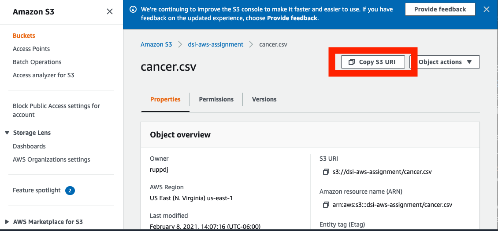

# AWS

Amazon Web Services (AWS) is a cloud computing and storage solution.  Today you will practice interacting with AWS storage (S3) and cloud compute (EC2).

You will interact with AWS through the website (GUI), through the terminal, and through code.


### Setting up the AWSCLI

You may need to install the following packages:
 - awscli - Amazon command line interface
    * `pip install awscli`
 - s3fs  - S3 file access library (Used for easier reading into Pandas)
    * `conda install s3fs`
 - boto3 - python library to interact with AWS (If needed)
    * `conda install boto3`


It is important to note that by setting up your `awscli` with `aws configure` command will set up your credentials to use the `aws cli` and `boto3`.


For more information on getting started on [AWS CLI](https://docs.aws.amazon.com/polly/latest/dg/getting-started-cli.html).

## Basic
### Part 1: S3 on AWS

S3 is the storage system on AWS. Here, you will practice interacting with it via the Amazon GUI
and with the Python library `boto3`.  You can also interact with it on the CLI. You should know how to read and write files to S3 using a
python script at the end of this exercise.

<br>

1. Log into your [Amazon account](http://aws.amazon.com/console/), and create an S3 bucket using the GUI. (This can also be done through the CLI and boto3)
   **The bucket name must be globally unique (not used on any AWS account).**

   [Rules for S3 Bucket Names](http://docs.aws.amazon.com/AmazonS3/latest/dev/BucketRestrictions.html):
   * Bucket names must be at least 3 and no more than 63 characters long.
   * Bucket names can contain lowercase letters, numbers, and hyphens.
   * Periods are allowed but can cause problems. Avoid using periods.
   * Bucket names cannot start or end with a hyphen or period.

 - By default buckets are private.  That is only you or people with access can read or write to the bucket or files.  Setting up the AWS CLI gives you the login permission to access private buckets.  If you ever wanted to make a bucket or file public for other people to use you can follow [these instructions](https://aws.amazon.com/premiumsupport/knowledge-center/read-access-objects-s3-bucket/)


2. Upload (using the GUI) `data/cancer.csv` to your bucket, and note the link to the file.   
    - The link can be found by clicking the highlighted button after selecting the file.

   

    - You can also try uploading the file through the [CLI](https://docs.aws.amazon.com/cli/latest/reference/s3/) or boto3.

3. Use `boto3` to read in the file from S3.   There are helpful boto3 [examples here](https://boto3.amazonaws.com/v1/documentation/api/latest/guide/s3-examples.html). Especially the [downloading](https://boto3.amazonaws.com/v1/documentation/api/latest/guide/s3-example-download-file.html) example.

    > Hint: You can use `pandas.read_csv()` to directly read the result.
      - Include the [chunksize](https://pandas.pydata.org/pandas-docs/stable/reference/api/pandas.read_csv.html) argument in `read_csv` to read in a subset of the file. In this case, with 301 rows, you would not need to subset your data.
    > Hint: Check the returned object of `s3_client.get_object()` function. What is the data type of this object? Which field contains the useful information?

    - If you used the `pd.read_csv()` command try again using `boto3`

4. Compute the rates of cancer for each row, and make a histogram of the rates. Save the histogram as a `.png`
   file using `savefig` in matplotlib. Save a `rate.csv` file of the rates you use for the histogram as well.

5. Write a script using `boto3` to upload the histogram `.png` and the rates `rate.csv` to the bucket you have created.
   Confirm you have uploaded the files by checking the GUI console.


<br>

## Advanced

### Part 2: EC2 on AWS   
- [Link to AWS EC2 Documentation](https://docs.aws.amazon.com/AWSEC2/latest/UserGuide/concepts.html)   


EC2 is a remote virtual machine that runs programs much like your local machine. Here you will learn how to
run tasks on an EC2 machine. Most EC2 instances come without a lot of the packages you need.    

<br>

1. Create an EC2 instance.
    - When creating a EC2 you can start out with a clean operating system and load anaconda after. Or using a existed Machine Image (do one of the following).  
        1. Search for a Machine Image (Community AMI) that has `anaconda3` and `Ubuntu`. 
        or
        2. Choose only Ubuntu as the AMI and you will need to follow the install steps at the bottom of the assignment after you log in.
    - Choose `t2.micro` for the instance type. 
    - Give the instance an IAM role that allows it full access to S3 [instructions](https://aws.amazon.com/premiumsupport/knowledge-center/ec2-instance-access-s3-bucket/).
        - Or look at the abridged instructions [here](workflow_recommendation.md) 
    - Choose an *all-lowercase* name for the instance and add a `Name` tag (Key=`Name`, Value=`examplename`). 
      - Careful: Do not replace `Name` in the key field. Set the value instead by replacing `examplename`.
  
2. Log into the instance you have launched using `ssh`.   For more details on ssh on AWS see [here](AWS_ssh_walk_through.md)

3. Update `apt` sources and perform routine updates:

```
sudo apt update
sudo apt upgrade
```

4. Modify the script you have written to process `cancer.csv` in `Part 1`. Instead of writing the results to
   the same S3 bucket as where `cancer.csv` is, change the script to write to a new bucket.  

   You will have to modify the script in another way, because EC2 linux servers don't have the same visual resources as your laptop.  Therefore, you'll need to change how you import `matplotlib.`  Modify the import in your script:
   ```python
   import matplotlib
   matplotlib.use("Agg")
   import matplotlib.pyplot as plt
   ```


5. Use `scp` or `git` to copy the script onto the EC2 instance.
   
6. Run the script on the EC2 instance and check S3 to make sure the results are transferred to a new bucket. In practice, you will be testing the script locally with a smaller subset of the data, and run the script on the whole set on EC2. If your task requires more processing power, you have the option to run it on a more powerful EC2 instance with more RAM and more cores.


**Hint**

Your Python script will have the following structure.


```python
# import libraries
import numpy as np
import pandas as pd
import boto3
import matplotlib
matplotlib.use("Agg")
import matplotlib.pyplot as plt

# create global variables like `s3_connection` and `s3_client`
s3_connection = # you fill this
s3_client =  # you fill this

def load_csv(from_s3, bucket_name, file_name, n_rows = 300):
    """
    Input:
        bucketname (str): Name of bucket that file is stored in
        filename (str): Name of csv within bucket (ex: "cool_data.csv")

    Output:
        pandas dataframe of csv (assuming no read_csv arguments are needed)
    """
    pass

def plot_cancer_rats(save_figure = False, plot_save_path = None):
    """
    Input:
        save_figure (bool): Whether save the figure or not
        plot_save_path (str): If save, the path of the save.

    Output:
        None, no output is given.

   # save figure snippet is provided
   if save_figure:
        plt.savefig(plot_save_path, dpi=500)
    """
    pass

if __name__ == "__main__":

    # 1. create new bucket
    # 2. create cancer rate.csv file and figure file
    # 3. upload csv file and csv file to newly created bucket
```


**Optional (if you didn't use an anaconda3 AMI)**

Install Anaconda   

**Note** You will want to use the most up to date Anaconda distribution.  You will want to replace the web address below with one found [here](https://www.anaconda.com/products/individual)

```
# Download Anaconda3
wget -S -T 10 -t 5 https://repo.anaconda.com/archive/Anaconda3-2020.11-Linux-x86_64.sh -O $HOME/anaconda.sh

# Install Anaconda
bash anaconda.sh

# when prompted for an installation path, 
# press "enter" to accpet the default


# when prompted to "prepend the install location 
# to your PATH", type 'yes'

# once installation is finished, you still have
# to execute the commands in ~/.bashrc
source ~/.bashrc

conda install boto3
```

