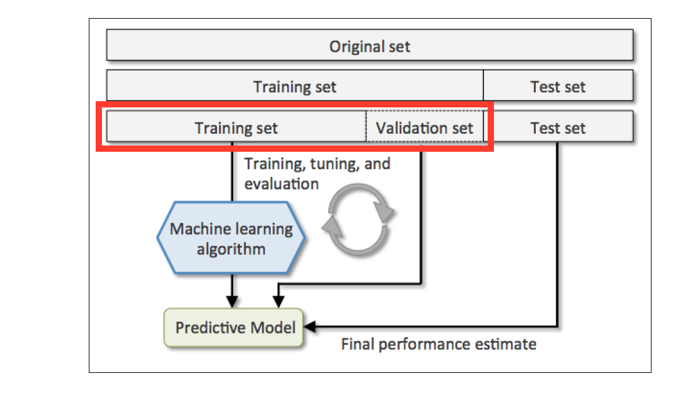

## Cross Validation

- [Cross Validation](#cross-validation)
- [Introduction](#introduction)
- [Basic](#basic)
  - [Part 1: Load and Split Data](#part-1-load-and-split-data)
  - [Part 2: K-fold Cross Validation](#part-2-k-fold-cross-validation)
    - [Simple Train and Test Split](#simple-train-and-test-split)
    - [K-fold Cross Validation](#k-fold-cross-validation)
- [Advanced](#advanced)
  - [Part 3: Investigation of Hyperperameters](#part-3-investigation-of-hyperperameters)

## Introduction

The goal of any model-building process is to increase the predictive performance of a statistical model. Today you'll learn the difference between a training set, a test set and a validation set. We will study a process known as cross-validation - and ultimately how these varying methods have a direct effect on your models predictive performance on unseen data.

Since we normally only have access to a fixed data set, it's common to split the original data set into two portions named a **train** and **test** set - of which we'll use the test portion to simulate 'unseen data.'

How we deal with the **train** portion of the original data set will be the focus of this sprint. Below are four different ways to build upon the complexity of our training strategy to produce the best process for training and validating our models.

- **Worst Option** - Train model with original data set without splitting into train and test set. Unable to score our model and determine its predictive performance since we don't have test set.
- **Bad Option** - Only perform a train-test split. Train model with entire training set and score against test set.
- **Better Option** - Further split training set into **one** smaller training set and **one** validation set. Use validation set score to guide our model choice and then score best model against test set. *Below is an image of this option.*
- **Even Better Option** - Cross validate training set by splitting into **many** training sets and **many** validation sets. Rotate through each portion to build and validate model and average results. Best model is used to score against test set.

> Please be aware that the name `score` can be misleading sometimes when the actual numerical values being evaluated is a `loss` rather than a `score`. In that case, the smaller the `loss` is, the higher the model's `score` is.

<div align="center">
    
</div>

####  Dataset classification

- **Training Set** - Used to train one, or more, models.
- **Validation Set** - Used to tune hyperparameters of different models and choose the best performing model.
- **Test Set** - Used to test the predictive performance of the best scoring model.

## Basic

### Part 1: Load and Split Data

1. Include the following lines to import the libraries needed:

   ```python
   from sklearn.neighbors import KNeighborsRegressor
   from sklearn.model_selection import KFold
   from sklearn.model_selection import train_test_split
   from sklearn.model_selection import cross_val_score
   import numpy as np
   from sklearn.datasets import load_boston
   ```

> Note that KNN regressor may not be the optimal regressor for the Boston housing price dataset. The comparison of different machine learning models is not the focus of this exercise. In this assignment, **K** refers to the number of folds in K-fold cross validation. The number of nearest neighbors used remains the default one (5) provided by scikit-learn **KNeighborsRegressor**.

2. Load in the boston data with the following commands.

   ```python
   boston = load_boston()
   X = boston.data # housing features
   y = boston.target # housing prices
   ```

   Descriptions for each column in feature matrix `X`:

   ```
   Attribute Information (in order):
    - CRIM     per capita crime rate by town
    - ZN       proportion of residential land zoned for lots over 25,000 sq.ft.
    - INDUS    proportion of non-retail business acres per town
    - CHAS     Charles River dummy variable (= 1 if tract bounds river; 0 otherwise)
    - NOX      nitric oxides concentration (parts per 10 million)
    - RM       average number of rooms per dwelling
    - AGE      proportion of owner-occupied units built prior to 1940
    - DIS      weighted distances to five Boston employment centers
    - RAD      index of accessibility to radial highways
    - TAX      full-value property-tax rate per $10,000
    - PTRATIO  pupil-teacher ratio by town
    - B        1000(Bk - 0.63)^2 where Bk is the proportion of African-American residents by town
    - LSTAT    % lower status of the population
   ```

3. Use `train_test_split()` in scikit learn to make a training and test dataset.
   There is no rule on train-test splits.  Below we use a 75 : 25 split.

   ```python
   X_train, X_test, y_train, y_test = train_test_split(X, y, test_size=0.25)
   ```

### Part 2: K-fold Cross Validation

In K-fold cross validation, we'll split our training set into **k** groups, usually 5 or 10. One of the k groups will act as our validation set, the rest of the (**k-1**) groups will be the training set. We'll iterate through each combination until each **fold** has had a chance to act as our validation set. At each iteration, a metric for accuracy (RMSE in this case) will be calculated and an average loss will be calculated across the k iterations.

<div align="center">
    
</div>

<br>

Before that, we need a benchmark and some utility functions like `rmse()`. Let's finish this part first.

#### Simple Train and Test Split

One way to evaluate a model is to ignore the validation set. Use the train set and test set only: we'll train our model on the training set only then evaluate the model on the test set. 

1. Write a function `rmse(true, predicted)` that takes your `true` and `predicted` values and calculates
   the RMSE. You should use `sklearn.metrics.mean_squared_error()` to confirm your
   results.

2. Use `KNeighborsRegressor()` in scikit-learn to build a model with your training data.

   Note that this is a complicated dataset with a good deal of correlation.  You might consider

   ```python
   # Fit your model using the training set
   reg = KNeighborsRegressor()
   reg.fit(X_train, y_train)

   # Call predict to get the predicted values for training and test set
   train_predicted = reg.predict(X_train)
   test_predicted = reg.predict(X_test)

   # Calculate RMSE for training and test set
   print( 'RMSE for training set ', rmse() )
   print( 'RMSE for test set ', rmse() )
   ```

3. Explain the advantages of evaluating RMSE on a separate test set (instead of fitting a
   model and calculating RMSE on the entire data set).

#### K-fold Cross Validation

Now, let' move on to the cross validation part.

1. Create the function `cross_val(X_train, y_train, k)` using K-fold validation **on the training dataset**. `sklearn` has its own implementation of K-fold (`sklearn.cross_validation.cross_val_score()`). However, to develop your understanding of K-fold, you will implement it here. Your own implementation should:

   A) Randomly split the dataset into **k** folds.  You may use sklearn's `KFold` class if you'd like.

   B) For each fold:
    1. train the model with the (k-1) _other_ folds,
    2. use the trained model to predict the target values of each example in the current fold,
    3. calculate the RMSE of the current fold's predicted values,
    4. store the RMSE for this fold.

   C) Average the **k** results of your error metric. Return the average error metric.

2. Use the code you just wrote to compute the k-fold cross validation loss on the training set. (use k=5 and train a KNN Regression model on the Boston housing price data). How does this compare to the RMSE loss you just computed for your **test set** with simple train test splitting?

3. To get a feel for how the **size of the training set** affects performance, do k-fold cross validation where you limit the training set size by varying amounts. Plot the learning curve (MSE in this case) across varying training set sizes. (You might want to use: [cross_val_score](http://scikit-learn.org/stable/modules/generated/sklearn.model_selection.cross_val_score.html) which is scikit-learn's built-in function for K-fold cross validation.)

## Advanced

### Part 3: Investigation of Hyperperameters

**k** is a [hyperparameter](https://en.wikipedia.org/wiki/Hyperparameter_(machine_learning)). Hyperparameters will influence the metrics of your model and we are going to investigate the cross-validation losses in this part. We also want to include the hold-out loss of a simple train-test split, in which there is no validation set but the [test set size or ratio](https://stackoverflow.com/questions/54413160/training-validation-testing-batch-size-ratio) as a hyperparameter.

1. For K-fold cross validation, investigate the relationship between **k** and the root mean squared error on the test set. You can set **k** from `2` to `50`. Note that in this question, the `whole set` we are using is `75%` of all available data.
2. For simple train-test splitting, a hyperparameter you can tune is the ratio of test set. In part 1, it is set to be `0.25`. Try to tune it to range from `0.05` to `0.45` and plot the train and test root mean squared error.
