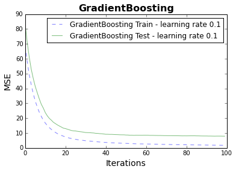
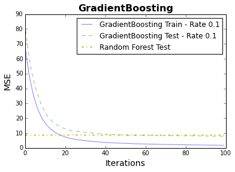

# Gradient Boosting for Regression
- [Gradient Boosting for Regression](#gradient-boosting-for-regression)
  - [Basic](#basic)
    - [Part 1: Setup](#part-1-setup)
    - [Part 2: Compare models](#part-2-compare-models)
    - [Part 3: Plot the error after each iteration](#part-3-plot-the-error-after-each-iteration)
  - [Advanced](#advanced)
    - [Part 4: Explore hyperparameters](#part-4-explore-hyperparameters)
## Basic

### Part 1: Setup
Here we will use boosting to solve a regression problem. Specifically we would
like to predict Boston house prices based on 13 features.

<br>

1. Import the following libraries.

   ```python
   from sklearn.tree import DecisionTreeRegressor
   from sklearn.ensemble import RandomForestRegressor
   from sklearn.ensemble import GradientBoostingRegressor
   from sklearn.datasets import load_boston
   from sklearn.model_selection import train_test_split, cross_val_score
   from sklearn.model_selection import GridSearchCV
   from sklearn.metrics import mean_squared_error, r2_score
   import matplotlib.pyplot as plt
   import numpy as np
   ```

2. Import the data.

   ```python
   boston = load_boston()
   # House Prices
   y = boston.target
   # The other 13 features
   x = boston.data
   ```

   Do a `train_test_split` where `train : test` is `80 : 20`. Set
   `random_state=1` so the exact same split can be replicated later.
   All subsequent model selection will be carried out with the train set.

### Part 2: Compare models
3. We are interested in comparing 3 classes of ML algorithms here:
   
   - Basic `DecisionTreeRegressor`
   - `RandomForestRegressor`
   - `GradientBoostingRegressor`

   Boosted decision trees
   have been shown empirically to outperform `RandomForest` on average
   ([_Table 4 - R. Caruana et. al._](./reference/compare_ml_algo.pdf)) in terms
   of predictive power. The runtime for boosting algorithms, as you will
   experience, is also competitive with random forest.

   As a starting point, below are instantiations of the 3 classes of
   algorithms. I have given you a set of hyperparameters for each
   class. Do not worry about tuning the parameters for now, we will do a
   `GridSearch` at the end of the exercise.

   ```python
   rf = RandomForestRegressor(n_estimators=100,
                               n_jobs=-1,
                               random_state=1)

   gdbr = GradientBoostingRegressor(learning_rate=0.1,
                                     loss='ls',
                                     n_estimators=100,
                                     random_state=1)

   dtr = DecisionTreeRegressor(random_state=1)
   ```
   **Note:**
   `n_jobs=-1` _allows the process to be run on multiple cores on
   your computer. Only parallel algorithms such as_ `RandomForest` _can
   do that. Boosting is sequential (the current step depends on the residuals
   from the previous) and does not have that option._
   `n_jobs=-1` _is not a hyperparameter._

4. Using `cross_val_score` in `sklearn`, define a function that 
   calculates the cross-validated train MSE and R2 for `DecisionTreeRegressor`,
   `GradientBoostingRegressor`, `RandomForestRegressor`.

   **Your output should be similar to this (Do not worry if the numbers do
   not match up exactly):**

   ```
   RandomForestRegressor     Train CV | MSE: 9.943 | R2: 0.866
   GradientBoostingRegressor Train CV | MSE: 8.720 | R2: 0.882
   DecisionTreeRegressor     Train CV | MSE: 16.958 | R2: 0.778
   ```

   Which of the models cross validates the best? Why is it inappropriate
   to make a judgement on the performance of the models
   based only on the evidence we have thus far?

5. Define a new instance of `GradientBoostingRegressor` with the exact same
   hyperparameters as above, except change the `learning_rate` to `1`
   (instead of `0.1`). Calculate the cross-validated train MSE.
    What do you notice?

### Part 3: Plot the error after each iteration

6. We're going to make a plot to help us understand the impact of the learning rate
   and the improvements in error after each iteration of the boosting.
   
   [`staged_predict`](http://scikit-learn.org/stable/modules/generated/sklearn.ensemble.GradientBoostingRegressor.html#sklearn.ensemble.GradientBoostingRegressor.staged_predict) is a method in both
   `GradientBoostingRegressor` (and `AdaBoostRegressor` which we didn't cover here). It allows us to get
   predictions from the estimator after each iteration of the boosting.
   Using `staged_predict`, define a function `plot_stage_score` that calculates the test and train MSE from each estimator. Do the calculations for `GradientBoostingRegressor`
   with `learning_rate=1` and `learning_rate=0.1`

   ```python
   def plot_stage_score(ax, estimator, X_train, y_train, X_test, y_test):
       '''
       Parameters: ax: a Matplotlib axis object, on which the graph will be plotted
                   estimator: GradientBoostingRegressor
                   X_train: 2d numpy array
                   y_train: 1d numpy array
                   X_test: 2d numpy array
                   y_test: 1d numpy array

       Returns: A plot of the number of iterations vs the MSE for the model for
       both the training set and test set.
       '''
      
      #### YOUR CODE HERE ####
   ```
   
   You should be able to run your code like this:
   
   ```python
   fig, ax = plt.subplots()
   plot_stage_score(ax, gdbr, X_train, y_train, X_test, y_test)
   ```
   
   And get a result which looks like this:

   
   
   In order to get the labels for the plot, you can use `model.__class__.__name__` to get the model name and `model.learning_rate` to get the learning rate.

7. Use your `plot_stage_score` function to make a plot that shows the error
   for gradient boosting with a learning rate of 0.1 and 1.

   Since you are comparing two models and we're showing both the training and
   test error, you should have 4 lines on your graph.

8. Given your plot, explain the behavior of the test / train curves
   for the two (0.1 and 1) learning rates. With a lower learning rate (0.1),
   what is necessary to obtain a low test error?

9. Using the `plot_stage_score` function, make a plot like you did above of
    the MSE for `GradientBoostingRegressor` with `learning_rate=0.1`.

    Add a horizontal line to indicate where the `RandomForestRegressor` test
   error is at.

   Your plot should look something like this:

   

   a. How many iterations does it take until Gradient Boosting beats Random Forest?

## Advanced

### Part 4: Explore hyperparameters

10. As seen above when we compared two learning rates, suboptimal hyperparameters
    can give rise to higher error
    (MSE). Therefore, we aim to search for the set of hyperparameters that
    would give us the lowest cross-validated train error. The search of these
    hyperparameters is known as grid-search. For each hyperparameter, a set
    of values are specified. The combination of the hyperparameters at different
    values will constitute the search space. We try each possible combination
    of parameters and find the combination which minimizes error.

    Use `GridSearchCV` for to find the best `RandomForestRegressor`
    and `GradientBoostRegressor` models respectively.
    Remember to specify `n_jobs=-1` in `GridSearchCV` to use all the cores of your
    machine and speed up your search.

    Here are some values to start out with trying for hyperparameters for Random Forest:

    ```python

    random_forest_grid = {'max_depth': [3, None],
                          'max_features': ['sqrt', 'log2', None],
                          'min_samples_split': [2, 4],
                          'min_samples_leaf': [1, 2, 4],
                          'bootstrap': [True, False],
                          'n_estimators': [10, 20, 40, 80],
                          'random_state': [1]}

    rf_gridsearch = GridSearchCV(RandomForestRegressor(),
                                 random_forest_grid,
                                 n_jobs=-1,
                                 verbose=True,
                                 scoring='mean_squared_error')
    rf_gridsearch.fit(X_train, y_train)

    print "best parameters:", rf_gridsearch.best_params_

    best_rf_model = rf_gridsearch.best_estimator_
    ```

    Feel free to change it to try a different set of parameters.

    Note that this will take about 3-5 minutes to run. The total number of combinations is:
    `2 * 3 * 2 * 3 * 2 * 4 * 1 = 288`. We are trying each of these possibilities!

    a. What are the optimal parameters?

    b. What is the MSE you get on the test set with these parameters?

    c. How does this compare with the MSE with the default parameters?

11. Go through the same process for `GradientBoosting`. Try several values for
    these hyperparameters:

    * `learning_rate`
    * `max_depth`
    * `min_samples_leaf`
    * `max_features`
    * `n_estimators`
    
    If you're unsure what values to include, take a look at sklearn's default. Include the default value and at least 
    one value less than and greater than the default value. Here's the [docs on Gradient Boosting](http://scikit-learn.org/stable/modules/generated/sklearn.ensemble.GradientBoostingClassifier.html#sklearn.ensemble.GradientBoostingClassifier) where you can see the defaults.
    If you want a set of starting parameters, [here](https://gist.github.com/pprett/3989337#file-grid_search-py-L115) is
    a reference.

    a. What are the parameters that give the optimal model?

    b. How does the MSE for this model compare with the original MSE you got with Gradient Boosting
    before tuning the parameters?


