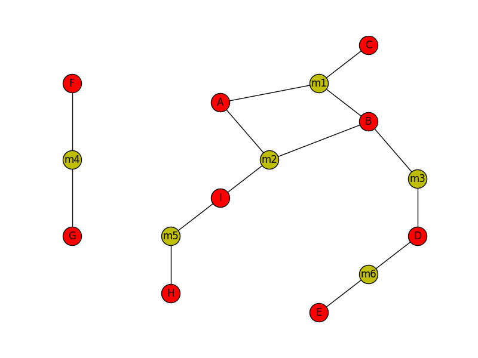

# Graphs: Search Algorithms
- [Graphs: Search Algorithms](#graphs-search-algorithms)
  - [Introduction](#introduction)
  - [Basic](#basic)
    - [Part 1: Loading the data](#part-1-loading-the-data)
      - [Small dataset](#small-dataset)
    - [Part 2: Shortest path](#part-2-shortest-path)
      - [Breadth First Search (BFS) Algorithm](#breadth-first-search-bfs-algorithm)
      - [Implementation](#implementation)
  - [Advanced](#advanced)
    - [Part 3: Get all the paths](#part-3-get-all-the-paths)
  - [Extra Credit](#extra-credit)
    - [Part 4: Dijkstra's shortest path algorithm](#part-4-dijkstras-shortest-path-algorithm)
      - [Graph code](#graph-code)
      - [Shortest Path Algorithm](#shortest-path-algorithm)
## Introduction

We're going to be working with a dataset from [IMDb (The International Movie Database)](http://www.imdb.com/). We can represent the movie data as a **graph**. Every movie is a **node**, and every actor is a **node**. There exists an **edge** (aka, a _connection_) between a movie node and an actor node if the actor was in the movie.

The data is formatted as a `tsv` (tab separated file) like this:

```
...
Kevin Bacon    Crazy, Stupid, Love.
...
```

The data can be found in [data/imdb_edges.tsv](data/imdb_edges.tsv).

## Basic
### Part 1: Loading the data

You can use the `load_imdb_data()` function in `src/load_imdb_data.py` to load the data.

```python
from src.load_imdb_data import load_imdb_data
actors, movies = load_imdb_data('data/imdb_edges.tsv')
```

Take a moment to get a feel for how the data is structured.  Beware of printing the entire data structures, they are large and you may freeze whatever environment you are using.

The `actors` and `movies` dictionaries represent adjacency lists of this IMDb graph. Make sure you understand the contents of these dictionaries before you move on. We have two dictionaries because we have two types of nodes. Think about how you might combine these two dictionaries; you'll be asked to combine them later to simplify analysis by having only one type of node.

#### Small dataset

For debugging and testing your graph algorithms, you are going to use a small fake dataset, which is stored in `data/example_edges.tsv`. This is what it looks like:



The actors are the red nodes and the movies are the yellow nodes.

### Part 2: Shortest path

The first task that we'll be tackling is discovering Kevin Bacon numbers. This is finding the shortest path from Kevin Bacon to another actor. The "Kevin Bacon number" is the number of movies along that path.

Play around with the [Oracle of Bacon](https://oracleofbacon.org/) to get a sense of Kevin Bacon numbers before you start implementing.

#### Breadth First Search (BFS) Algorithm

To implement shortest path in an unweighted graph, we can use the BFS algorithm. Here is the pseudocode for finding the shortest path using BFS from one node to another in a graph. 

```python
def shortest_path(start, end):
    create an empty queue Q
    create an empty dictionary path
    set path[start] = [start]
    add start to Q
    while Q is not empty:
        take node off Q
        if node is end: 
            return path[node]. # we're done!
        for each neighbor of node:
            if neighbor is in path: skip neighbor
            set path[neighbor] = path[node] + [neighbor]
            add neighbor to Q

    return None. # we finished the search and no path was found.
```

#### Implementation

Implement the `shortest_path()` function in `src/shortest_path.py` as follows:

1. The `shortest_path()` function takes two adjacency list dictionaries (`actors` and `movies`). It will be easier to write BFS if you only have to deal with one adjacency list, so combine `actors` and `movies` into one dictionary.

2. Use the pseudocode above to implement your own BFS, starting at `actor1` and searching until you find `actor2`, returning the path found between the two actors.

3. Test it out first with the small dataset before you use the whole IMDb dataset. You can run it from the command line like this:

    ```
    python src/shortest_path.py "data/example_edges.tsv" "I" "D"
    ```

    The result should be the following:
    ```
    length: 2
        I
    m2
        B
    m3
        D
    ```

4. Once you've verified that your code is correct, run it on the whole IMDb dataset:

    ```bash
    python src/shortest_path.py "data/imdb_edges.tsv" "Kevin Bacon" "Julia Roberts"
    python src/shortest_path.py "data/imdb_edges.tsv" "Kevin Bacon" "Steve Carell"
    python src/shortest_path.py "data/imdb_edges.tsv" "Kevin Bacon" "Matthew Sordello"
    ```

    Jody Mullins is the most distant from Kevin Bacon (7 movies!), test your code with this:
    ```bash
    python src/shortest_path.py "data/imdb_edges.tsv" "Kevin Bacon" "Jody Mullins"
    ```

## Advanced
### Part 3: Get all the paths

The above implementation just finds _one_ path between the two actors. It's possible that there are multiple paths between the two actors of the same length.

1. Write a function `shortest_paths()` to return all shortest paths, rather than a single one.

2. Modify `src/shortest_path.py` to print all the shortest paths as returned by your `shortest_paths()` function. The command below should now print 7 paths between Kevin Bacon and Julia Roberts (each of length 2).

    ```
    python src/shortest_path.py "data/imdb_edges.tsv" "Kevin Bacon" "Julia Roberts"
    ```


## Extra Credit
### Part 4: [Dijkstra's shortest path algorithm](https://en.wikipedia.org/wiki/Dijkstra%27s_algorithm)

Dijkstra's algorithm is similar to BFS for finding the shortest path between two nodes, but Dijkstra works for weighted graphs! (BFS only works as a shortest path algorithm for unweighted graphs.)

Here is an example graph that we'll be playing with in implementing this algorithm:

```
               4        ----------   3   ----------------   1   ---------------
         /------------- | Marina | ----- | Russian Hill | ----- | North Beach |
        /               ----------       ----------------       ---------------
 ------------               |                       |
 | Presidio |               | 2                     | 1
 ------------               |                       |
      | 1               --------------          ------------
------------    8    /--| Pac Heights|          | Nob Hill |
| Richmond |---------   --------------          ------------
----------- \               |                       |
    |        \              | 2                     | 2
    |       7 \             |                       |
  | 4   | \       -------------------  3   ------------ |
  | --- |Western addition| ---- | Downtown |
----------              ------------------      ------------
| Sunset |                    |                    |
----------                  4 |                    | 5
                              |                    |
                        ----------             --------
                        | Haight |             | Soma |
                        ----------             --------
                              \                /
                              1 \            / 5
                                  \        /
                                  -----------
                                  | Mission |
                                  -----------
```

#### Graph code

You can find an implementation of a graph in `src/graph.py`. It also contains code for loading in the above graph.

#### Shortest Path Algorithm

For this shortest path algorithm, we use a **priority queue**. In a priority queue, each item is associated with a value that denotes its priority (or importance). Items are removed from the queue in accordance with their priority (rather than in the order they were added).

Here is the psuedocode for the algorithm. Note how similar it is to the BFS algorithm.

```python
def dijkstra(graph, start, end):
    create an empty priority queue Q
    create an empty dictionary path
    create an empty dictionary distance
    set path[start] = [start]
    set distance[start] = 0
    add start to Q with priority distance[start]
    while Q is not empty:
        take lowest priority element off Q, call it node
            call the priority p
        if node is end: return path[node]. we're done!
        for each neighbor of node:
            set dist = p + weight(node, neighbor)
            if neighbor is in path and distance[neighbor] <= dist:
                skip neighbor
            set path[neighbor] = path[node] + [neighbor]
            set distance[neighbor] = dist
            add neighbor to Q with priority distance[neighbor]
    return None. We finished the search and no path was found.
```

Implement the shortest path algorithm to work on the above graph using the pseudocode given.
