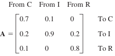
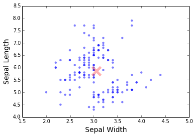

# Linear Algebra

## Introduction

In this assignment, you will practice matrix and vector operations
with numpy.

**For the following exercises, use numpy vector/matrix operations. Do not use a for loop over a numpy array unless given explicit instructions to do so!**

## Important Numpy Notes:

In an numpy array, a **row vector** is defined as:

```python
a = np.array([[1, 2, 3]])
```
The shape of `a` is `(1, 3)`.  There is one row and multiple columns.

A **column vector** is defined as:
```python
b = np.array([[1], [2], [3]])
```
The shape of `b` is `(3, 1)`.  There are three rows, and one column.

Check the `shape` of all the vectors throughout the exercise.  If the shape is
missing a value, i.e. `(3,)` or  `(,3)`, use `np.newaxis` or `np.reshape` to
restore the correct dimensions.

## Basic

### Part 1: Markov Chains

A [Markov Chain](https://en.wikipedia.org/wiki/Markov_chain) is a simple model
for a system that transitions between states, where there is some randomness
involved in the transitions.  If, for example, the system has three states (on,
off, and idle, for example), then the probabilities from transitioning from one
state to another can be encoded as a three by three matrix of probabilities
with some simple properties, this is called a *stochastic matrix*.

The probability of entering a certain state depends only on the last state
occupied and the transition probabilities in the stochastic matrix, not on the
entire history of states.  This is called the *markov property*, and it makes
Markov Chains particularly simple and appealing models.

Suppose that the 2004 **state of land use** in a city of 60 square miles built-up area is:

```
In 2004:
   
C (Commercially Used): 25%
I (Industrially Used): 20%
R (Residentially Used): 55%
```

1. Find the **state of land use** in **2009** and **2014**,
   assuming that the transition probabilities for 5-year intervals are given
   by the matrix **A** and remain practically the same over the time considered.
   
<div align="center">
   
</div>
   
<br>

2. Suppose that all of the land in the city starts as residential.  Use the
transition matrix to calculate how the usage of the other three land types evolves
over time.

3. Do the same as above for both an all industrial and an all commercial
starting point.  How does the long term makeup of the city differ for different
starting points?

## Advanced

### Part 2: Iris

This following question uses the `iris` dataset. Load the data in with the
following code.
   
```python
iris = pd.read_csv('data/iris.txt')
data = iris[['SepalWidth', 'SepalLength']].values
```
  
1. Make a scatter plot of sepal width vs sepal length (you will have to explore
the `iris` object to extract this information). Plotting will be covered in the `Matplotlib` lecture. For now, you can make use of the following minimalist script following the OOP design pattern, i.e. don't use `plt` functions directly.
   
    ```python
   # scatter plot array `x` against array `y`
   fig, ax = plt.subplots()
   ax.scatter(x, y)
    ```
  
2. Compute the mean vector (column-wise) of the data matrix. The `shape`
   of the mean vector should be `(1, 2)`
     
   Plot the mean sepal width and sepal length vector on the scatter plot in `question 1` 

   <div align="center">
    
   </div>

3. Write a function (`euclidean_dist`) to calculate the euclidean distance
   between two **column vectors (not row vector)**. Your function should check
   if the vectors are column vectors and the shape of the two vectors are the same .

4. Write a function (`cosine_sim`) to calculate the cosine of the angle of separation between two **column vectors**.
   
5. Write a function that would loop through all the data points in a given matrix and 
   calculate the given distance metric between each of the data point and the mean
   vector.
      
   **Input of the function:**
     - Data matrix as an ndarray
     - Function to compute distance metric (Euclidean / Cosine Similarity)
      
   **Output of the function:**
     - An array of distances.
      
   Use the function to compute Euclidean Distance and Cosine Similarity between each of
   the data points and the mean of the data points. You should be able to call the function
   in this manner:

   ```python
   euclidean_dists = compute_dist(iris_data, euclidean_dist)
   cosine_sims = compute_dist(iris_data, cosine_sim)
   ```
6. Plot histograms of the euclidean distances and cosine similarities using only `sepal width` and `sepal length`. The minimalist example is provided
   
   ```python
   # histogram plot of an array `x`.
   fig, ax = plt.subplots()
   ax.hist(x, bins=20)
   ```

   <div align="center">
    
   </div>

   <div align="center">
    
   </div>


## Extra Credit

### Part 3: Implementing the PageRank Algorithm

The [Page Rank Algorithm](http://en.wikipedia.org/wiki/PageRank) is used by Google Search (in their early days) to rank websites in their search engine in terms of the importance of webpages.

[More about PageRank](http://books.google.com/books/p/princeton?id=5o_K4rri1CsC&printsec=frontcover&source=gbs_ViewAPI&hl=en#v=onepage&q&f=false)

We will implement PageRank on this simple network of websites.

   <div align="center">
    
   </div>

**In the above image:**
   - Each node is a web page
   - Each directed edge corresponds to one page referencing the other
   - These web pages correspond to the states our Markov chain can be in
   - Assume that the model of our chain is that of a random surfer/walker.

In this model, we transition from one web page (state) to the next with
equal probability (to begin).  Or rather we randomly pick an outgoing edge
from our current state.  Before we can do any sort of calculation we need to
know how we will move on this Markov Chain.

1. Create an `numpy ndarray` representing the transition probabilities between
   nodes for **the above network (in the image)**. The position _i_, _j_ in the matrix corresponds to the
   probability of going from node _i_ to node _j_.

2. Now that we have a transition matrix, the next step is to iterate on this
   from one page to the next (like someone blindly navigating the internet) and
   see where we end up. The probability distribution for our random surfer can
   be described in this matrix notation as well (or vector rather).

   Initialize a vector for the probability of where our random surfer is.
   It will be a vector with length equal to the number of pages.
   Initialize it to be equally probable to start on any page
   (i.e. you start randomly in a state on the chain).

3. To take a step on the chain, simply matrix multiple our user vector by the
   transition matrix.
   After one iteration, what is the most likely location for your random surfer?

4. Plot how the probabilities change.
   Iterate the matrix through the first ten steps.
   At each step create a bar plot of the surfers probability vector.

   ```python
   # bar plot of array `x`.
   fig, ax = plt.subplots()
   ax.bar(x)
   ```

5. This time to compute the stationary distribution, we can use numpy's
   matrix operations. Using the function for calculating [eigenvectors](http://docs.scipy.org/doc/numpy/reference/generated/numpy.linalg.eig.html) compute the
   stationary distribution (page rank).  Is it the same as what you found
   from above?  What is it's eigenvalue?
   
   **Hint:** 
   - The stationary state is represented by the real form of the left (first) eigenvector
   - The left eigenvector obtained from `numpy.linalg.eig` has to be normalized
