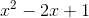
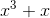
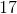

# Object-Oriented Programming

- [Object-Oriented Programming](#object-oriented-programming)
  - [Introduction](#introduction)
  - [Basic](#basic)
    - [Part 1: Starting your class](#part-1-starting-your-class)
      - [More about `__repr__` method](#more-about-__repr__-method)
    - [Part 2: Do some math](#part-2-do-some-math)
    - [Part 3: Create more magic methods](#part-3-create-more-magic-methods)
    - [Part 4: Equality](#part-4-equality)
  - [Advanced](#advanced)
    - [Part 5: Make human-readable strings](#part-5-make-human-readable-strings)
    - [Part 6: Multiplication](#part-6-multiplication)
    - [Part 7: Do calculus](#part-7-do-calculus)

In this short project, you will build a class for manipulating polynomial objects.

## Introduction

A *polynomial* is an expression of a single variable consisting of the sum of one or more *terms*. Each term is a non-negative integer power of a variable times some constant coefficient. For example







The largest power of the variable appearing in a polynomial is called its *degree*. Note that even though the last example does not include any terms with the variable, we still count it as a degree zero polynomial.

We want to write a class that creates polynomial objects. We'll write methods to

 * Evaluate the polynomial for a given value of `x`,
 * Add or subtract two polynomials, returning another polynomial,
 * Multiply two polynomials,
 * Return a string representation of polynomials, suitable for display with LaTeX,
 * Take the derivative or integral of a polynomial.

Your class will need to store the coefficients. Talk with your partner about what sort of object you'll use to do this, and make sure you both understand the objects you'll be creating. 

## Basic

### Part 1: Starting your class

Create a Polynomial class with two methods: `__init__` and `__repr__`. The first should allow you to initialize a new Polynomial object with a list, so `Polynomial([3,2,1])` creates the equivalent of `x^2 + 2x + 3`. The second should convert it to a string that could be used to create that same object, so `Polynomial([3,2,1]).__repr__()` will return the string `"Polynomial([3,2,1])"`.

We've suggested you enter the coefficients with the lowest-exponent terms first, i.e. `Polynomial([3,0,-2,1])` is `3 - 2x^2 + x^3`.  Breaking this down even more: `3 * x^0 + 0 * x^1 + (-2) * x^2 + 1 * x^3`.  And even more abstractly: `Polynomial([C0,C1,C2,C3,C4,C5])` = `C0 * x^0 + C1 * x^1 + C2 * x^2 + C3 * x^3 + C4 * x^4 + C5 * x^5` and so on.

#### More about `__repr__` method

The `__repr__` method is not strictly required to continue the assignment. It is merely a string `representation` of an object. You can check this [example](https://stackoverflow.com/a/1984177/3836903) from StackOverflow.

### Part 2: Do some math

Add an `evaluate` method to your class that takes a single number, so `Polynomial([3,2,1]).evaluate(2)` will return 11.

### Part 3: Create more magic methods

Add methods `__add__`, `__sub__`, and `__neg__`. Test out that they give you the expected results.

Example:
```
>> Polynomial([3,2,1]).__add__(Polynomial([3,2,1]))
Polynomial([6,4,2])
```
Which is the same as:
```
>> Polynomial([3,2,1]) + Polynomial([3,2,1])
Polynomial([6,4,2])
```

### Part 4: Equality

Add an `__eq__` method that takes in two `Polynomial` objects, and returns `True` or `False`. It should return `True` for `Polynomial([1,0]) == Polynomial([1])`, and `False` for `Polynomial([0, 1]) == Polynomial([1])`.

> Hint: For magic methods like `__eq__`, the first argument is always `self`, the `__eq__` method only takes one more polynomial object as another input. You can check the official doc [here](https://docs.python.org/3/reference/datamodel.html#object.__eq__).

## Advanced

### Part 5: Make human-readable strings

Add an `__str__` method that returns a human-readable expression of the polynomial. Don't try to do it perfectly right away, but have it return something and gradually improve it. For example, `Polynomial([-3, 1, 0, -2])` should return `"-2x^3 + x - 3"`, but your first attempt might return `"-2x^3 + 0x^2 + x^1 + -3x^0"`.

### Part 6: Multiplication

Write a polynomial multiplcation called `__mul__` which takes in two polynomials and returns the product polynomial.

### Part 7: Do calculus

Add `differentiate` and `integrate` methods that return the derivative and integral of a polynomial.  Check out the [polynomial_calculus_helper.md](reference/polynomial_calculus_helper.md) in this repository for an introduction/review and for some algorithmic hints on how to accomplish it.

