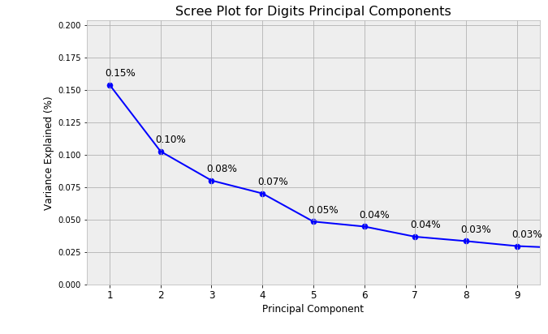

# Principal Components Analysis

- [Principal Components Analysis](#principal-components-analysis)
  - [Introduction](#introduction)
      - [Curse of Dimensionality](#curse-of-dimensionality)
      - [PCA Visualized](#pca-visualized)
  - [Basic](#basic)
    - [Part 1: Explore the data](#part-1-explore-the-data)
    - [Part 2: PCA on subset](#part-2-pca-on-subset)
  - [Advanced](#advanced)
    - [Part 3: Redundant Features](#part-3-redundant-features)

## Introduction

#### Curse of Dimensionality

> The curse of dimensionality refers to various phenomena that arise when analyzing and organizing data in high-dimensional spaces (often with hundreds or thousands of dimensions) that do not occur in low-dimensional settings such as the three-dimensional physical space of everyday experience.

The curse of dimensionality is a phenomenon that any model/technique which involves a distance metric suffers from.  Due to the number of features, even the closest data points seem very far away.  A simple way to see this is with Euclidean distance:


As __n__ grows, the distance grows without bounds.

Even models that do not explicitly use a distance metric can be affected by a high number of dimensions. A rough heuristic for a model to be effective is that you need the distance between points to be less than some value <!-- $d$ --> . For a single dimension (unit-length) this usually requires on average <!-- $\frac{1}{d}$ -->  points. If you have <!-- $p$ -->  dimensions the number of data points you need scales as <!-- $\frac{1}{d^p}$ --> .


#### PCA Visualized

To get introduced to PCA and gain some intuition behind it, we will be applying dimensionality reduction to images.  There exists a spooky example of this called [Eigenfaces](http://en.wikipedia.org/wiki/Eigenface); dimensionality reduction applied to images of faces.


This has the effect of creating composite faces which in theory can be combined (with various degrees) to reconstruct any of the original faces (as a linear superposition).  Each principal component represents some linear combination of our original feature space.  The principal component projections are defined such that each tries to capture as much variance of the original dataset (the first capturing the most, the second captures the next most variance, and so forth).

We will be performing a similar analysis on the classic MNIST dataset of handwritten digits.

## Basic
### Part 1: Explore the data

For these two questions, open up an **iPython Notebook** (but save your code in **individual.py** as you go).

1. Import the dataset.

> Hint: If you are running on a virtual machine with limited memory, you can choose to load not 10 classes but fewer. See [load_digits documentation.](http://scikit-learn.org/stable/modules/generated/sklearn.datasets.load_digits.html)


```python
from sklearn.datasets import load_digits
digits = load_digits()
```

1. Using one figure with 100 subplots in 10-by-10 grid,  display the first 100 images using `ax.imshow`.

    

    To display only the images, use `ax.set_xticks([]), ax.set_yticks([])` and  `ax.axis('off')`.

### Part 2: PCA on subset

For simplicity we will look at the first 6 digits.

1. Load the first 6 classes of the MNIST digits dataset using [scikit-learn](http://scikit-learn.org/stable/modules/generated/sklearn.datasets.load_digits.html). This is all the datapoints for the digits 0-5. You should have 1083 datapoints.

2. For PCA, it is important that our data is normalized/scaled.  Using scikit-learn's [StandardScaler](http://scikit-learn.org/stable/modules/generated/sklearn.preprocessing.StandardScaler.html), scale the digits dataset.

3. Now that we have properly scaled images, we can apply the PCA transformation.  Using scikit-learn's [PCA](http://scikit-learn.org/stable/modules/generated/sklearn.decomposition.PCA.html), project our digits dataset into lower dimensional space.  First try 10 components.

4. Due to the loss of information in projecting data into lower dimensional space, our transformation is never perfect. One way we can determine how well it worked is to plot the amount of explained variance.  Using the function snippet below, plot the amount of explained variance of each of the principal components.

    ```python
    def scree_plot(ax, pca, n_components_to_plot=8, title=None):
        """Make a scree plot showing the variance explained (i.e. variance
        of the projections) for the principal components in a fit sklearn
        PCA object.
        
        Parameters
        ----------
        ax: matplotlib.axis object
          The axis to make the scree plot on.
          
        pca: sklearn.decomposition.PCA object.
          A fit PCA object.
          
        n_components_to_plot: int
          The number of principal components to display in the scree plot.
          
        title: str
          A title for the scree plot.
        """
        num_components = pca.n_components_
        ind = np.arange(num_components)
        vals = pca.explained_variance_ratio_
        ax.plot(ind, vals, color='blue')
        ax.scatter(ind, vals, color='blue', s=50)
    
        for i in range(num_components):
    	ax.annotate(r"{:2.2f}%".format(vals[i]), 
    		   (ind[i]+0.2, vals[i]+0.005), 
    		   va="bottom", 
    		   ha="center", 
    		   fontsize=12)
    
        ax.set_xticklabels(ind, fontsize=12)
        ax.set_ylim(0, max(vals) + 0.05)
        ax.set_xlim(0 - 0.45, n_components_to_plot + 0.45)
        ax.set_xlabel("Principal Component", fontsize=12)
        ax.set_ylabel("Variance Explained (%)", fontsize=12)
        if title is not None:
    	ax.set_title(title, fontsize=16)
    ```

    

   We will see kmeans clustering, picking an appropriate value of k is very important. Here we need to pick an appropriate number of components to keep.  Looking at the plot of explained variance, we are interested in finding the 'elbow', the fewest principal components that explain the most variance.  What is the optimal number of components to keep for the digits dataset?

5. Another way to visualize our digits is to force a projection into 2-dimensional space in order to visualize the data on a 2-dimensional plane. The code snippet below will plot our digits projected into 2-dimensions on x-y axis.

    ```python
    def plot_mnist_embedding(ax, X, y, title=None):
        """Plot an embedding of the mnist dataset onto a plane.
        
        Parameters
        ----------
        ax: matplotlib.axis object
          The axis to make the scree plot on.
          
        X: numpy.array, shape (n, 2)
          A two dimensional array containing the coordinates of the embedding.
          
        y: numpy.array
          The labels of the datapoints.  Should be digits.
          
        title: str
          A title for the plot.
        """
        x_min, x_max = np.min(X, 0), np.max(X, 0)
        X = (X - x_min) / (x_max - x_min)
        ax.axis('off')
        ax.patch.set_visible(False)
        for i in range(X.shape[0]):
            plt.text(X[i, 0], X[i, 1], 
                     str(y[i]), 
                     color=plt.cm.tab10(y[i] / 10.), 
                     fontdict={'weight': 'bold', 'size': 12})
    
        ax.set_xticks([]), 
        ax.set_yticks([])
        ax.set_ylim([-0.1,1.1])
        ax.set_xlim([-0.1,1.1])
    
        if title is not None:
            ax.set_title(title, fontsize=16)
    ```

6. Using the above method, project the digits dataset into 2-dimensions.  Do you notice anything about the resulting projections?  Does the plot remind you of anything?  Looking at the results, which digits end up near each other in 2-dimensional space?  Which digits have overlap in this new feature space?

## Advanced

### Part 3: Redundant Features
Additionally, PCA can be used to get rid of redundant features, and removes the issue of multicollinearity among the feature space used to regress the dependent variable.  Let's look at the car dataset and regress mpg.

1. (Data cleaning) Use pandas to load the car dataset into a dataframe

    ```python
    cars = pd.read_table('data/cars.tsv', header=None).
    ```

    Expand the first column containing an array of numbers to a new list with pandas' built-in functions with the command

    ```python
    new_df = pd.concat([pd.DataFrame(cars.iloc[:,0].str.split().tolist()),
                        pd.DataFrame(cars.iloc[:,1])], axis=1, ignore_index=True)
    ```

    Clean the data a little bit by removing any problematic rows or columns that are not numeric and only keep the first 8 columns.

    ```python
    car_df = new_df[new_df[3] != '?'].iloc[:,:8]
    ```

   Assign column names to your new data frame with

    ``` python
    car_df.columns = ['mpg', 'cylinders','displacement','horsepower','weight','acceleration','model_year', 'origin']
    ```

    Convert the numeric values to numeric datatype

    ``` python
    float_df = car_df.apply(pd.to_numeric)
    ```
    Split off mpg to use as the target variable with the other variables as features to predict mpg. Also, 'origin' is categorical, so either split off from feature dataframe or create dummy variables.

2. Apply PCA to the feature set and explore different numbers of components.
3. Perform the same visualization of the explained variance with the scree-plot from above.  What is an ideal number of components?
4. Using statsmodels, perform a regression on the untransformed data and on the PCA transformed dataset.  How do the resulting models compare on the R-squared and Adj. R-squared values?
