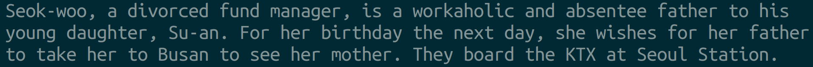
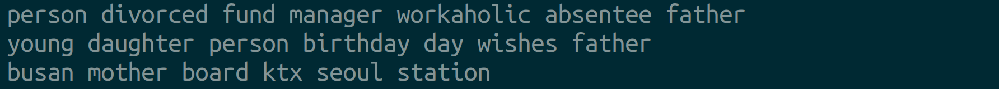
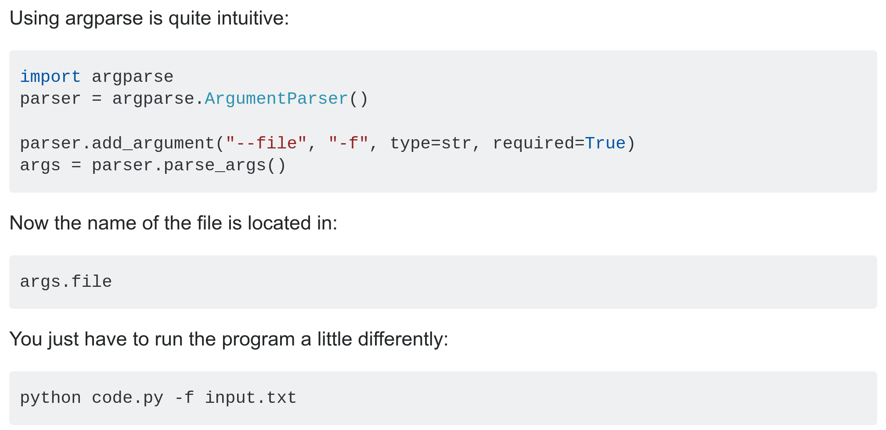

# Python

## Introduction

You're tasked with creating a text pre-processing pipeline for movie description 
clustering.  Your script should read in a movie description and write a condensed 
version that will be the input for another script that clusters the movie descriptions.  You 
aren't responsible for creating the clustering script.

Let's make the assignment more specific using an example. Clone the `python-intro` repo locally. The `data` folder 
contains a Wikipedia movie description of the 2016 South Korean thriller 
**Train to Busan**.  The description is in the text file `train_to_busan_description.txt`.

<p align="center">
    
</p>

<p align="center">source: Wikipedia</p>

You will create a script `src/description_parser.py` that takes a text file (in this case `data/train_to_busan_description.txt`) as an input 
argument and writes a condensed version of the text file as output (in this case `parsed/train_to_busan.txt`).

Note that the three files mentioned above exist in different directories, as indicated
by the text preceding the forward slash:  
* `src/`  The source directory where Python scripts (`*.py`) are stored.  
* `data/` The directory where the **original** text descriptions (`*.txt`) are stored.
* `parsed/` The directory where **parsed** text versions (`*.txt`) of the movie descriptions will be stored.
            

The script needs to run from Terminal (the command line) in the root directory of the project like so:  
```bash
$ python src/description_parser.py -i data/train_to_busan_description.txt -o parsed/train_to_busan.txt 
```

This results in the creation of `parsed/train_to_busan.txt`. Showing just the first
three lines, the images below shows how `src/description_parser.py` should tranform the 
text from the description to the parsed version.

`data/train_to_busan_description.txt`  


`parsed/train_to_busan.txt`  


As you can see, `train_to_busan.txt` is a line-by-line transcription of the 
`train_to_busan_description.txt` but with the following modifications:

* it's in a different directory (`parsed` instead of `data`)
* all the text has been **lower-cased**
* **punctuation** has been removed
* words that are common (e.g "at", "the", "for" which are often referred as stopwords) have been removed
* people's names have been replaced with "person"

This assigment will walk you through creating this application.

## Basic
### Part 1: Explore the data (and Introduction to Jupyter Notebooks)  

Before making the application let's first get a sense for what the data are like.  
In this case, you can simply navigate to the text file and read it using the command 
line utility `less`.  Try it:  
```bash
$ less train_to_busan_description.txt
```

But let's it explore it more quantitatively using Python.  Data exploration
is a perfect use-case for Jupyter Notebooks.

#### Jupyter Notebooks
> If you are during a sprint and have limited time, go to the end of this part directly to use it.

As described in the [Jupyter Notebook Quickstart Guide](https://jupyter-notebook-beginner-guide.readthedocs.io/en/latest/what_is_jupyter.html):
> Jupyter Notebook documents (or “notebooks”, all lower case) are documents produced by 
> the Jupyter Notebook App, which contain both computer code (e.g. Python) and 
> rich text elements (paragraph, equations, figures, links, etc…). Notebook 
> documents are both human-readable documents containing the analysis description 
> and the results (figures, tables, etc..) as well as executable documents which 
> can be run to perform data analysis. 

Jupyter Notebooks run the IPython interactive kernel in "Code" cells, but then allow for 
text formatting and use of sophisticated Latex rendering using MathJax (see these [examples](https://jupyter-notebook.readthedocs.io/en/stable/examples/Notebook/Typesetting%20Equations.html)) in "Markdown" cells.  This makes them a good candidate for
Python lectures to technical audiences.

One distinguishing characteristic of Jupyter Notebooks is that code is executed in cells.
Therefore you can execute a bit of code, and then in the next or (_horror_) preceding cell
query the results of code execution.

Jupyter Notebooks are also visually-pleasing graphical environments.  Plots show up naturally.

Their non-linear, iterative, cellular, and visual nature make Jupyter Notebooks a powerful
tool for rapid data exploration and visualization.  However, these same characteristics (as
well as poor git tracking/merging) sabotage their use as a way to create a sequential operating
script executable from the command line.

Very often a project will start with exploration in a Jupyter Notebook but end with an
application deployed as a script.

Let's demonstrate the use of a Jupyter Notebook to explore the `train_to_busan_description.txt`
file.  In Terminal, navigate to the `notebooks` folder of this repository.  Once inside,
open the Jupyter notebook inside and execute cell-by-cell sequentially using `shift-enter`,
carefully reading the comments and observing the syntax along the way.  Don't be afraid to add
cells and perform your own exploration and analysis.

Here's how you open a Jupyter Notebook from the command line:  

```bash
$ jupyter notebook explore_movie_description.ipynb
```

You know a file is Jupyter Notebook from its `*.ipynb` file extension.

### Part 2: Fill in the `text_parsing_functions.py` functions  

Now that you've explored the text and gained some familiarity with functions (in the
Jupyter Notebook) that could be used to clean it, let's transition to writing scripts for
the application.

This work environment requires a text editor and two Terminals.  They all should be set 
to run from the project's root directory.  You can get set-up by navigating to the 
repository from Terminal, then using VSCode to open the project, then opening up
another Terminal in the same location and executing IPython.  For example:

```bash
$ cd ~/path/to/repo/python-intro
$ code .
```
Note the space then period (.) after code above.  The period signifies the current
directory (we're inside `python-intro` so open up VSCode inside this repository).

Switch back to Terminal using `Alt + Tab` (Linux) or `Command + Tab` (Mac) then use
a shortcut to open another Terminal in the same location: `Ctrl + Shift + t` (Linux) or
`Command + t` (Mac).  In that Terminal, start IPython:  

```bash
$ ipython
```

As long as you don't have any other applications besides a web browser running (and why would you?!?), you can now easily switch between your text editor and Terminals using `Alt` or `Command + Tab`.
Note that [VSCode also has an integrated Terminal](https://code.visualstudio.com/docs/editor/integrated-terminal). You may want to start IPython there instead.  

The `description_parser.py` file will need text parsing functions to condense
the movie descriptions.  These functions _could_ be written in the `description_parser.py` 
file itself, but these text parsing functions could be useful in other applications too.

So let's develop and test the text parsing functions in a separate script - `text_parsing_functions.py` and then once they are working as desired _import_ them into the `description_parser.py` file for use.

`text_parsing_functions.py` has been started for you.  It's in the `src` folder.

1. Fill in the functions in `text_parsing_functions.py`, starting from the top.  Make sure you return values from the functions, and delete `pass` as you do. Test them as you go by calling the functions
given the provided test strings under the `# your code below` comment under the `if __name__ == '__main__':` block.  As an example, the first function has been completed and tested for you.  

We recommend that you run this script from within the IPython interactive console, so that you can query values in IPython after executing the script:

```python
In [1]: run src/text_parsing_functions.py
```

### Part 3: Try out the Python Standard Library Debugger (PDB)

Sometimes you'd like to be able to check values in functions or classes as your code executes.  Python provides a simple way to do that using the Python debugger (pdb).  As shown below, insert a `breakpoint()` into your `line_cleaning_pipeline` and execute your code.  You will be dropped into the debugger at
the `breakpoint()` where you can query values after a given line has been run.  `n` executes the current line of code.  Try it out.

```python
def line_cleaning_pipeline(text, stopwords_set, name_set, replace_val):
    breakpoint() 
    text_lc = lowercase_text(text)
    text_np = remove_punctuation(text_lc)
    text_nnl = remove_newline(text_np)
    words = split_text_into_words(text_nnl)
    words_nsw = remove_stopwords(words, stopwords_set)
    words_cleaned = replace_names(words_nsw, name_set, replace_val) 
    line_of_text_cleaned = create_cleaned_textline_from_words(words_cleaned)
    return line_of_text_cleaned
```
After entering the debugger, to see if `text_lc` evaluated correctly type `n` which evaulates the line and then type `text_lc` to see what its value is.  

An especially valuable use of the debugger is to insert a `breakpoint()` on a line immediately
before you have code that gives you some kind of execution error.  You'll be able to query
variables (like you did with `text_lc` above) to see if they contain the values you think they do!

`q` quits the debugger.

Delete the `breakpoint()` when you no longer need it.

Your course `quick-reference` folder contains a `PDB.pdf` cheatsheet listing common Python debugger commands.


## Advanced

### Part 4: Create and fill out the `description_parser.py`

Now that we have line-cleaning functions in `text_parsing_functions.py` let's import
those functions into another file so that file can use them.

2. Make a `description_parser.py` file in the `src` directory, and add the following lines
to it.

```python
from string import punctuation
from sklearn.feature_extraction.text import ENGLISH_STOP_WORDS
stopwords = ENGLISH_STOP_WORDS

import text_parsing_functions as tpf


if __name__ == '__main__':
    replace = 'person'
    names = set(['suan', 'seongkyeong', 'yonsuk', 'seokwoo', 'ingil', 'yonghuk'
                 'jinhee'])
    line_text = "pregnant wife Seong-kyeong, a high school baseball team, rich-yet-egotistical" 
    cleaned_text = tpf.line_cleaning_pipeline(line_text, stopwords, names, replace)
    print(cleaned_text)
```

Note now that this script import functions from the `text_parsing_functions.py` script and
that they are accessed using the prefix `tpf.` which we assigned.

Execute this code.  You may do it from the IPython console, or you may execute it directly
from Terminal:

```bash
$ python src/description_parser.py
```

3. `description_parser.py` needs to read in a file line-by-line and pass each line to the
line-cleaning-pipeline. Using the **With Statement** construction in this [blog](https://www.geeksforgeeks.org/read-a-file-line-by-line-in-python/), add a function to `description_parser.py` that takes
a filepath, opens it, and prints out each line.  Add
```python
filepath = 'data/train_to_busan_description.txt'
```
under your `if __name__ == '__main__':` block (INEMB).

If it doesn't work don't forget about the debugger!

4. Now refactor your function that reads and print all the lines in a file to take
each line, clean it, and then print it out.  If that works, then refactor your code
to return one large list instead, where each element in the list is one cleaned line
of text.

5. Once that's working, consult this [Stack Overflow Answer](https://stackoverflow.com/questions/7138686/how-to-write-a-list-to-a-file-with-newlines-in-python3) to learn how to write each element of a list
to a file.  Write to the `parsed` directory in the project.  Remember to specify `parsed/train_to_busan.txt`
as the path to write to.  For now put that path in your `description_parser.py` under the INEMB.


6. Finally, we'd rather not hard-code paths into our code.  We'd rather make it extensible to be
able take other files and paths from the command line.  This [Stack Overflow Post](https://stackoverflow.com/questions/7033987/python-get-files-from-command-line) succinctly describes how to use ArgumentParser
to get these arguments from the command line.

<p align="center">
    
</p>

Implement ArgumentParser so that you can execute your code like this:
```bash
$ python src/description_parser.py -i data/train_to_busan_description.txt -o parsed/train_to_busan.txt 
```
Consult the Python documentation to learn more about ArgumentParser.

Congratulations!  You may have just written your first Python application! 
