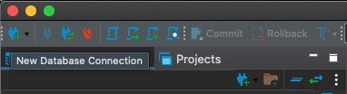
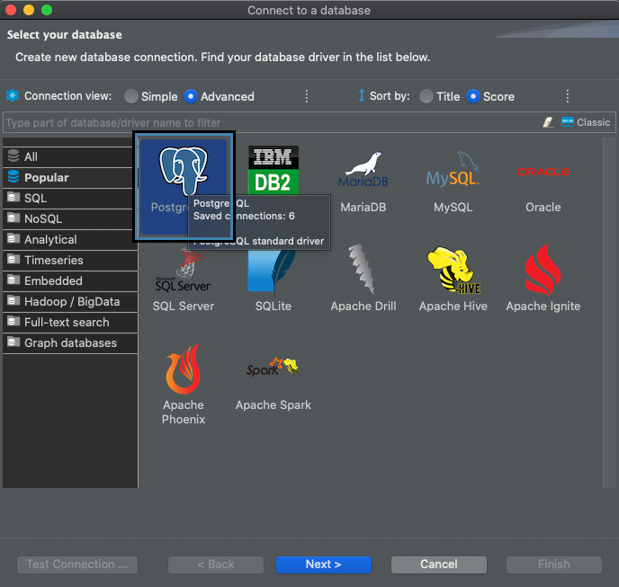
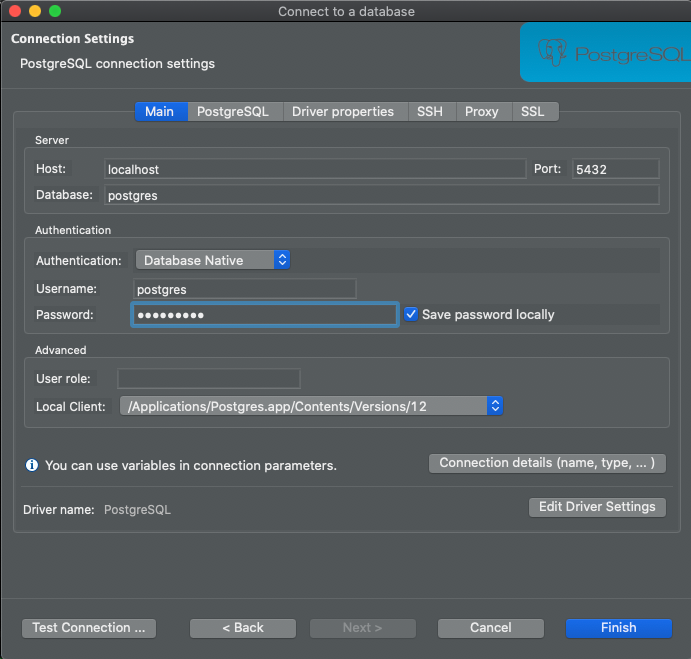
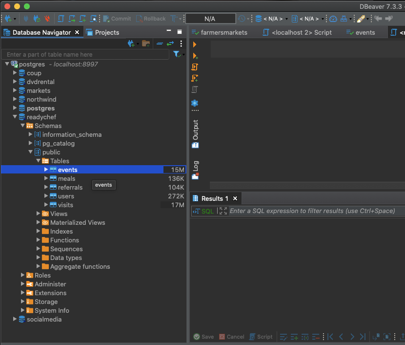

## Accessing a PostgreSQL Database using DBeaver Community Edition

Data scientists frequently write SQL using a GUI to explore SQL-based data before working with that data in Python. Frequently the GUI is proprietary or specific to the database software we are using, like PostgreSQL or MySQL. There are also general-purpose GUIs that can connect to many different types of databases. We will use one such tool, DBeaver, but there are many other options. The point of using DBeaver is to demonstrate the most common workflow for writing SQL, not to teach DBeaver specifically. 

1. Install and run [DBeaver](https://dbeaver.io/download/).
2. Click on Database > New Database Connection in the menu or click on the plug icon on the upper left corner of the screen.
   
    

3. Choose what type of database you want to connect to: there are lots of options. In our case, we are using PostgreSQL so click on that icon. If it asks to download drivers, go ahead with that.
   
    

4. You will now be looking at a connection configuration menu. You don't need to change much here. Just put in the name of the database (the default is postgres but the docker image contains others used in the course) you want to connect to and the password you set in the docker run command. The password is `galvanize` by default.

    

5. Then select the PostgreSQL tab, and check the box which says **Show all databases**. This will allow you to view all databases with one connection.

    

6. You can now browse the tables, view the column data types and begin writing SQL queries against the database. You can find the tables by navigating by navigating the following path in the database connection window: **Connection -> Database -> Schemas -> public -> Tables**. If you double click on a table name, you will get a browsable window into that table. You can go to the SQL Editor menu and select "Open SQL Console" to start writing SQL queries.

    