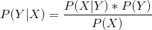
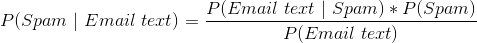
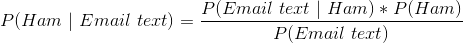
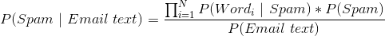
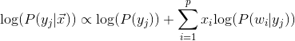
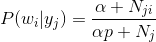
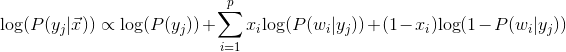
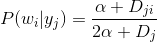
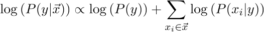

# Text Classification and Naive Bayes
- [Text Classification and Naive Bayes](#text-classification-and-naive-bayes)
  - [Introduction](#introduction)
      - [What is Bayes' Rule?](#what-is-bayes-rule)
      - [How can we use Bayes' Rule to classify?](#how-can-we-use-bayes-rule-to-classify)
      - [Naive Bayes](#naive-bayes)
      - [Calculating probabilities](#calculating-probabilities)
        - [Multinomial Likelihoods](#multinomial-likelihoods)
        - [Bernoulli Likelihoods](#bernoulli-likelihoods)
        - [Why the Laplace Smoothing?](#why-the-laplace-smoothing)
        - [Gaussian Likelihoods](#gaussian-likelihoods)
      - [Making predictions](#making-predictions)
  - [Basic](#basic)
    - [Part 1: Implementing Multinomial Naive Bayes](#part-1-implementing-multinomial-naive-bayes)
      - [Multinomial Naive Bayes](#multinomial-naive-bayes)
      - [Bernoulli Naive Bayes](#bernoulli-naive-bayes)
      - [Test](#test)
  - [Advanced](#advanced)
    - [Part 2: Applications of tf-idf and cosine similarity](#part-2-applications-of-tf-idf-and-cosine-similarity)
      - [Feature importances](#feature-importances)
      - [Ranking](#ranking)
  - [Extra Credit](#extra-credit)
    - [Part 3: Tuning and Model Comparison](#part-3-tuning-and-model-comparison)
## Introduction

In this exercise you will implement Naive Bayes classification in Python. You should rely primarily on counters and dictionaries instead of numpy arrays for this implementation.  Before we start, a bit of review:

#### What is Bayes' Rule?
<!--https://www.codecogs.com/latex/eqneditor.php
P(Y | X) = \frac{P(X | Y) * P(Y)}{P(X)}
-->


Remember, the Y here represents the target or response variable, which for our purposes will be a binary variable such as `spam` / `ham` (ham meaning "good" email) or `play golf` / `don't play golf`, and the X represents our data or feature vector.

#### How can we use Bayes' Rule to classify?
<!--https://www.codecogs.com/latex/eqneditor.php
P(Spam | Email) = \frac{P(Email | Spam) * P(Spam)}{P(Email)}
-->
  

<!--https://www.codecogs.com/latex/eqneditor.php
P(Ham| Email) = \frac{P(Email | Ham) * P(Ham)}{P(Email)}
-->
  

All we did here was replace `X` and `Y` with the things they represented.  But we have a problem here; what is the probability of a specific email?  Our classifier won't be very useful if it can only predict spam email that it has already seen.  We must make some simplifying assumptions!

#### Naive Bayes
Under Naive Bayes, we make the assumption that the probability of seeing an email is the product of the probabilities of the individual words that make up the email.  In other words:  

<!--https://www.codecogs.com/latex/eqneditor.php
P(Spam| Email) = \frac{\prod_{i=1}^N P(Word_i | Spam)* P(Spam)}{P(Email)}
-->
  

Additionally, since the denominator P(Email text) will be the same for both `spam` and `ham`, we don't need to calculate it!  If we wanted to though, we could sum the joint probabilities for all word and class combinations.

#### Calculating probabilities
Calculating the prior probabilities is pretty straightforward:  
P(Spam) = # of spam documents / # of total documents  

However, there are many possible ways for us to calculate likelihoods:

##### Multinomial Likelihoods

The probability of a word given spam is the probability of a randomly-chosen word in a randomly-chosen spam document being the current word:  
P(Word | Spam) = (Total # of times `Word` appears in all spam documents) / (Total # of words in all spam documents)

Deriving the posterior and applying smoothing gives the following formula:





Where 
 - `x_i` is the number of times word `w_i` appears in document `x` 
 - `alpha` is the smoothing parameter (usually 1)
 - `N_ji` is the count of word `w_i` across all documents of class `j`
 - `N_j` is the total count of all words in all documents of class `j`
 - `p` is the total number of unique words (features) across the corpus

##### Bernoulli Likelihoods
The probability of a word given spam is the probability of a randomly-selected spam document containing that word:  
P(Word | Spam) = (# of spam documents that `Word` appears in) / (# of spam documents)

Deriving the posterior and applying smoothing gives the following formula:





Where
 - `x_i` is either `1` or `0`, indicating the presence of word `w_i` in document `x`
 - `alpha` is the smoothing parameter (usually 1)
 - `D_ji` is the number of documents of class `j` that word `w_i` appears in
 - `D_j` is the total number of documents of class `j`

##### Why the Laplace Smoothing?
What if we run into a `Word` that we haven't seen before in a spam email?  If the probability of any word in the email is zero, then the unsmoothed P(Spam | Email) will equal 0.  For this reason, we use Laplace Smoothing by adding alpha to the numerator of the likelihood, and alpha \* the # of unique words to the denominator of the likelihood (in the case of Multinomial NB).

##### Gaussian Likelihoods
So far, our features have been discrete counts.  We can also use continuous data and assume that, within a single class, the distribution of values for each feature is Gauusian. Then, given a data point, we can write down the likelihood density of that data under each class as a product of Gaussian likelihood densities.  It might sound fancy, but a Gaussian likelihood density is nothing more than the product of a bunch of PDF values calculated from the conditional mean and standard deviation.

For example, if a new document has an average sentence length of 5, and mean average sentence length of all spam documents is 7 with a stdev of 2, the likelihood density `P(x = 5 | spam)` would be:

```
In [6]: scs.norm(7,2).pdf(5)
Out[6]: 0.12098536225957168
```

Note: Again we're making the "naive" assumption that there is no correlation between all of the continuous features.

#### Making predictions

Given an e-mail's text, what class do we say it belongs to? Whichever one has the highest posterior probability! For computational reasons, we deal with the log of the posterior



Read this as: **"The log of the probability of class y given feature vector x is proportional to the log of the probability of class y plus the sum of the logs of the probabilities of each item in the feature vector x given class y"**

In our case, we are determining the probability of spam or not spam given the text content of the email.  `P(y)` is the frequency class `y` in the training set (our prior), and `P(x_i|y)` is the likelihood of word `x_i` given class `y` (which may either be a Bernoulli or Multinomial likelihood as described above).

For a data point `x`, calculate `log(P(y|x))` for each class in your training set, and then the class with the maximum log probability will be the most likely class for that point.

Here is [scikit-learn's description of the Naive Bayes algorithm](http://scikit-learn.org/stable/modules/naive_bayes.html); you may find it helpful as well!

## Basic

### Part 1: Implementing Multinomial Naive Bayes
> Expected time of completion: 50 mins.

#### Multinomial Naive Bayes
1. Run `pytest test/test_naive_bayes.py` to see how your implementation will be tested & what kind of data to expect as the input. It is expected that you will see several errors.

2. Open `src/naive_bayes.py` and look at the `fit` method in the MultinomialNaiveBayes class definition. This method does all the counting necessary to compute likelihoods: number of documents of each class, total word count across all documents for each class, and individual word counts for each class.

3. Implement the `_compute_likelihoods` method. This is the majority of work we will need to do to train the model.

    * The `class_counts` attribute should contain the total number of observations (documents) for each class. The keys of the `class_counts` dictionary should be the labels.

    * The `class_feature_counts` attribute should contain the total number of times a specific word has appeared for a specific type of document (eg. spam / not spam). This is a dictionary of dictionaries (technically a defaultdict of Counters). You should be able to access this dictionary like this: `class_feature_counts[class_y][feature_j]`.  For example, typing `class_feature_counts["spam"]["nigeria"]` should give you the number of times the word "nigeria" was used across all spam emails.
    
    * The `class_total_feature_counts` attribute should contain the total wordcount across all documents for each class. This is a dictionary of `int`s: `class_total_feature_counts["spam"]` should give you the total number of words (not unique words!) appearing in spam emails. 

    This is all we need! We will be doing the Laplace smoothing when we compute the posteriors. As you go, you can run `pytest test/test_naive_bayes.py` to verify you've correctly implemented each method.

4. Implement the `posteriors` method. For each row in the feature matrix `X` and for each potential label, you will need to calculate the log likelihood. You should follow the formula from above.  The `predict` method then returns the class with the largest probability for each data point.

5. Run `pytest test/test_naive_bayes.py` to verify you've correctly implemented the above.

6. Run the `run_naive_bayes.py` script that contains code to load & tokenize the NY Time data set to verify that your implementation agrees with the Sklearn implementation. Note that this question depends on previous [nlp assignment](https://github.com/GalvanizeDataScience/nlp). To reduce running time we're only loading the 'Sports' and 'Fashion & Style' articles.  Fit the dataset using your Naive Bayes implementation. This scirpt also tries to find the words that have the greatest discriminatory power (ie. the ratio between P(Word | Sports) and P(Word | Fashion & Style) is either very large or very small). Spend some time to understand how it is done.

#### Bernoulli Naive Bayes

7. `src/bernoulli_naive_bayes.py` contains stub code for a BernoulliNaiveBayes class; you can run tests for it with `pytest test/test_bernoulli_naive_bayes.py`.  Much of the implementation is the same as what you've written above, so you may wish to refactor the common code in the two classes to a class like `BaseNaiveBayes` that both the Multinomial and Bernoulli versions could inherit from.  However, this is not required.

#### Test

8. With your new class, fit the NYT data from step 5 and see if this way of encoding document content (word presence/absence vs. word counts) provides more discriminatory power.  Are the most discriminatory words the same under both kinds of naive Bayes, or different?

## Advanced

### Part 2: Applications of tf-idf and cosine similarity
> Expected time of completion: 50 mins.

Tfidf can be used for purposes other than just classification. In this exercise we will explore using tfidf to highlight important topics and to compare the topics of different documents.

For this exercise we will use the [20 News groups corpus](http://qwone.com/~jason/20Newsgroups/) (a canonical NLP text). [scikit-learn](http://scikit-learn.org/stable/datasets/twenty_newsgroups.html) and [nltk](http://www.nltk.org/nltk_data/) both have utilities for loading in the dataset.

#### Feature importances

For a given corpus you can rank words (features) by their average (or total) tf-idf score across documents or simply consider words with the highest term frequency across your corpus.

1. For 4 groups (classes) of the 20newsgroups corpus (your choice), find the 10 most important words by:
    * total tf-idf score
    * average tf-idf score (average only over non-zero values)
    * highest tf (only) score across corpus (try using `use_idf = False` in `TfidfVectorizer` )

2. Do the top 10 words change based on each of the different ranking methods?

3. Also do this for each category of article (each of the 20 newsgroups) and compare the top words of each. You should treat each category of newsgroup as a separate "corpus" for this question.

#### Ranking

You can use cosine similarity to rank the relevance of a document to a given search query using the following process:
* Convert a search query into a feature vector, treat the query as a document in your corpus and apply tf-idf vectorizing to it.
* Normalize your query vector and all of your document vectors (since documents are often much longer than a query)
* Compute the cosine similarity between the search query and each of your documents
* Rank the documents by their similarity score

Sample queries are available in `data/queries.txt`.

1. For each query, find the 3 most relevant articles from the 20 Newsgroups corpus.

## Extra Credit

### Part 3: Tuning and Model Comparison
> Expected time of completion: flexible

Try to run each of these other classifiers over a dataset and compare the results.

1. Load in the data.

   ```python
    newsgroups_train = fetch_20newsgroups(subset='train', categories=['alt.atheism', 'sci.space', 'sci.med','sci.space','soc.religion.christian','talk.politics.guns',])
    data = newsgroups_train.data
    labels = newsgroups_train.target
    le = LabelEncoder()
    y = le.fit_transform(labels)
    return np.array(data), np.array(y)
   ```

2. To create the label vector `y`, use sklearn's [LabelEncoder](http://scikit-learn.org/stable/modules/generated/sklearn.preprocessing.LabelEncoder.html) to convert the strings to integers. The code is provided for you in the code block above as well.

3. For all of your models, you should use [TfidfVectorizer](http://scikit-learn.org/stable/modules/generated/sklearn.feature_extraction.text.TfidfVectorizer.html) to create a feature matrix of the text.

   Tf-idf will create a feature matrix where each word is a feature.

   **Note:** You should fit the tfidf vectorizer on the *training set only*! Don't use the test set to build your training feature matrix, or you are using the test set to help build your model! You should do something like this, if `data` is a list of strings of the text of the documents.

   ```python
   data_train, data_test = data[train_index], data[test_index]
   tfidf = TfidfVectorizer()
   X_train = tfidf.fit_transform(data_train)
   X_test = tfidf.transform(data_test)
   ```

4. Use sklearn's implementation of Naive Bayes: [MultinomialNB](http://scikit-learn.org/stable/modules/generated/sklearn.naive_bayes.MultinomialNB.html). Use cross validation to find the optimal value for the laplace smoothing constant.

5. Try running the classifiers we've learned about so far:

   * Logistic Regression
   * kNN
   * Decision Tree
   * Random Forest
   * AdaBoost
   * Gradient Boosting
   * SVM
   * Naive Bayes

   Note that to use some of these models, you will need to use tactics to deal with multiple classes. SVMs and Logistic Regression only work on binary predictions. kNN, Decision Trees, Random Forests and Naive Bayes are naturally multiclass. There are two techniques for dealing with making multiclass classification problems into binary problems:

   * One-Vs-All: For each of the labels, build a model which predicts True or False for that label. (faster!)
   * One-Vs-One: For each pair of labels, build a model which predicts which of those two labels is more likely.

   Sklearn has these implemented already, and you can read about them [here](http://scikit-learn.org/stable/modules/multiclass.html).

   In the interest of time, use any cross validation technique you see fit.

   Which models get the best accuracy?

   If you have time, do a grid search to get the best parameters for each model so you can do a fair comparison.

6. Use the `time` module to get the runtime of each of the models like this:

   ```python
   import time

   start = time.time()
   # do some stuff
   end = time.time()
   print("total time:", end - start)
   ```

   Which models are the fastest to train? To predict?
