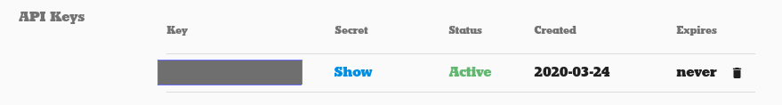

# Web scraping

- [Web scraping](#web-scraping)
  - [Basic](#basic)
    - [Part 1: Using the PyMongo Client](#part-1-using-the-pymongo-client)
    - [Part 2: Finding by Class](#part-2-finding-by-class)
  - [Advanced](#advanced)
    - [Part 3: Using a Web API to get meta data](#part-3-using-a-web-api-to-get-meta-data)
    - [Part 4: Scraping using the meta data](#part-4-scraping-using-the-meta-data)
  - [Extra Credit](#extra-credit)
    - [Part 5: User Login](#part-5-user-login)
    - [Part 6: Client side templating](#part-6-client-side-templating)

## Basic
### Part 1: Using the PyMongo Client

The PyMongo Client resembles Python much more than the Mongo shell. In most applications, you will use PyMongo to interact 
with your Mongo Database as part of your data pipeline. 

1. Use the following snippet to start a Pymongo client and access a database 
   and a collection (table) within that database. Note that if the database 
   and collection you try to access doesn't exist, the PyMongo client will initiate 
   it for you. 
 
   ```python
   from pymongo import MongoClient
   client = MongoClient('localhost', 27017)
   # Access/Initiate Database
   db = client['test_database']
   # Access/Initiate Collection
   test_collection = db['test_collection']
   ```

2. Insert an entry into the collection you have initiated. Check if the entry 
   is inserted from the mongo shell. Query the inserted entry using PyMongo. 
   For some help on this, look for **Querying for More than One Document**
   in the [tutorial.](https://pymongo.readthedocs.io/en/stable/tutorial.html)

3. Try [updating the entry](https://www.w3schools.com/python/python_mongodb_update.asp).
   you have inserted and verify that it has been updated.

### Part 2: Finding by Class

CSS classes are used when the web developer wants to apply several formatting 
rules to a section of the page. Often the same CSS class is reused (e.g. every
review block will be formatted the same). As scrapers, we can use these CSS
classes to grab the elements that we care about.

The best way to discover what CSS selectors are used by a page is to use the 
`Inspect Element` tool in the Google Chrome browser (Firefox also has this 
tool). We will walk through the work flow in the exercise below.

**Hosting the websites on the internet (optional)**

   1. If you want to finish this exercise by accessing an actual url other than local files. You can upload the `ebay_shoes.html` and the corresponding `ebay_shoes_files` (file structure must be maintained) to an AWS S3 bucket and made the files public. **Do make sure delete these files from S3 bucket after exercise**.

   2. Another easier option, if AWS is not taught yet, is to zip both the html file ( you need to rename it to `index.html` since it is the default entry point of a website) and the `ebay_shoes_files` and upload them onto free static web hosting service like [tiiny.host](https://tiiny.host/). The files then will be accessible in for days for example.

Your tasks for part 2 includes the following.

1. Open up `data/ebay_shoes.html` with Google Chrome. It should be as shown below.

   
   
2. Right click on the first shoe image and click `Inspect Element` to bring up 
   a panel, as seen below.

   

3. You should find a line which contains `class="...."`. Make note of this 
   class.

4. We'd like to search for all of the shoe elements. We'll later use the class
   that we noted in `3` in our python code, but first we'd like to make sure we have 
   it correct. You can do this by writing this code in the Console: 
   `$('.classname')` (you will need to replace `.classname` with the class 
   that we have noted).

   Note that if you found something like `class="one two"`, you actually have 
   two classes, `one` and `two`. In this case, we can search for them like 
   this: `$('.one.two')`.

   

5. Open up IPython in your terminal and import Beautiful Soup with the line 
   `from bs4 import BeautifulSoup`.  Read `data/ebay_shoes.html` in as one 
   string from the file and put it into a `BeautifulSoup()` object with the 
   line `soup = BeautifulSoup(html_str, 'html.parser')`.

   You should be able to use the CSS selector that you found in `3` on the 
   soup using `soup.select('your css selector')` (e.g. `soup.select('.one.two')`).

   You can alternatively do the same search like this: 
   `soup.find_all(class_='one two')`.

   This will return a list of tags that contain the css selector. In our case,
   this will return a list of tags that contain the paths to our shoe image 
   locations. Create a list of these paths by looping through the list of tags 
   and accessing the image path using `tag['src']`.

6. Loop through the list of paths you created in `5`, reading in each file as 
   a string and writing it to a new directory named `images`. When you're done, 
   open the files in the `images` directory to ensure the images are saved 
   properly.

7. This is the basic work flow of web scraping with CSS selectors. Realistically, 
   you would not be reading in a local html file, but reading it from a link 
   instead. For practice, go to ebay, search for a product of your choice, and 
   copy the link to the search results. Use the `.get()` function in the [`requests` library][requests]
   to retrieve the html. The `.get()` function returns a raw response, and 
   accessing the `content` attribute of the response (`response.content`) 
   returns the html as a string.
   
8. Retrieve the images from your selected page by following the web scraping work flow.  

## Advanced

### Part 3: Using a Web API to get meta data

We do not always have to web scrape. Sometimes the web site provides an API to 
access its information. A web site API is usually just a set of endpoints 
(URL paths) that we can issue get requests to and get back nicely formatted
data (as opposed to having to use BeautifulSoup to parse it). APIs are 
usually easier to use than working with CSS selectors using BeautifulSoup. 
In the following exercise we will be using the NYT [API][NYT-API] to 
programmatically retrieve its articles.

1. Obtain an API key from the NYT for the [Article Search API][NYT-API-register]. 
   Follow the steps carefully. Once you've created a new App, your API key will be in the API Keys section (obscured here for security).  Hover over it to add it to your clipboard:
   
   

2. To avoid writing your API key in your code (which would then be pushed to github), add the following line to your `~/.bash_profile` or `~/.zsh_profile`:

   ```export NYT_API_KEY="yourkeyfromstepone"```
   
   You many need to source your `.bash_profile` and reopen your jupyter notebook if you're using one.

   ``` source ~/.bash_profile``` or

   ```source ~/.zsh_profile```
   
3. Now that we have access we can begin to have some fun!  Make a request to 
   the article search API endpoint to retrieve the metadata of the articles 
   for the last week.  

    * Look for what [parameters][NYT-Article-Search] you can set in your 
      requests using the API
    * Use the [`requests`][requests] module to interact with the API. 
    * Use the `os` module to read your API key from your system's environment variables

    ```python
    import requests
    import os 
    
    def single_query(link, payload):
        response = requests.get(link, params=payload)
        if response.status_code != 200:
            print('WARNING', response.status_code)
        else:
            return response.json()
    
    if __name__ == '__main__':
        link = 'http://api.nytimes.com/svc/search/v2/articlesearch.json'
        payload = {'api-key': os.environ['NYT_API_KEY']}
        html_str = single_query(link, payload)
    ```

    **Note: We are using `os.environ` to read your API key so that you never type it out explicitly! Make sure you don't push up your API KEY to github. You should get in the habit of never pushing up this kind of information to github.**

4. Examine the metadata of one of the articles returned.  Look at its 
   structure and the fields returned.  Make sure you can get a single 
   article's metadata (and you know what it looks like) before you retrieve 
   the metadata for __ALL__ of the NYT articles. Note that this article 
   metadata **does not** include the full text of the article, but that 
   one of its fields gives us a URL that we can use to get the full text of 
   the article. 

5. Now that you have some experience with the API and can successfully access 
   articles with their associated metadata, it is time to start storing them 
   in [MongoDB](http://www.mongodb.org/)! Since you have a sense of what a 
   single article response looks like, we can begin to scale up. Begin 
   downloading all of the NYT articles' metadata, starting with the most recent.
   You will not have time (or effort) to download all of the corpus, so let 
   us start with the most recent articles and download as many as we can! 
   Again, store these in mongoDB.

6.  Inspect how many articles were returned from your request for all of the NYT. 

    * How many documents are there?  
    * How many total articles are there in all of the NYT?  
    * Look to the API docs for the Article Search API to learn about why there 
    is a discrepancy between these two numbers (and how to find the second 
    number -- total articles)

    **Hint**: Look at the "Using Facets" section in the API docs

7. The NYT does some things to prevent us from getting it's articles. But we 
   are clever data scientists (cleverer than the NYT API that is)!
    * Find out how to circumvent the API pagination.
    * The NYT is rate limited.  Deal with it.
    * The API only lets you access a fixed number of pages (from the 
    pagination). What is this number and how can you get around this 
    limit?

    **Hint**: Consider using `time.sleep()` to limit your calls per second, 
    and playing with the `page` and `end_date` parameters passed to the API
    endpoint in your requests. 

8. Once you have figured how to deal with the NYT quirks, we are ready to start 
   looping. Begin to download the 10,000 most recent NYT articles.

    * You will want to check how your loop is progressing. To do so, be sure 
    to print some checkpoint information on how many documents it has
    downloaded (maybe every 100 articles?).  

### Part 4: Scraping using the meta data

**At this point:**: 

- **We have successfully gathered article metadata from the NYT API**
- **We have stored said metadata in MongoDB**
- **We have URLs for each article that we can now use for scraping the full text**

1. Now that we have all the meta data, it it time to get the article content! 
We will be doing something I call a data join (some people call it 
[data blending][data-blending]... but they charge you money so they can call 
it that). 
    
    * Iterate over your collection of article metadata in your database.  For 
    each article's metadata, use the 'web url' in the metadata to make a web 
    request.
  
    * Use Beautiful Soup to parse the returned HTML. Make sure to initialize 
    `soup` with: `soup = BeautifulSoup(response.text, 'html.parser')`
      
    * Add a new field to each article's metdata in your Mongo database to 
    store the raw HTML from the web page.
    
    * Find the CSS selectors that would allow you to extract the article text 
    in the web pages. You can use the Chrome DevTools to help you find the 
    relevant CSS Selectors. If you are having problems such as `$ is not a 
    function`, use the following script to load in the jQuery library and 
    then try again.
  
        ```js
        var jq = document.createElement('script');
        jq.src = "https://ajax.googleapis.com/ajax/libs/jquery/1/jquery.min.js";
        document.getElementsByTagName('head')[0].appendChild(jq);
        ```
      
    * Use `soup.select(Your CSS Selector)` to extract the article text from the 
    web pages.
    
    * Add a new field to each article's metadata in your Mongo database to 
    store the text of the articles.

You have made it to the end (hopefully successfully)!  Now that you have your 
data and have contextualized it with information from the web, you can start 
performing some interesting analysis on it.

## Extra Credit

### Part 5: User Login

Scraping sites is easy when you can have clear access to the content and it is 
in a semi-structured form.  One issue that arises with scraping sites is the 
need to login.  

1. Find a site that you might want to get data from that requires a login.

* Use a [requests session][advanced-requests] to login to a site to scrape.


### Part 6: Client side templating

Some sites do what is called [client side templating][client-side-templating]. 
Basically, you only send data from the server - you write a bunch of Javascript
to dynamically write HTML when the page loads.

1. Find a site that templates on the client.
2. Look at the [Chrome Developer Tools][chrome-developer] to find which 
"Resource" the data came in.  

**Hint, look for a JSON file**


[requests]:http://docs.python-requests.org/en/latest/
[NYT-API]: https://developer.nytimes.com/docs/articlesearch-product/1/routes/articlesearch.json/get
[NYT-API-register]:https://developer.nytimes.com/get-started
[NYT-Article-Search]:https://developer.nytimes.com/docs/articlesearch-product/1/overview
[data-blending]:http://www.tableausoftware.com/videos/data-integration
[advanced-requests]:http://docs.python-requests.org/en/latest/user/advanced/
[client-side-templating]:http://www.smashingmagazine.com/2012/12/05/client-side-templating/
[chrome-developer]:https://developers.google.com/web/tools/chrome-devtools/manage-data/local-storage?hl=en
[gschool-aws-and-the-cloud]:https://github.com/gschool/dsi-aws-and-the-cloud#assignment
[cron]:http://www.unixgeeks.org/security/newbie/unix/cron-1.html
[python-scheduler]:https://github.com/dbader/schedule
