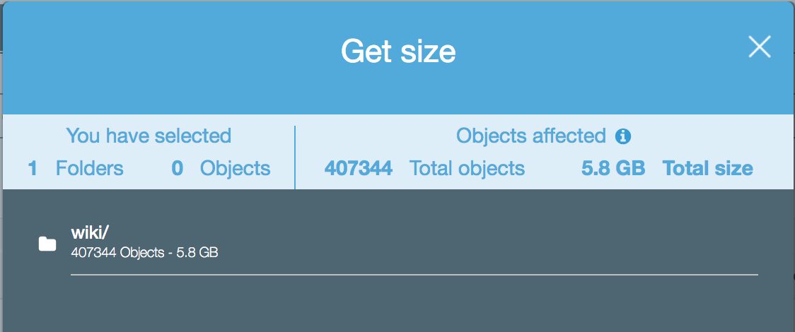

# NLP On Large Datasets
In today's case study, you will be using several skills from 
the previous weeks, including AWS, Spark, NLP, and SVD (or other
matrix factorization techniques).

## The Scenario
Today is your first day working for a large firm that does advertising.
Your supervisor tells you that they want to build a dense language
representation based on a set of neutral data.  Luckily, they knew this
task was coming up, so they have a collection of nearly every English
language Wikipedia page stored in an S3 bucket.  Your job is to use
this data to create a dense representation of words.

## The Data
The data is on 
<a href="https://s3.console.aws.amazon.com/s3/buckets/jgartner-test-data/?region=us-east-2&tab=overview">this S3 bucket</a>.
There are several folders in this bucket, but only two that are relevant
for your task.  The entire data set is located in the "wiki" folder.

This folder contains text files, where the content of the file is the
body of Wikipedia page, and the file name is the page title.  There
is a non-trivial amount of clean up that needs to be performed to 
get the data to the point where it can be analyzed. We can see that 
this folder has a huge amount of items, and will be difficult to 
work with initially.  Luckily, there is a smaller folder "text" that
only contains the small number of pages where "zero" is the first word
in the page title.  Consider (strongly!!!!) developing cleaning functions
on this data before moving on to other tasks.

Your very first task will be to copy the data to your own S3 bucket.  This
might take some time, but will speed things up in the long run.

## Procedure
Roughly, your steps are to:
<ul>
<li>Clean the data</li>
<li>Do EDA</li>
<li>Perform Basic NLP Tasks</li>
<li>Create a Word to vector representation of your documents</li>
<li>Test your word vectors</li>
</ul>

## Deliverable
At every step in this process you will be making decisions.  <b>Think</b>
about everything you do. Presentation of why you chose to do what you did is due EOD. 

