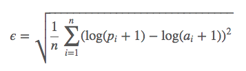

# Predict Heavy Equipment Auction Price

- [Predict Heavy Equipment Auction Price](#predict-heavy-equipment-auction-price)
  - [Case Study Goal](#case-study-goal)
    - [Evaluation Metrics](#evaluation-metrics)
  - [Backgrounds](#backgrounds)
  - [Data](#data)
  - [Overview of the `loss_model.py` script](#overview-of-the-loss_modelpy-script)
  - [Credit](#credit)
  - [Appendix](#appendix)
    - [Important Tips](#important-tips)
    - [Restrictions](#restrictions)

## Case Study Goal
Predict the `sale price` of a particular piece of heavy equipment at auction, based
on its usage, equipment type, and configuration.  The data is sourced from auction
result postings and includes information on usage and equipment configurations.

### Evaluation Metrics
The evaluation of your model will be based on Root Mean Squared Log Error.
Which is computed as follows:



where *p<sub>i</sub>* are the predicted values (predicted auction sale prices) 
and *a<sub>i</sub>* are the actual values (the actual auction sale prices).

Note that this loss function is sensitive to the *ratio* of predicted values to
the actual values, a prediction of 200 for an actual value of 100 contributes
approximately the same amount to the loss as a prediction of 2000 for an actual
value of 1000.  To convince yourself of this, recall that a difference of
logarithms is equal to a single logarithm of a ratio, and rewrite each summand
as a single logarithm of a ratio.

This loss function is implemented in [`loss_model.py`](./loss_model.py). Read it to understand how it works.

## Backgrounds

Please check the original Kaggle contest [page]((https://www.kaggle.com/c/bluebook-for-bulldozers)).

## Data
The data for this case study are in `./data`. Although there are both training
and testing data sets, the testing data set [test.csv](./data/test.csv) should **`only`** be utilized to evaluate
your final model performance at the end of the day. Also, the ground truth of the test data is in [ground_truth/test_actual.csv](./data/ground_truth/test_actual.csv). Think about it as your
hold out set.  Use cross-validation on the training data set [train_1.csv](./data/train_1.csv) and [train_2.csv](./data/train_2.csv) to identify your
best model and report the performance of your best model on the test data at the end of the day.

> Hint: use `cat` to concatenate `train_1.csv` and `train_2.csv` to a single `train.csv` file.
  ```bash
  cat train_1.csv train_2.csv > train.csv
  ```

By using the same test data and the same evaluation metric (RMSLE) the relative
performance of different group's models on this case study can be assessed.

A [data_dictionary.csv](./data/data_dictionary.csv) is included that explains the columns in the data.

## Overview of the `loss_model.py` script
Included is a loss function to test your predictions of the test set against the provided hold out test set.  This follows a common setup in competitions such as Kaggle, where this came from.  In these types of setups, there is a labeled train set to do your modeling and feature tuning.  There is also a provided hold-out test set to compare your predictions against.  You will need to fit a model on the training data and get a prediction for all the data in the test set.  You will then need to create csv containing the field 'SalesID' and 'SalePrice' (must match exactly). An example file is created for you [Example_Output.csv](./data/Example_Output.csv). This csv file will be the input parameter to running the function.
Example:
In terminal:

```bash
python loss_model.py <path to csv file>
```

For example, the following command returns `0.7802091986822471`
```bash
python loss_model.py data/Example_Output.csv
```


## Credit
This case study is based on [Kaggle's Blue Book for Bulldozers](https://www.kaggle.com/c/bluebook-for-bulldozers) competition.  The best RMSLE was only 0.23 (obviously lower is better).
>  Note that if you were to simply guess the median auction price for all the pieces of equipment in the test set you would get an RMSLE of about 0.7.

## Appendix

### Important Tips

1. This data is quite messy. Try to use your judgement about where your
cleaning efforts will yield the most results and focus there first.
2. Because of the restriction to linear models, you will have to carefully
consider how to transform continuous predictors in your model.
3. Remember any transformations you apply to the training data will also have
to be applied to the testing data, so plan accordingly.
4. Any transformations of the training data that *learn parameters* (for
example, standardization learns the mean and variance of a feature) must only
use parameters learned from the *training data*.
5. It's possible some columns in the test data will take on values not seen in
the training data. Plan accordingly.
6. Use your intuition to *think about where the strongest signal about a price
is likely to come from*. If you weren't fitting a model, but were asked to use
this data to predict a price what would you do? Can you combine the model with
your intuitive instincts?  This is important because it can be done *without
looking at the data*; thinking about the problem has no risk of overfitting.
7. Start simply. Fit a basic model and make sure you're able to get the submission 
working then iterate to improve.

8. Remember that you are evaluated on a loss function that is only sensitive to
the *ratios* of predicted to actual values.  It's almost certainly too much of
a task to implement an algorithm that minimizes this loss function directly in
the time you have, but there are some steps you can take to do a good job of
it.

### Restrictions
Please use only *regression* methods for this case study.  The following techniques
are allowed.

  - Linear Regression.
  - Logistic Regression.
  - Median Regression (linear regression by minimizing the sum of absolute deviations).
  - Any other [GLM](http://statsmodels.sourceforge.net/devel/glm.html).
  - Regularization: Ridge and LASSO.

You may use other models or algorithms as supplements (for example, in feature
engineering), but your final submissions must be losses from a linear type
model.

## Credit
This case study is based on [Kaggle's Blue Book for Bulldozers](https://www.kaggle.com/c/bluebook-for-bulldozers) competition.  The best RMSLE was only 0.23 (obviously lower is better).  Note
that if you were to simply guess the median auction price for all the pieces of equipment in
the test set you would get an RMSLE of about 0.7.