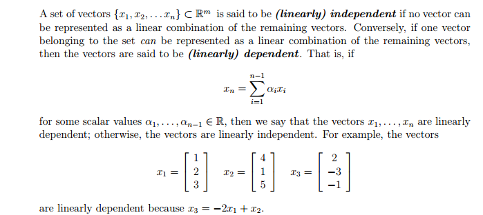

Linear Algebra and Numpy
========================

1. [What is Linear Algebra?](#what-is-linear-algebra)
1. [Matrices and Vectors](#matrices-and-vectors)
     1. [Dimensions](#dimensions)
     1. [Transpose](#transpose)
     1. [Indexing in numpy](#indexing-in-numpy)
     1. [Modifying numpy vectors and matricies](#modifying-numpy-vectors-and-matricies)
     1. [Concatenate](#concatenate)
     1. [Scalar Operations](#scalar-operations)
     1. [Elementwise Operations](#elementwise-operations)
     1. [Matrix Multiplication](#matrix-multiplication)
     1. [Identity Matrix](#identity-matrix)
     1. [Axis wise operations](#axis-wise-operations)
     1. [Rank](#rank)
     1. [Inverse](#inverse)
1. [Feature Matrix](#feature-matrix)


# What is Linear Algebra?

Linear algebra is about being able to solve systems of equations in an efficient manner.

Let's start with a basic example of an equation:

     4y - 5z = -13
    -2y + 3z = 9

What values of `y` and `z` satisfy this equation?

To rewrite the equation, we can put the values into matrices:

    X =  4 -5    
        -2  3
   
    y = -13
          9

    b =  y
         z
    
Now the equation can be written as `Xb = y`.

Solving this by hand can take a long time. With matrices, there are a lot of established rules of math that come in to play that allows us to do computations efficiently.


# Matrices and Vectors

Matrices are a 2d brick of numbers. Vectors are a 1d matrix.

Here is an example matrix


2 kinds of vectors, row and column. A row vector is a 1 x n vector where n is the number of columns. A column vector is an m x 1 vector where m is the number of rows. They are transposes of each other (review of that coming up).

Pictured below:


In numpy, we can create matrices and vectors as follows:

```python
import numpy as np

mat = np.array([[4, -5], [-2, 3]])
vect = np.array([-13, 9])
column_vect = np.array([[13], [9]])
```

You can also initialize a numpy array with all zeros or all ones:
```python
In [1]: np.ones((2, 4))
Out[1]:
array([[ 1.,  1.,  1.,  1.],
       [ 1.,  1.,  1.,  1.]])

In [2]: np.zeros((3, 2))
Out[2]:
array([[ 0.,  0.],
       [ 0.,  0.],
       [ 0.,  0.]])
```

Now we'll get into some different matrix operations and what we can do with numpy.


## Dimensions

The dimensions of a matrix are generally written as rows x columns. In numpy, we can get the dimensions of a matrix using `shape`.

```python
In [1]: A = np.array([[2, 3, 5], [4, 5, 6]])

In [2]: A.shape
Out[2]: (2, 3)

In [3]: np.shape(A)
Out[3]: (2, 3)
```

Note that there is both a `shape` function and a `shape` method. You can use either.


## Transpose

`A^T` (or `A'`) is `A` transpose. This flips the columns and rows of the matrix. A quick example:

    A =   6  10   9
         11   1   3

    A' =  6  11
         10   1
          9   3

In numpy:

```python
In [1]: A = np.array([[6, 10, 9], [11, 1, 3]])

In [2]: A.transpose()
Out[2]:
array([[ 6, 11],
       [10,  1],
       [ 9,  3]])

In [3]: A.T
Out[3]:
array([[ 6, 11],
       [10,  1],
       [ 9,  3]])
```

Note that there is both a `transpose` method and a instance variable `T`. The main difference is that if you use `A.T` and then modify the result, you will also be modifying `A`.

If you want to convert a vector to a column vector, just taking the transpose will not work because it is a vector. You can do this using `reshape`:

```python
In [1]: v = np.array([2, 3, 4])

In [2]: v.reshape((3, 1))
Out[2]:
array([[2],
       [3],
       [4]])
```

You can also make a vector into a row vector:
```python
In [3]: v.reshape((1, 3))
Out[3]: array([[2, 3, 4]])
```

Note that I used the `reshape` method. There is also a `reshape` function and it doesn't matter which you use:

```python
In [4]: np.reshape(v, (3, 1))
Out[4]:
array([[2],
       [3],
       [4]])
```


## Indexing in numpy

Let's go through the syntax for getting specific values, rows or columns from a numpy array.

For our examples, we'll be using the following vector and matrix:

```python
In [1]: v = np.array([6, 8, 2, 5, 1])

In [2]: A = np.array([[3, 7, 2, 5], [9, 8, 1, 6], [2, 4, 6, 3]])

In [3]: A
Out[3]:
array([[3, 7, 2, 5],
       [9, 8, 1, 6],
       [2, 4, 6, 3]])
```

To get a single entry:

```python
In [4]: v[3]
Out[4]: 5

In [5]: A[1,2]
Out[5]: 1

In [6]: A[1][2]    # equivalent to above
Out[6]: 1
```

To get a row or column from a matrix:

```python
In [7]: A[1]    # row
Out[7]: array([9, 8, 1, 6])

In [8]: A[:,1]    # column
Out[8]: array([7, 8, 4])
```

To slice:

```python
In [9]: v[1:4]
Out[9]: array([8, 2, 5])

In [10]: A[0:2,1:3]
Out[10]:
array([[7, 2],
       [8, 1]])
```


## Modifying numpy vectors and matricies

Numpy arrays can't change size or dimensions, but you can modify their values.

```python
In [11]: A
Out[11]:
array([[3, 7, 2, 5],
       [9, 8, 1, 6],
       [2, 4, 6, 3]])

In [12]: A[1,0] = 10

In [13]: A
Out[13]:
array([[ 3,   7,   2,   5],
       [10,   8,   1,   6],
       [ 2,   4,   6,   3]])
```

You can modify any slice. You can fill it in with a scalar.

```python
In [14]: A[0:2,1:3] = 22

In [15]: A
Out[15]:
array([[ 3, 22, 22,  5],
       [10, 22, 22,  6],
       [ 2,  4,  6,  3]])
```

Or you can fill it in with another array of the appropriate size.

```python
In [16]: A[:,2] = np.array([11, 12, 13])

In [17]: A
Out[17]:
array([[ 3, 22, 11,  5],
       [10, 22, 12,  6],
       [ 2,  4, 13,  3]])
```

If you want to double a row:

```python
In [18]: A[2] = A[2] * 2

In [18]: A
Out[18]:
array([[ 3, 22, 11,  5],
       [10, 22, 12,  6],
       [ 4,  8, 26,  6]])
```


## Concatenate

You can concatenate two matricies together, as long as their sizes match. The default to concatenate on axis 0, which means you are adding new rows to the matrix (so the number of columns must match). You can also concatenate on axis 1 (add new columns in which case the number of rows must match).

```python
In [1]: A = np.array([[1, 2], [3, 4]])

In [2]: B = np.array([[5, 6]])

In [3]: np.concatenate((A, B))
Out[3]:
array([[1, 2],
       [3, 4],
       [5, 6]])
       
In [4]: np.concatenate((A, B.T), axis=1)
Out[4]:
array([[1, 2, 5],
       [3, 4, 6]])
```


## Scalar Operations

Matrices can actually have a number applied elementwise to each. This is called a scalar operation.

An example:

    2 3 5   + 1   =   3 4 6
    4 5 6             5 6 7

In numpy:

```python
In [1]: A = np.array([[2, 3, 5], [4, 5, 6]])

In [2]: A + 1
Out[2]:
array([[3, 4, 6],
       [5, 6, 7]])
```

You can do any of the standard operations: `+`, `-`, `/`, `*`


## Elementwise operations

You can do elementwise operations on two matricies `A` and `B` if they have the same shape.

An example:

      A        B
    [2,2]    [1,1]
    [3,3]    [2,2]

    A + B = [3,3]
            [5,5]

You can do all the same operations.


## Matrix Multiplication

Different from elementwise matrix multiplication, a matrix multiplication can only happen when the number of columns of the first matrix are the same as the number rows of the second matrix.

Let's identify suboperations of a matrix multiply. This can help contextualize the general case.

### Inner Product (aka Dot Product)
An Inner product, or dot product is as follows:


Of note here is that x is a row vector and y is a column vector.

### Outer product


Of note here is that x is a column vector and y is a row vector.


### Matrix matrix multiplication
We can think of a matrix multiply as a series of vector-vector products. That is that the (i, j)th entry of an output C is equal to the inner product of the ith row of A and the jth column of B.
Symbolically, this looks like the following:


Let's do a quick example:

     A = [1, 2]
         [3, 4]
    
     B = [9, 7]
         [5, 8]
    
    AB = [1*9+2*5, 1*7+2*8]  =  [19, 23]
         [3*9+4*5, 3*7+4*8]     [47, 53]

#### Numpy gotcha
`A * B` is the *elementwise* multiplication. If you want to do matrix multiplication, use `np.dot` or `A.dot`.

```python
In [1]: A = np.array([[1, 2], [3, 4]])

In [2]: B = np.array([[9, 7], [5, 8]])

In [3]: A * B    # elementwise
Out[3]:
array([[ 9, 14],
       [15, 32]])

In [4]: np.dot(A, B)    # matrix multiplication
Out[4]:
array([[19, 23],
       [47, 53]])

In [5]: A.dot(B)    # matrix multiplication
Out[5]:
array([[19, 23],
       [47, 53]])
```


## Identity Matrix

An identity matrix is a square matrix with all 1s on the diagonal zeros everywhere else.

Below is the 3x3 identity matrix:

    A = 1   0   0
        0   1   0
        0   0   1

The following is true for all matricies:

    A * I = A
    
You can also create this matrix in numpy:

```python
In [1]: np.identity(3)
Out[1]:
array([[ 1.,  0.,  0.],
       [ 0.,  1.,  0.],
       [ 0.,  0.,  1.]])
```


## Axis wise operations

Numpy has max, min, mean and other aggregate functions. You can get these values over the whole matrix, or per row or per column.

We'll work with this example matrix:

```python
In [1]: A = np.array([[7, 6, 5], [0, 2, 1]])

In [2]: A
Out[2]:
array([[7, 6, 5],
       [0, 2, 1]])
```

Aggregates over the whole matrix:

```python
In [3]: A.max()
Out[3]: 7

In [4]: A.mean()
Out[4]: 3.5
```

For each column:

```python
In [5]: A.mean(axis=0)
Out[5]: array([ 3.5,  4. ,  3. ])
```

For each row:

```python
In [6]: A.mean(axis=1)
Out[6]: array([ 6.,  1.])
```


## Rank

Rank is about finding dependent rows and columns in a matrix. A dependent row (or column) is a a row (or column) that is a linear combination of other rows (or columns).

Some examples of this:

* a row that is a multiple of another row
* a column that is the sum of two other columns

Rank is the number of linearly independent rows or columns in a matrix.

Formalizing this a bit:



For any matrix A ∈ R m×n, the row or column rank is the largest subset of rows or columns that are linearly independent.

The following are some basic properties of the rank:

• For A ∈ R m×n , rank(A) ≤ min(m, n). If rank(A) = min(m, n), then A is said to be full rank.
• For A ∈ R m×n , rank(A) = rank(A^T).
• For A ∈ R m×n , B ∈ R n×p , rank(AB) ≤ min(rank(A),rank(B)).
• For A, B ∈ R m×n , rank(A + B) ≤ rank(A) + rank(B)

There is a numpy function called `matrix_rank` ([documentation](http://docs.scipy.org/doc/numpy-dev/reference/generated/numpy.linalg.matrix_rank.html)). Note that `np.rank` *is not what we want*.


## Inverse

An inverse of a matrix `A` is defined as follows, where `I` is the identity matrix:

    A^−1 A = I = A A^−1

A matrix that has an inverse is called invertible.

In order for a square matrix `A` to have an inverse `A^−1`, then `A` must be full rank (no dependent columns).

Numpy has a `inv` function ([documentation](http://docs.scipy.org/doc/numpy/reference/generated/numpy.linalg.inv.html)).


# Feature Matrix

In machine learning and statistics, matrices come up as *feature matrices*. A feature matrix is a matrix where each column is an attribute and each row is a data point. Here's an example of car data. Each column represents a different piece of data about a car and each row is a specific car:

|   mpg | cylinders | displacement | horsepower | weight | acceleration | year |
| ----- | --------- | ------------ | ---------- | ------ | ------------ | ---- |
|  38.0 |         4 |        91.00 |      67.00 |   1995 |         16.2 |   82 |
|  25.0 |         6 |        181.0 |      110.0 |   2945 |         16.4 |   82 |
|  38.0 |         6 |        262.0 |      85.00 |   3015 |         17.0 |   82 |
|  26.0 |         4 |        156.0 |      92.00 |   2585 |         14.5 |   82 |
|  22.0 |         6 |        232.0 |      112.0 |   2835 |         14.7 |   82 |


There's often a specific column we're trying to predict based on the others. Let's say we'd like to predict the miles per gallon of a car. Our feature matrix will be the other six columns and the mpg will be the column we're trying to predict.

We will often have our data stored in a csv that looks like this:

```
mpg,cylinders,displacement,horsepower,weight,acceleration,year
38.0,4,91.00,67.00,1995,16.2,82
25.0,6,181.0,110.0,2945,16.4,82
38.0,6,262.0,85.00,3015,17.0,82
26.0,4,156.0,92.00,2585,14.5,82
22.0,6,232.0,112.0,2835,14.7,82
```

The simplest way to get your data is to first read it into a pandas dataframe and then make it into numpy arrays. We generally use `X` for the feature matrix and `y` for what we're trying to predict.

```python
In [1]: import pandas as pd

In [2]: import numpy as np

In [3]: df = pd.read_csv('car_data.csv')

In [4]: y = df.pop('mpg').values

In [5]: X = df.values

In [6]: y
Out[6]: array([ 38.,  25.,  38.,  26.,  22.])

In [7]: X
Out[7]:
array([[    4. ,    91. ,    67. ,  1995. ,    16.2,    82. ],
       [    6. ,   181. ,   110. ,  2945. ,    16.4,    82. ],
       [    6. ,   262. ,    85. ,  3015. ,    17. ,    82. ],
       [    4. ,   156. ,    92. ,  2585. ,    14.5,    82. ],
       [    6. ,   232. ,   112. ,  2835. ,    14.7,    82. ]])
```

