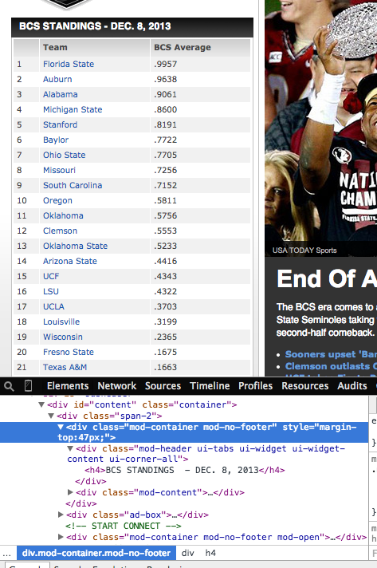

##Web Scraping with Python

This is a tutorial stepping through the steps needed for you to get started
with scraping. Feel free to skip it if you are already comfortable with scraping.

1. Install the library needed from web scraping:

   - Beautiful Soup – A library designed for
     screen-scraping HTML and XML in Python

   ```
   pip install beautifulsoup4
   ```
2. We are going to scrape the BCS college football rankings as they appeared on the front page of [http://bcsfootball.org/](http://bcsfootball.org/) on December 8th, 2013. (The current version of the site does not include rankings.)
   - Fortunately, the Internet Archive Project keeps point-in-time snapshots of most popular web sites.
        - To see whether historical snapshots of `bcsfootball.org` are available, visit [http://web.archive.org/](http://web.archive.org/) and enter `http://www.bcsfootball.org/` into the search box.
        - Navigate to the correct date:
            1. Select the year 2013 on the activity graph.
            2. Choose December 8th on the calendar.
       - You should end up at this URL, which includes the date and time of the snapshot:
         [http://web.archive.org/web/20131208113724/http://www.bcsfootball.org/](http://web.archive.org/web/20131208113724/http://www.bcsfootball.org/)

3. Identify the table on the left hand side of the webpage, right click anywhere on it,
   and then select inspect element from the dropdown menu.

   

4. Now we are going to scrape that table using the following code. Type the code out line by line
   and run it yourself. Make sure you understand what each line is doing.

    ```python
    # Import a library to fetch web content using HTTP requests.
    import requests

    # Import a library to parse the HTML content of web pages.
    from bs4 import BeautifulSoup

    import pandas as pd

    # Use a snapshot of http://www.bcsfootball.org/ taken on December 8th, 2013.
    URL = "http://web.archive.org/web/20131208113724/http://www.bcsfootball.org/"

    # Get the HTML content of the web page as a string.
    content = requests.get(URL).content

    # Use a BeatifulSoup object to parse the HTML with "html.parser".
    soup = BeautifulSoup(content, "html.parser")

    # Find all <tr> elements (table rows) in the <tbody>
    # of the <table class="mod-data"> element.
    rows = soup.select('table.mod-data tbody tr')

    # Extract the text in each cell and put into a list of lists,
    # such that each list in the list represents content in a row.
    table_lst = []
    for row in rows:
        cell_lst = [cell.text for cell in row]
        table_lst.append(cell_lst)

    ranking = pd.DataFrame(table_lst)
    ranking.columns = ['ranking', 'state', 'score']
    print ranking.head()
    ```

5. Extra credit (optional):
    - Scrape the historical BCS Football rankings for a different date and time.
    - Given the name of a football stadium, scrape its location (latitude and longitude) from the stadium's Wikipedia page?
