# Model Comparison

## Table of Contents

1. [__High Level__](#high-level)
 1. [Why we model?](#why-we-model)
 2. [Scoring a model](#scoring-a-model)
 3. [Cross Validation](#cross-validation)
 4. [Characteristics of Models](#characteristics-of-models)

2. [__Regression__](#regression)
 1. [Linear Regression](#linear-regression)
 2. [k-Nearest Neighbors Regression](#k-nearest-neighbors-regression)
 3. [Decision Tree Regression](#decision-tree-regression)
 4. [Bagged Tree Regression](#bagged-tree-regression)
 5. [Random Forest Regression](#random-forest-regression)
 6. [Boosted Trees Regression](#boosted-trees-regression)

3. [__Classification__](#classification)
 1. [Logistic Regression](#logistic-regression)
 2. [k-Nearest Neighbors Classifier](#k-nearest-neighbors-classifier)
 3. [Decision Tree Classifier](#decision-tree-classifier)
 4. [Bagged Tree Classifier](#bagged-tree-classifier)
 5. [Random Forest Classifier](#random-forest-classifier)
 6. [Boosted Trees Classifier](#boosted-trees-classifier)
 7. [SVM](#svm)
 8. [Neural Networks](#neural-networks)
 9. [Naive Bayes](#naive-bayes)

4. [__Unsupervised Learning__](#unsupervised-learning)
 1. [k-means Clustering](#k-means-clustering)
 2. [Hierarchical Clustering](#hierarchical-clustering)

5. [__Other Good Resources__](#other-good-resources)


## High Level
Notes here are generally applicable and will provide a good framework for this guide.

### What is a model?
At its core, a model represents a relationship between variables. Our goal is to define that relationship as well as we can, having to make some simplifying assumptions along the way.

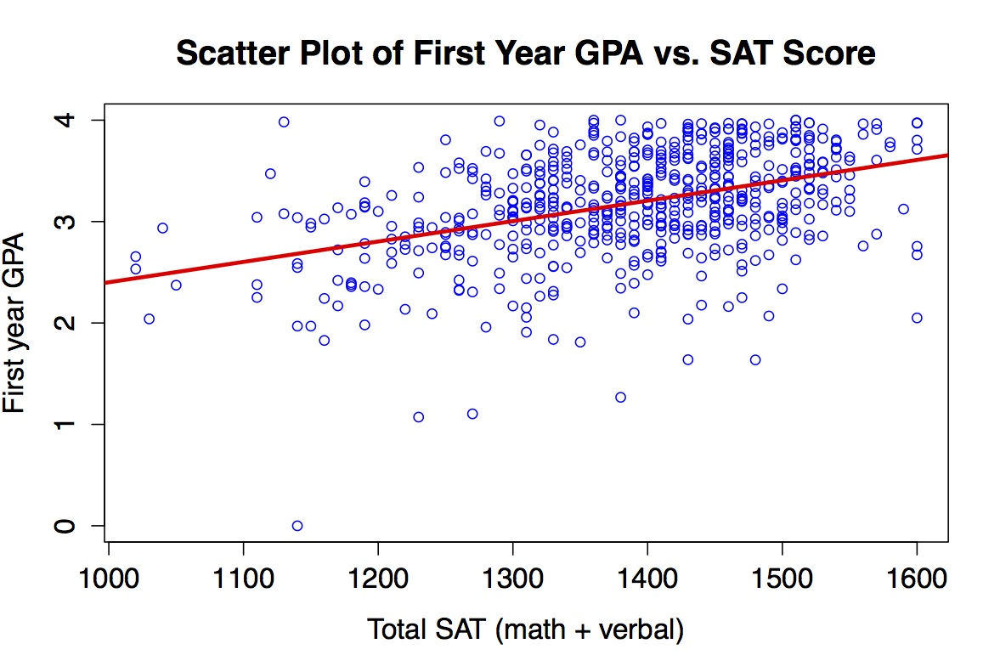

### Why we model?
There are two motivations for building models, __prediction__ and __inference__.

__Prediction__ - Given a set of features, what is the most likely dependent variable.  Used when getting the right answer is the goal.  Example - Predicting the stock market.

__Inference__ - What are the most important features in determining the dependent variable.  Used when trying to understand the relationship between the feature set and dependent variable.  Example - Understanding the lifestyle characteristics most important in predicting diabetes.

There may be a trade-off between the two.  On one extreme, linear regression is great for inference - the coefficients in a linear regression model are great at explaining.  On the other extreme, a Gaussian kernel SVM may be more accurate, but it loses a lot of interpretablity.

### Scoring a model
Generally, there are two major steps when we train a model.  __Building the model given a set of inputs__ and __choosing between models__.  The pool of metrics used when building the model and choosing the model are the same for each model type.  The key difference is that we use one metric score when __building the model__ and any number when __choosing a model__.

__Building the Model__
Each type of model has its own algorithm / equation when fitting _a fixed set of inputs (independent variables)_.  The result of this process is a model.  Therefore, the process for building the model needs a target metric in order to optimize the model it will output.  This target metric is referred to as the _loss_ and training tries to minimize the _loss_.  The most common _loss_ metric when training a _linear regression_ model is __Residual Sum of Squares (RSS)__, though it can be others.

__Choosing the Model__
A given model is only as good as the data on which it was trained.  We often want to build multiple models using different model types and / or inputs and then compare them.  Unlike when building a model, when choosing a model, we (humans) are using our judgment to choose the best model.  Because models often provide a number of trade-offs, it's important to use a number of scoring metrics when determining the "best" model.

#### Cross Validation
When building a (supervised) model, we almost always want to build the model on a __training set__ of data and validate its accuracy on the __test set__.  This will help us ensure we are choosing models that are __robust__--they score well for all types of possible data inputs.

__k-Fold CV__ is a type of cross validation ([there are more](https://en.wikipedia.org/wiki/Cross-validation_(statistics)#Common_types_of_cross-validation)) which splits the data into k groups. For each of the k groups, it fits your model on all of the training data that is NOT in the kth group, uses this model to predict the target for observations in group k, and returns a score.  The scores for all k models are averaged and this average is used when determining if this is a good _model form_ to choose.  If so, then a final model should be built on all training data and assessed against the original test data (often referred to as _holdout data_)


#### Characteristics of Models:

* High dimensionality - How well does the model perform when the data has a lot of explanatory variables?  Assume there are more predictors (p) than points of data (n).  
* Training speed - How long does it take to train the model?  
* Prediction speed - Once a model is trained, how long will it take to make a prediction?  
* Interpretability - Can we determine the most important features and their direct cause in the model?  See inference above.
* Communication - What's the 2-sentence overview for non-technical colleagues?
* Visualization - How do we present the model / process visually?
* Evaluation - What metrics are at hand to score the model in order to __choose the best model__.
* Nonlinearity - How does this model react to nonlinear data?
* n << p - How does this model react when there are more predictors than data points?
* Outliers - How robust is the model to outliers?
* Overfitting - Does this model tend to overfit?
* Hyperparameters - What levers can we tune in the model to help achieve a better score?
* Online - Can the model be easily updated with new data (without fitting using previously fitted data)?
* Unique attributes
* Special use cases

#### Other High Level Notes

More data usually beat a better model. Better features usually beat a better model. So data collection and feature engineering
typically trump model selection. Keep that in mind whenever you're tackling a new problem.

The data are usually messy: the inputs tend to be mixtures of quantitative, binary, and categorical variables, the latter often with many levels. There are generally many missing values, complete observations being rare. Distributions of numeric predictor and response variables are often long-tailed and highly skewed.

Usually only a small fraction of the large number of predictor variables that have been included in the analysis are actually relevant to prediction.

Furthermore, when doing model selection, trying out several models is one of the best ways to determine which model to use. And you may ultimately find that an ensemble works the best.

Things like speed, simplicity, and interpretability will often guide your choice of model on the job.

## Regression

#### Linear Regression

Predict the values of the dependent variable on a _continuous_ scale.  Makes the assumption that there is a _linear_ relationship between the independent and dependent variables.  The most common form is _ordinary least squares (OLS)_ which minimizes the _residual sum of squares_ when fitting the model.

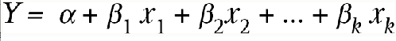

* High dimensionality
    * Linear regression can be performed with a number of independent variables, however, having too many will cause the model to be overfit.

* Training speed
    * Depends on the size of the data, but generally a fast model to train.  [Stochastic gradient descent](http://scikit-learn.org/stable/modules/sgd.html#regression) can be used to speed up training when training on more than 10,000 points

* Prediction speed  
    * Predictions are very fast as they are merely the dot product of the coefficient vector and the input matrix.

* Interpretability
    * One of the biggest attractions of linear regression is the high degree of interpretability.  The coefficients of the linear regression model indicate the relationship between the predictor and the predicted value.  The coefficient of any single predictor can be interpreted as the change in the predicted value with a 1 unit increase in the predictor value _holding all other variables constant_ (ISL, 63).

* Communication
    * Linear regression models are introduced in many introductory courses and given the straight forward interpretation of the coefficients, are fairly easy to communicate.

* Visualization
    * Visualizing is easy when there is a single predictor (and feasible if there are 2 predictors).  We can calculate the predicted values across the range of possible inputs and see the predictions directly as well as the magnitude of the changes.  Using 2 predictors will require a 3-D visualization.  Any more than 2-predictors is not visually feasible, so it is often best to determine the most important predictors and visualize the relationships with those.

    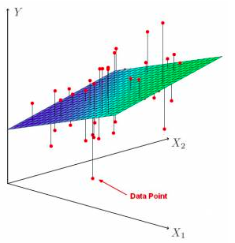

* Evaluation
    * When training the model, OLS uses __RSS__ for the loss function (ISL, 62).  This ensures that we do not over or under estimate the model (since residuals are squared, they lose their sign) and that outliers are penalized (squaring the residual causes exponentially greater loss in large residuals).  Because of the squared term, it is not robust to outliers.
        * If the data is expected to be particularly prone to outliers, [Least Absolute Residual (LAR)](https://en.wikipedia.org/wiki/Least_absolute_deviations) can be used as the loss function.  This will weigh each residual equally and minimize the sum of the absolute values of each residual.  However, LAR models are not robust, so if the training data is not representative of the actual data or if the data is inherently highly variable, the model will perform poorly.

    * When deciding between models, the most common metric to use is __R^2__.   R^2 is described as _the proportion of variability in Y that can be explained by X_.  This is better understood when one considers how we calculate R^2.  R^2 = (TSS - RSS) / TSS, where TSS is the _total sum of squares_ and is calculated as the sum of the residuals if we used the average value of Y as our predictor--i.e. how much do the data differ from the average value.  The RSS is the variability in the data that persists after we have created our best predictions.  So if we subtract out the variability that still persists from the total, we are left with the amount of variance that we have explained.  To normalize this value, we divide by the TSS.  Because R^2 is a normalized metric, it is not prone to the units of measurements in Y and will always between 0 and 1.  A "good" R^2 is dependent on the field of study.  Hard sciences typically have high values of R^2 while business regressions may consider an R^2 between 0.10 and 0.20 to be very good (ISL, 70).

    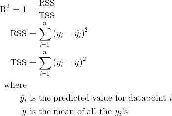

    * R^2 __should not be used__ to compare models with different numbers of predictors.  More predictors __will always__ increase R^2.  Rather, we should use __Adjusted R^2__, which penalizes models for each included predictor.  In addition to __Adjusted R^2__, we can also compare different models' __AIC__, __BIC__, and __F-Statistic__. 

* <a name="lr_nl_power">Nonlinearity</a>
    * When there isn't a strict linear relationship between the X and Y variables, we can transform the X variables by their square, cube, etc.  The model is still considered linear because there is a __linear relationship between the coefficient and the input__, despite that input being transformed.

* <a name="lr_big_n_small_p">n << p</a>
    * In addition to the problems of overfitting discussed above in high dimensional data, OLS will in fact not converge when there are more predictors than data points.  There is no unique least squares coefficient and the variance is infinite!  OLS cannot be used and we must decrease the number of predictors in the model (ISL, 204).

* Outliers
    * Linear regressions is vulnerable to outliers (even when using an LAR score).  It is best to inspect the data before and after fitting a model to determine outliers.

    * <a name="lr_outlier"></a>An easy way to detect outliers before fitting a model (for numerical values) is to use the 1.5 X IQR threshold.

    * After fitting the model, you can also look for points that are __influential__ and / or have __high leverage__.
      * Influential points are points whose inclusion will significantly change the slope of the model.  
        * Points with large residuals AND high leverage are more influential

      * Leverage refers to points with unusual values in the X direction.

* <a name="lr_overfitting"></a>Overfitting
    * Overfitting can be prevented by decreasing the number of predictors

    * Overfitting can also be prevented by ensuring we are cross-validating the model

* Hyperparameters
    * OLS does not have any hyper-parameters, however, its cousins Lasso and Ridge regressions do.  See below.

* Online
    * Can be updated online through [stochastic gradient descent](https://en.wikipedia.org/wiki/Online_machine_learning#Stochastic_Gradient_Descent).

* Unique attributes
    * Assumes linear relationship between the independent and dependent variables
    * Assumes the error terms of all observations are normally distributed around a mean of 0
    * Assumes constant variance in observations
    * Scale the data if you want the coefficients to give you some indication of
      feature importance. Make sure to be careful about stating the effect of a change in y: "A one unit change in the *scaled feature* x corresponds to a beta unit change in y".

* <a name="lr_subset"></a>Special use cases  
      There are 3 main techniques to prevent overfitting (ISL, 204):  

  1. Subset Selection  
          Choose a subset of the predictors when creating the model.
          _Forward Stepwise_, _Backward Stepwise_, _Forward/Backward Stepwise_
  2. Regularization (aka Shrinkage)
        Methods that _regularize_ (__shrink__) the coefficient estimates towards zero.  Shrinkage methods can significantly reduce variance.  __Ridge__ and __Lasso__ regressions are techniques for regularizing linear regression models.  Both penalize larger coefficients with a tuning parameter (lambda).  The greater the lambda value, the more regular the coefficients.  As lambda approaches infinity the coefficient estimates approach 0.  As lambda approaches 0, the coefficient estimates approach the estimates in a non-regularized linear regression model.

        __Ridge Regression__ uses an l2 scoring model, which squares the coefficients before summing.  __Lasso Regression__ uses an l1 scoring model, which sums the absolute values of the coefficients.  Lasso models have the added feature of letting feature coefficients equal 0, thus performing feature selection.  Ridge regularization models will include a non-zero value for each coefficient.  Neither method has proven to be universally better.

        The tuning parameter lambda should be chosen using cross-validation.

         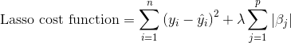  

      3. Dimensionality Reduction  
        Use PCA or SVD to reduce the feature space.

#### k-Nearest Neighbors Regression
  A model for predicting values by using the mean of the k "nearest" values.  "Nearness" is calculated with some distance metric between the value we are predicting for and all data points in the original data set.  __Cosine Similarity__ and __Euclidean Distance__ are the two most common similarity scores.  __Cosine Similarity__ measures how different items are, but doesn't account for the magnitude of the difference.  __Euclidean Distance__ penalizes differences with large magnitudes.

  * <a name="knn_reg_high_dim"></a>High dimensionality
    * Suffers in high dimensions due to the _curse of dimensionality_.  While two points may be the "nearest", with a lot of dimensions, it's difficult to assess if they are actually similar, and thus a good proxy for value (ISL, 108).

  * <a name="knn_reg_ts"></a>Training speed
    * KNN never trains a model, only predicts.

  * <a name="knn_reg_ps"></a>Prediction speed
    * Prediction speed can be [slow](http://www.inf.ed.ac.uk/teaching/courses/iaml/slides/knn-2x2.pdf) and grows with size of data set.

  * <a name="knn_reg_inter"></a>Interpretability
    * It is [hard to determine the effect of any one feature in determining the overall prediction score](https://www.quora.com/Classification-machine-learning/When-should-I-use-a-K-NN-classifier-over-a-Naive-Bayes-classifier), so we cannot easily interpret the effects of the features.

  * <a name="knn_reg_com"></a>Communication
    * The idea around KNN is fairly intuitive--use known data points that are similar to our unknown point to estimate the unknown point's target.  The distance concept may be a little foreign, but the Euclidean distance is a p-dimension extension of the Pythagorean theorem, so should be relatable to most.

  * <a name="knn_reg_viz"></a>Visualization
    * Plotting two or three of the features for the data points against each other and then showing where the predicted point lies is a good way of visualizing the nearest neighbor concept.  You can expand this to the entire potential universe of values.

    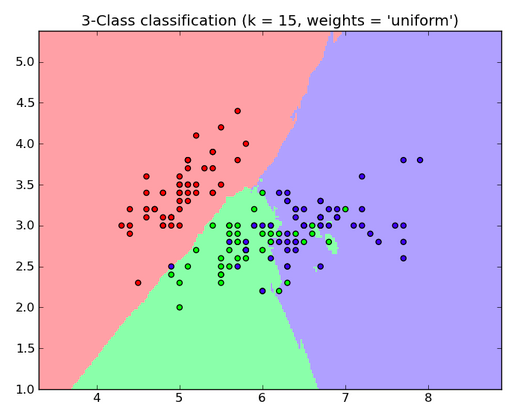

  * <a name="knn_reg_eval"></a>Evaluation
    * We can evaluate how appropriate KNN is as a regression model for a given data set by calculating the MSE and comparing it to the MSE from another regression model type (ISL, 106).

  * <a name="knn_reg_nl_p"></a>Nonlinearity
    * KNN performs particularly well in nonlinear situations and will outperform linear regression models when the underlying data does not exhibit a linear relationship (ISL, 106).

  * <a name="knn_reg_big_n_small_p"></a>n << p
    * KNN suffers from the curse of dimensionality when p becomes too large.  n<<p is therefore especially troublesome (ISL, 108).

  * <a name="knn_reg_outlier"></a>Outliers
    * KNN is prone to [outliers](http://www.inf.ed.ac.uk/teaching/courses/iaml/slides/knn-2x2.pdf) because we take a simple average of the nearest neighbors.  If an outlier exists "close" to our predicted feature, that outlier's value will skew our prediction.

  * <a name="knn_reg_overfi"></a>Overfitting
      * As the number of neighbors, k, approaches 1, KNN will be more likely to overfit.  To find the optimal k, create a holdout set from the observed data set and perform cross-validation by comparing different values of k and the resulting MSE when predicting on the holdout set.  The optimal value of k is the value that results in the largest decline in MSE ('elbow method') or minimizes MSE (ISL, 42).

  * <a name="knn_reg_hyperp"></a>Hyperparameters  
      * The number of nearest neighbors to choose, k.  k can be optimized through cross-validation (see Overfitting).

  * <a name="knn_reg_online"></a>Online  
      * Because there is no fitting involved, KNN can be performed online, so long as new data is added to the data set used for predictions.

  * <a name="knn_reg_unqatt"></a>Unique attributes
    * Make sure to scale your data so that the distance calculation makes sense.
    * Noisy features will reduce performance, just as they would with k-means, since typically each feature is an equally-weighted dimension in the distance calculation.
    * Can incorporate mixtures of numeric and categorical predictor variables and missing values

  * <a name="knn_reg_spec_use_case"></a>Special use cases  
    * Can be used to fill in missing data by finding k nearest neighbors based on present features and then filling in the missing value based on the average of the nearest neighbors.

#### Decision Tree Regression
  Decision trees are the basis for all [decision tree learning](https://en.wikipedia.org/wiki/Decision_tree_learning) models.  These models are relatively intuitive and deal well with lots of features, outliers, and mixed data types.  Decision tree learning models are the closest thing to "off the shelf" models that can be implemented with relatively minimal engineering.

  Regression trees iterate through the feature space, perform binary splits on the data to create two groups that are all the same on that given feature (if the feature is continuous, the split will be all values greater than and all values less than a certain threshold).  They then calculate the change in RSS from splitting on that feature.  After all features have been iterated through, the feature that resulted in the largest decrease in RSS will be used to split the data.  The same procedure is then performed on each split until RSS can no longer be decreased or some stopping criteria is hit (most likely in regression).  When the terminal split is not pure, the predicted value is the average of the values in the leaf.  Regression tress are __greedy__ because they always split on the feature that will most decrease RSS _at that moment_ rather than the split that is optimal in the end.  They are __top down__ because they start at the top of the tree (no splits), and are __recursive__ because they perform the same splitting process on each resulting split (ISL, 306).

  

  * <a name="dt_reg_high_dim"></a>High dimensionality  
    * When imposed with stopping criteria, regression trees work very well with high dimensional data.  A great characteristic of decision tree learning models is that they will perform feature selection--if a feature does not decrease RSS, then it will not be included in the final model.  Without stopping criteria, regression trees in high dimensional data will almost necessarily overfit (ISL, 307).

  * <a name="dt_reg_ts"></a>Training speed
    * Decision trees are relatively slow to train, especially as the number of features increases.  This is fairly intuitive because at each split, the fitting algorithm iterates through each feature.  As the number of features grows, so does the length of iterations, as well as number of possible splits.

  * <a name="dt_reg_ps"></a>Prediction speed
    * Fairly quick to predict.

  * <a name="dt_reg_inter"></a>[Interpretability](http://www.salford-systems.com/blog/dan-steinberg/what-is-the-variable-importance-measure)
    * Because each feature is considered at each split, there is not a straightforward interpretation of the effect changing a given predictor's value will have on the prediction value.  However, we can create rankings of the feature importance.  For each feature, we sum the resulting change in RSS at the nodes which use that feature for splitting.  At the end, we will have each feature and the cumulative decrease in RSS associated with that feature.  The features with the largest cumulative decrease are the "most important" in this regression.

  * <a name="dt_reg_com"></a>Communication
    * Decision trees closely mirror human decision making process and communicating the model should be fairly straightforward. (ISL, 315)  _For every possible feature on which we can segment our data, which will result in the largest gain?_

  * <a name="dt_reg_viz"></a>Visualization
    * Decision tree graphs are ubiquitous and great for visualizing the model (ISL, 315).

  * <a name="dt_reg_eval"></a>Evaluation
    * By default, regression trees use RSS as the loss function, but there is no reason why another loss function cannot be used.  However, because regression trees are fairly robust to outliers, changing from RSS to LAR isn't as common as with linear regression (ISL, 306).

    * When __choosing between models__, RSS and [MSE](https://www.quora.com/Does-a-low-R-square-make-my-decision-tree-model-unreliable) are both valid metrics.  There is less consensus on R^2 [see reply by John Gins](http://www.analyticbridge.com/forum/topics/rsquared-for-decision-tree)

  * <a name="dt_reg_nl_p"></a>Nonlinearity
    * Decision tree learning models are particularly strong at fitting nonlinear data (ISL, 106).

  * <a name="dt_reg_big_n_small_p"></a>n << p
    * When n << p, stopping criteria should be used in order to avoid overfitting.  Also consider using dimensionality reduction to ensure the features are [discriminative](http://scikit-learn.org/stable/modules/tree.html#tips-on-practical-use).

  * <a name="dt_reg_outlier"></a>Outliers
    * Quite robust to outliers.

  * <a name="dt_reg_overfi"></a>Overfitting
    * A major flaw of decision trees are their tendency to overfit the data. Because of this, we can _prune_ or impose _stopping criteria_.
      * __Pruning__ (also referred to as _post-pruning_)
        Grow the tree as deep as possible.  Then, for each terminal node, calculate the error associated with a tree that leaves the node as is. Then merge the two leaves and calculate the error from the resulting model.  If the overall model has a lower error rate, merge the leaves.

      * __Stopping Criteria__ (also referred to as _pre-pruning_)
        Stop growing the tree once some stopping criteria are met.
          * Minimum Leaf Size: Stop when the number of data points for a leaf gets below a threshold
          * Depth: Stop when the depth of the tree (distance from root to leaf) reaches a threshold
          * Loss: Stop when the RSS reduction isn't improved significantly

  * <a name="dt_reg_hyperp"></a>Hyperparameters
      * Minimum leaf size - some number of observations that each leaf needs to contain in order to prevent overfitting
      * depth - number of nodes between the root and final leaves
      * loss threshold - each split causes some decrease in sum of squares. We can assert that if the decrease is below some threshold, the split is not valuable enough to execute.

      "The preferred strategy is to grow a large tree T0, stopping the splitting
process only when some minimum node size (say 5) is reached. Then this
large tree is pruned using cost-complexity pruning" (see more: ISL 308)

  * <a name="dt_reg_online"></a>Online  
    * The traditional decision tree model cannot use streaming data as all data is required when fitting the model.  However, there has been [work](http://www.jmlr.org/papers/volume11/ben-haim10a/ben-haim10a.pdf) to modify the algorithm to allow for streaming data.

  * <a name="dt_reg_unqatt"></a>Unique attributes
    * Easy to communicate
    * Strong in high dimensions (with pre / post pruning)
    * Robust to outliers
    * Mixed types of inputs (categorical / numerical)

  * <a name="dt_reg_spec_use_case"></a>Special use cases  
    sklearn's decision tree learning models are a little finicky and require data be in a particular format.
    * _Missing_ values have to be dealt with -- use surrogate variables
    * _Categorical_ variables need to be "dummified"

#### Bagged Tree Regression
Because regression trees have high variance (they overfit), we can apply the principles of [bootstrapping](https://en.wikipedia.org/wiki/Bootstrapping_(statistics)) to create _bagged_ trees.  When creating bagged trees, we create _B_ decision trees trained on _B_ bootstrapped training sets.  The trees are grown very deep and aren't pruned. The predicted value is the average value after predicting through all _B_ trees. Each tree will have high variance but low bias.  Because we are averaging the values, we are, in effect, averaging the variance as well.  Thus, we can have a model that has low bias, and moderate variance.  

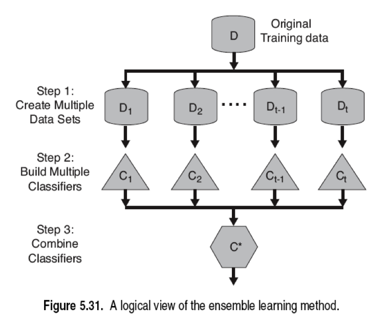

Below are the characteristics of differentiation between bagged trees and decision trees

* <a name="bt_reg_inter"></a>Interpretability
  * Finding feature importance in bagged trees is similar to a single decision tree, except the summation is across all bagged trees.

* <a name="bt_reg_com"></a>Communication
  * Bagged trees add two layers of complexity when communicating, __multiple trees__ and __bootstrapped training sets__.  Explaining averaging the results of multiple trees isn't too cumbersome, but the reasoning for bootstrapping the training data is less straightforward.  See [here](http://stats.stackexchange.com/questions/26088/explaining-to-laypeople-why-bootstrapping-works) for some different methods for explaining bootstrapping to laypeople.

* <a name="bt_reg_viz"></a>Visualization
  * Because there are now multiple trees, a single decision tree graph is no longer accurate.  You can show multiple trees and may also rely on a bar chart showing feature importance (ISL, 319).

* <a name="bt_reg_eval"></a>Evaluation
  * When bootstrapping, we only select (approx.) [2/3 of the data](http://stats.stackexchange.com/questions/88980/why-on-average-does-each-bootstrap-sample-contain-roughly-two-thirds-of-observat).  The ~1/3 of the data not used when building the tree is the "out-of-bag" data and can be viewed as a proxy "test set".  Thus, for each data point, there are ~_B_/3 trees constructed without that point.  We can calculate the error for that point by averaging the predictions of the _B_/3 trees.  Doing this across all data points yields an __out-of-bag error__ (OOB).  The OOB characteristic of bagged models is a benefit because we don't have to hold out data when fitting our model--the model inherently does it (ISL, 318).

* <a name="bt_reg_overfi"></a>Overfitting
  * Bagging is a fix for overfitted decision trees.  However, you still need to tune the hyperparameters (see below) to optimize as much as possible.

* <a name="bt_reg_hyperp"></a>Hyperparameters
  * The pruning hyperparameters for decision trees are also available for the bagged trees--however, it is recommended that the trees in the bagged model are grown with minimal pruning (ISL, 317).
  * _B_ can be changed, but optimizing isn't necessary--choose a _B_ that is sufficiently large (ISL, 317).


#### Random Forest Regression
  The random forest is a decision tree learning model and is an extension from bagged decision trees that look to further reduce variance in the model.  Random forests are bagged decision tree models, except during training, each time we split, we reduce the available feature set on which to split from _p_ total features to a random set of _m_ features.  That means, that at each split the model doesn't even consider all of the features in the model.  The primary motivation for this is to introduce randomness into the fitting process so as to _decorrelate_ the trees which make up the model.  Recall, that the motivation for bagging is to average away the variance that are inherent in a single decision tree. However, if there are a few strong predictors, then those will consistently be chosen at the top of the trees in the bagged model.  These trees will be highly correlated.  Averaging away variance only works when the items are decorrelated.  Thus, the motivation for limiting the potential features __for each split__ to a random subset. (ISL, 320)

* <a name="rfr_reg_high_dim"></a>High dimensionality
  * Random forests are robust to high dimensional data.  However, if only a small fraction of features contain signal, a model fit with a small _m_ will perform poorly.  In this case, _m_ should be increased (ESL, 596)

* <a name="rfr_reg_ts"></a>Training speed
  * While decision trees are typically slow to train, by selecting subsets of the feature space, random forests significantly decrease training speed. ([pg. 95](https://github.com/glouppe/phd-thesis/blob/master/thesis.pdf).)

* <a name="rfr_reg_ps"></a>Prediction speed
  * Prediction speed is [significantly faster](http://rexdouglass.com/fastest-random-forest-sklearn/) than training speed.

* <a name="rfr_reg_inter"></a>Interpretability
  * Finding feature importance in random forests is similar to a single decision tree, except the summation is across all trees.

  * [sklearn's](http://scikit-learn.org/stable/modules/ensemble.html#feature-importance-evaluation) ```feature_importance_``` attribute uses a different calculation.
   Basically, the higher in the tree the feature is, the more important it is in determining the result of a data point.
   The expected fraction of data points that reach a node is used as an estimate of that feature's importance for that tree.
   Finally, average those values across all trees to get the feature's importance.

* <a name="rfr_reg_com"></a>Communication
  * Random forests are 3 levels of abstraction away from decision trees (bootstrapped training, multiple trees, random choice of features).  Focus communication on describing a single tree and then layer in the added complexity by emphasizing the goal is to make the model robust to overfitting.

* <a name="rfr_reg_viz"></a>Visualization
  * Variable importance charts are useful

    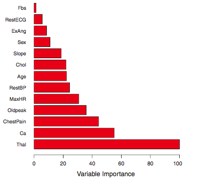

  * It maybe also useful to present a few different trees (or the first few branches) which use different features for splitting.  Emphasize this is a subset of the forest.  This will illustrate its ensemble characteristic as well as punctuate that each tree can have a different set of important features.

* <a name="rfr_reg_eval"></a>Evaluation
  * See [bootstrapping evaluation](#bt_reg_eval)

* <a name="rfr_reg_nl_p"></a>Nonlinearity
  * Decision tree learning models are particularly strong at fitting nonlinear data (ISL, 106).

* <a name="rfr_reg_big_n_small_p"></a>n << p
  * Small n, large p can cause problems for random forests, though there isn't universal [consensus](http://stats.stackexchange.com/questions/48434/limits-to-tree-based-ensemble-methods-in-small-n-large-p-problems).  [Page 10](http://arxiv.org/pdf/0811.3619.pdf) shows bagging can outperform random forest in n << p situations.

* <a name="rfr_reg_outlier"></a>Outliers
  * Handle outliers because made up of trees?

* <a name="rfr_reg_overfi"></a>Overfitting
  * While random forests improve on bagging and decision trees, they can still overfit. [Cross validating](http://stats.stackexchange.com/questions/111968/random-forest-how-to-handle-overfitting) the tuning parameters should be done (ESL, 596).  

* <a name="rfr_reg_hyperp"></a>Hyperparameters (ESL, 592)  
  * _m_, _minimum leaf size_, _depth_, and _loss_ can and should be tuned using cross-validation (and if time permits, grid search cross-validation)
  * A rule of thumb _m_ is p/3
  * A rule of thumb _minimum leaf size_ is 5

* <a name="rfr_reg_online"></a>Online
  * The traditional random forest model cannot use streaming data as all data is required when fitting the model.  However, there has been [work](http://research.cs.queensu.ca/home/cords2/ideas07.pdf) to modify the algorithm to allow for streaming data.

* <a name="rfr_reg_spec_use_case"></a>Special use cases  
  * Because random forests are robust to wide and tall data, outliers, and overfitting they are attractive as first cut models.  When you need a place to start, try a random forest and build other model types based on the "free" learnings.

#### Boosted Trees Regression<a name="boosted_trees_reg"></a>

* High dimensionality
  * Works well, although we may need stopping criteria to prevent overfitting.

* Training speed

* Prediction speed
  * Fast.

* Interpretability
  * Not all that interpretable. However, they might be slightly more interpretable compared to Random Forests. ISL: In boosting, because the growth of a particular tree takes into account the other trees that have already been grown, smaller trees are typically sufficient. Using smaller trees can aid in interpretability as well; for instance, using stumps leads to an additive model.

* Communication
  * This is a Decision Tree based model, where the trees are grown sequentially. Each tree is trained on a modified version of the dataset used by its predecessor, and no use is made of bootstrapping.

  * AdaBoost ([sklearn documentation](http://scikit-learn.org/stable/modules/ensemble.html#adaboost)): The core principle of AdaBoost is to fit a sequence of weak learners (i.e., models that are only slightly better than random guessing, such as small decision trees) on repeatedly modified versions of the data. The predictions from all of them are then combined through a weighted majority vote (or sum) to produce the final prediction. The data modifications at each so-called boosting iteration consist of applying weights w_1, w_2, ..., w_N to each of the training samples. Initially, those weights are all set to w_i = 1/N, so that the first step simply trains a weak learner on the original data. For each successive iteration, the sample weights are individually modified and the learning algorithm is reapplied to the reweighted data. At a given step, those training examples that were incorrectly predicted by the boosted model induced at the previous step have their weights increased, whereas the weights are decreased for those that were predicted correctly. As iterations proceed, examples that are difficult to predict receive ever-increasing influence. Each subsequent weak learner is thereby forced to concentrate on the examples that are missed by the previous ones in the sequence.

  * Gradient Boosting (ISL): "Given the current model, we fit a decision tree to the residuals from the model. That is, we fit a tree using the current residuals, rather than the outcome Y , as the response. We then add this new decision tree into the fitted function in order to update the residuals. Each of these trees can be rather small, with just a few terminal nodes, determined by the parameter d in the algorithm. By fitting small trees to the residuals, we slowly improve f in areas where it does not perform well. The shrinkage parameter lambda slows the process down even further, allowing more and different shaped trees to attack the residuals."  

* Visualization

* Evaluation
  * Standard metrics for regression/classification.

* Nonlinearity
  * As a decision tree-based model,works well with non-linear data.

* n << p
  * Will work well provided we use early stopping.

* Outliers
  * Robust to outliers.

* Overfitting
  * Can overfit if the number of trees is too large.

* Hyperparameters
  * The number of trees B.
  * The shrinkage parameter lambda. This controls the rate at which boosting learns.
  * The number d of splits in each tree, which controls the complexity of the boosted ensemble.

* Online
  * No. All data is required to make the splits and as each tree is also trained sequentially, it is impossible to do this online.

* Unique attributes
  * Makes a strong learner from weak learners.
  * A major disadvantage is scalability. Due to its sequential nature, it cannot be parallelized.

* Special use cases
  * Boosted trees are powerful and usually outperform Bagging and Random Forests.  

## Classification
  Many of the regression models can be used as classification models.  When this is the case, for the sake of brevity, only differences and notable characteristics will be emphasized.


#### __Logistic Regression__
  Logistic regression is the most widely used general-purpose classifier.  In linear regression, features are used to predict the value of a continuous outcome. The coefficient vector represents the change in the predicted value for one unit of change in the feature.  In logistic regression, features are used to predict the __probabilities of incoming data belonging to a particular class__. The coefficient vector represents the change in the logit function for one unit of change in the feature.

 * High dimensionality
  * As with linear regression, logistic regression is prone to overfitting when using a large number of features.  Subset selection, regularization, and dimensionality reduction can all be used to reduce the dimensions.

* Training speed
  * Depends on the size of the data, but generally a fast model to train.  [Stochastic gradient descent](http://scikit-learn.org/stable/modules/sgd.html#classification) can be used to speed up training when training on more than 10,000 points

* Prediction speed  
  * Predictions are very fast as they are merely the dot product of the coefficient vector and the input matrix.

* Interpretability
  * The odds ratio tells you how much a one unit increase of a feature increases the odds of being classified in the positive class. The coefficients of logistic regression models are the odds ratio and can be interpreted similarly to that of linear regression (ISL, 132).

  * Similar to linear regression, the coefficients could be interpreted to indicate the importance of the factors, but you have to be careful about putting the data on a uniform scale and about losing the one unit increase explanation.
  ```Note most of the time we don't put things on a uniform scale, in which case you can't interpret importance via magnitude of the coefficients.```

* Communication
  * Logistic regression predicts the probability that a given point belongs to the "positive" class.  Therefore, the model will predict if the point is from the positive class when the probability is greater than you threshold (usually 0.5) (ISL, 134).

* Visualization
  * For a model with a single predictor, you can plot the training data, colored by class value.  All positive labels will be on the line y=1 and all negative labels will be on the line y=0.  Then plot the sigmoid curve (model) as well as the horizontal probability threshold (usually y=0.50).  The intersection of the sigmoid curve and the probability threshold line will represent the _decision boundary_.  X values greater than the intersection will be predicted as a positive class.

  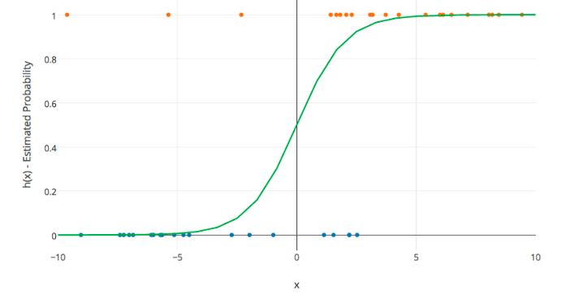

  * If the model has 2 predictors, you can again plot the training data colored by class value, but the x-axis will be one predictor and the y-axis will be the other.  Then, plot the _decision boundary_ line.  Predicted values above the decision boundary will be labeled as the majority class also above the line.

  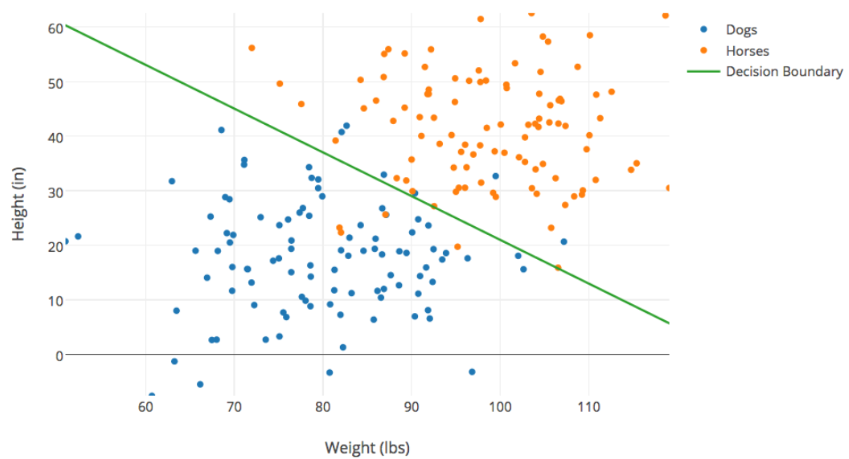

* <a name="clas_eval"></a>Evaluation (these apply to all classification algorithms)
  * For all supervised learning algorithms, we care most of all about generalization on unseen data. That means that during prototyping and model iteration, k-fold cross validation should be what we're aiming to optimize, and in the end, the evaluation metric we care about is performance on hold-out test data.
  * [F1](https://en.wikipedia.org/wiki/F1_score) - The harmonic mean of precision and recall. Basically, a metric that rewards correctly labeled positive values while penalizing incorrectly labeled positive values.  

  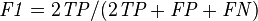

  * [Precision](https://en.wikipedia.org/wiki/Precision_and_recall) aka _Positive Predictive Value (PPV)_ - The proportion of correctly predicted positive labels to all predicted positive labels.  

  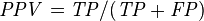

  * [Recall / Sensitivity](https://en.wikipedia.org/wiki/Precision_and_recall) aka _True Positive Rate (TPR)_ - The proportion of correctly predicted positive labels to all actual positive labels.  

  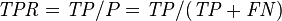

  * [Specificity](https://en.wikipedia.org/wiki/Sensitivity_and_specificity) aka _True Negative Rate (TNR)_ - The proportion of correctly predicted negative labels to all actual negative labels.  

  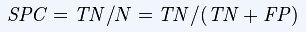  

  * [Fall Out](https://en.wikipedia.org/wiki/Sensitivity_and_specificity) aka _False Positive Rate(FPR)_ - The proportion of incorrectly predicted positive labels to all actual negative labels. 1 - Specificity  

  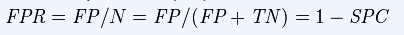  

  * [Accuracy](https://en.wikipedia.org/wiki/Sensitivity_and_specificity) - The proportion of correctly predicted positive and negative labels to all actual labels.  

  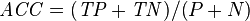

  * [Receiver Operator Characteristic (ROC) curve](https://en.wikipedia.org/wiki/Receiver_operating_characteristic) - Illustrates the trade-off between sensitivity (TPR) and the Fall Out (FPR) as the prediction threshold changes.  

    * [Area Under The Curve (AUC/AUROC)](https://en.wikipedia.org/wiki/Receiver_operating_characteristic#Area_under_the_curve) is equal to the probability that the model will rank a randomly chosen positive instance higher than a randomly chosen negative instance.  AUC should be used with caution when comparing models.  

  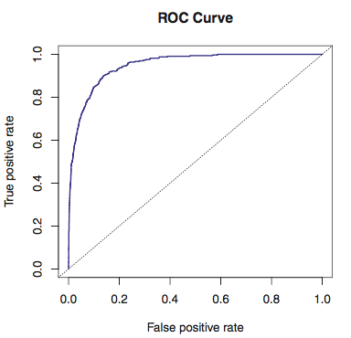

* Nonlinearity
  * Since logistic regression is essentially linear regression in a sigmoid curve, we can model nonlinearity in the [same way](#lr_nl_power).

* n << p
  * See [linear regression](#lr_big_n_small_p).

* Outliers

* Overfitting  
    * See linear regressing [overfitting](#lr_overfitting) and ways to [prevent it](#lr_subset).

* [Hyperparameters](http://scikit-learn.org/stable/modules/generated/sklearn.linear_model.LogisticRegression.html)
  * Threshold for positive classification (typically 0.5)
  * Class weighting for unbalanced classes  
  * Parameters for [gradient descent](http://scikit-learn.org/stable/modules/generated/sklearn.linear_model.SGDClassifier.html#sklearn.linear_model.SGDClassifier):
    * Step size
    * Stopping criterion: minimum change in error or number of iterations

* Online
  * Can be updated online through [stochastic gradient descent](https://en.wikipedia.org/wiki/Online_machine_learning#Stochastic_Gradient_Descent).

* Unique attributes
  * The output of logistic regression can be interpreted as a probability of classification.

  * Scale the data if you want the coefficients to give you some indication of feature importance.

* Special use cases  
  * <a name="class_imbalance"></a>__Class Imbalance__
    * Class Imbalance occurs when one of the classes rarely occurs in the data set.  While imbalanced classes are not outliers, their presence must be detected early to ensure we are evaluating the model properly. An example is credit fraud in a transaction log--the vast majority of transactions are not fraudulent and it could likely be less than 1% of observations.  A stupid model that always predicts "not fraud" would therefore have a 99% accuracy.  There are some steps that can be taken to alleviate some of the issues present in class imbalance.
      * Oversampling
        * Replicate samples in smaller class
        * Can cause overfitting because noise is replicated
        * Can generate new examples in neighborhood of observations
      * Undersampling
        * subsample from larger class repeatedly and ensemble classifiers
      * Can combine over- and under-sampling

#### k-Nearest Neighbors Classifier
Similar to [k-nearest neighbors regression](#k-nearest-neighbors-regression) with the exception that the predicted value is the __most common (mode)__ class of the nearest neighbors.  Other differences are noted below.  
* Evaluation
  * See [logistic regression classifiers](#clas_eval).
  ROC curves are inapplicable

#### Decision Tree Classifier
Similar to [decision tree regression](#decision-tree-regression) with the exception that the predicted value is the __most common (mode)__ class of the terminal node (leaf).  Other differences are noted below.  

* Evaluation
  * While decision tree regression typically uses RSS to fit the model, this is inapplicable in a classification setting.  The two most common loss metrics for classification are __information gain__ and __gini impurity__.  
    * __Information Gain__ tries to minimize the _entropy_ in the system (in this case the data in the preceding node) at each split.  When determining the best split _at that point_, all features are evaluated, and the feature which creates a split that decreases the entropy the most _at that point_ is chosen.
        * __Entropy__ is a measure of disorder within a system.  Intuitively, systems which have near uniform classes will have low entropy and the entropy grows as the mix becomes more heterogeneous.
    * [Gini Impurity](https://en.wikipedia.org/wiki/Decision_tree_learning#Gini_impurity) (a.k.a Gini Index) is another measure of heterogeneity. It is the probability of misclassifying a randomly drawn point when guessing its label based on the known class proportions (ISL, 312).
  * For choosing between models, see the metrics in [logistic regression classifiers](#clas_eval).  ROC curves are inapplicable because decision trees predict classes rather than probabilities.
    * _sklearn_ has a [method](http://scikit-learn.org/stable/modules/generated/sklearn.tree.DecisionTreeClassifier.html#sklearn.tree.DecisionTreeClassifier.predict_proba) to calculate the "probabilities".  This is not actually probability, rather it is the [percentage](http://stats.stackexchange.com/questions/105760/how-we-can-draw-an-roc-curve-for-decision-trees) of observations in the terminal node from the majority class.

* Overfitting
  * See [Decision Tree regression](#dt_reg_overfi)
        * __Stopping Criteria__: In addition to the decision tree regression stopping hyperparameters, classification trees have:  
          * Mostly the Same: Stop when some percent of the data points are the same (rather than all the same)
          * Error threshold: Stop when the error reduction (information gain) isn't improved significantly. (_Instead of loss_)

* Hyperparameters
  * See [Decision Tree regression](#dt_reg_hyperp)  
  Additionally, there is  _mostly the same_ and _error threshold_ (instead of _loss_).

* Special use cases
  * See [Class Imbalance](#class_imbalance)

#### Bagged Tree Classifier
Similar to bagged tree regression with the exception that the predicted value is the __most common (mode)__ class of the predictions from each tree.  Other differences are noted below.  

 * Evaluation
    * See [logistic regression classifiers](#clas_eval)
    * See [Bagged Tree regression](#bt_reg_eval) for OOB-error explanation

#### Random Forest Classifier
Similar to [random forest regression](#random-forest-regression) with the exception that the predicted value is the __most common (mode)__ class of the predictions from each tree.  Other differences are noted below.  

* Hyperparameters
  * See [Random Forest regression](#rfr_reg_hyperp) with the following differences (ESL, 592):
    * A rule of thumb _m_ is sqrt(p)
    * A rule of thumb _minimum leaf size_ is 1

* Special use cases
  * See [Random Forest regression](#rfr_reg_spec_use_case)
  * See [Class Imbalance](#class_imbalance)


#### Boosted Trees Classifier
* See [Boosted Trees Regression](#boosted-trees-regression)


#### SVM
* High dimensionality
  * Work well.

* Training speed
  * Very slow.

* Prediction speed
  * Fast. We only need to compute the kernel between the point and the support vectors.  

* Interpretability
  * Not interpretable. Support Vectors are vectors near the margin - they give us no information about the features.
* Communication
  * SVMs find a boundary between classes and try to find the largest possible margin. This margin is supported by points which are called "Support Vectors". The maximum margin classifier needs strictly separable data. SVMs can learn decision boundaries for non-separable data, when we allow for misclassification. The width of the margin then depends on the number of points we allow to be misclassified. For prediction, we only need to compute the kernel between the support vectors and the new point, which makes for extremely fast predictions.

* Visualization
  * Easy to visualize for 2-D or 3-D data, not otherwise.  

  

* Evaluation
  * Standard metrics for classification problems: Accuracy, Precision/Recall, F1-score.

* Nonlinearity
  * Using non-linear kernels enables it to learn non-linear decision boundaries.  

* n << p
  * Only linear kernel might work (__or will it?__). More complex kernels will be prone to overfitting.

* Outliers
  * Not susceptible to outliers. Only support vectors determine the separation hyperplane, and the margin width is determined by points closest to the plane.

* Overfitting
  * Prone to overfitting, if we force the margin to be too small (i.e. allow too few misclassifications).  

* Hyperparameters
  * Margin-width (C-parameter) and kernel parameters (gamma, degree)

* Online
  * No. Theoretically, if the point does not lie within the margin, we could. Otherwise, we would need to recompute the margin. But we don't know where the point lies, so it is impossible to train online.

* Unique attributes
  * Scaling is necessary, else features with larger ranges gain more weight.
  * Able to learn complex decision boundaries.

* Special use cases
  * Works well with most classification problems.  


#### Neural Networks (with one hidden layer)

* High dimensionality
  * Works well, but will take longer to train. Typically in case of image classification, dimensionality reduction methods are used for faster training.

* Training speed
  * Very slow.

* Prediction speed
  * Fast - only depends on (h + 1) matrix multiplications, where h is the number of hidden layers. Although depending on the size of the matrices (which in turn depend on the number of features and the size of the hidden layer), this time could be longer than other models.

* Interpretability
  * Not interpretable.  

* Communication
  * Quoting directly from _Elements of Statistical Learning_: Neural Networks were first developed as models for the human brain. Each unit represents a neuron, and the connections represent synapses. The neurons fired when the total signal passed to that unit exceeded a certain threshold. In earlier models a step function was used, which was later modified to sigmoid so that we have a differentiable function for optimization.

* Visualization

  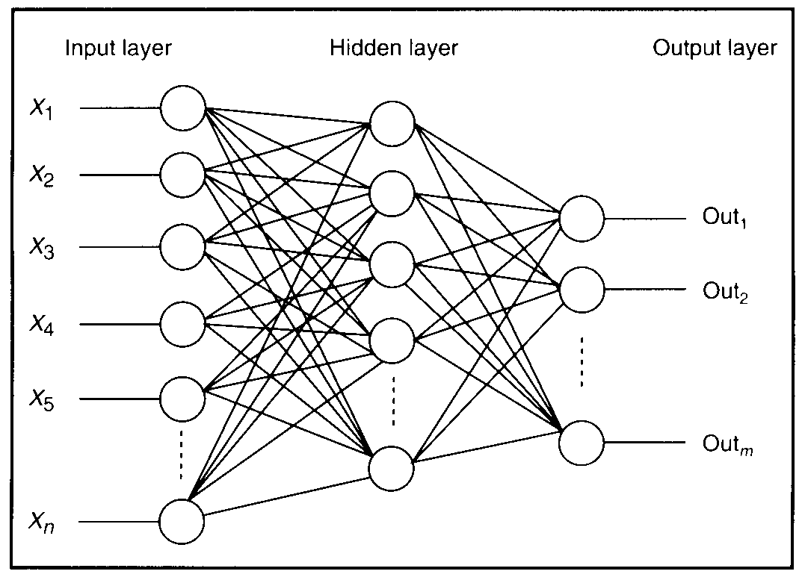

* Evaluation
  * When used for classification - the standard metrics for classification: Accuracy, Precision, Recall, F1-score.

* Nonlinearity
  * Very powerful, if trained correctly. Can learn any decision boundary.  

* n << p
  * Will tend to overfit.

* Outliers
  * Sensitive to outliers.

* Overfitting
  * Prone to overfitting. From _Elements of Statistical Learning_: "The model is generally overparametrized, and the optimization problem is nonconvex and unstable unless certain guidelines are followed." The guidelines refer to 'early stopping' - where we can use a validation set to stop training before reaching the global minimum, or to use 'weight decay', which is essentially regularization.

* Hyperparameters
  * Number of hidden layers. Number of units in the hidden layer.  
  * Early stopping criteria or Weight decay parameters to prevent overfitting.

* Online
  * Yes, via stochastic gradient descent.  

* Unique attributes
  * This is one case where we do not like to reach global minimum as it leads to overfitting.
  * Standardizing inputs in necessary.

* Special use cases
  * Especially suited for Image classification.


#### Naive Bayes

* High dimensionality
  * Can handle an arbitrary number of independent features - both continuous and/or categorical

* Training speed
  * One of the fastest learning models. [NB on sklearn](http://jaquesgrobler.github.io/Online-Scikit-Learn-stat-tut/modules/naive_bayes.html): "The decoupling of the class conditional feature distributions means that each distribution can be independently estimated as a one dimensional distribution. This in turn helps to alleviate problems stemming from the curse of dimensionality."  

* Prediction speed
  * High

* Interpretability

* Communication
  * Naive Bayes is a simple model commonly used for classification in NLP tasks. It predicts the posterior probabilities p(y|x) by estimating p(x|y) and p(y) (using MLE), making it a generative model. It is "naive" because it assumes that the features are independent of each other. However, without this assumption, it is impossible to learn the probabilities as the number of parameters is too large. This simplification enables it to work with a large number of features, even as the number of features exceeds the number of data points.

* Visualization
  * Result of classification using Naive Bayes:

  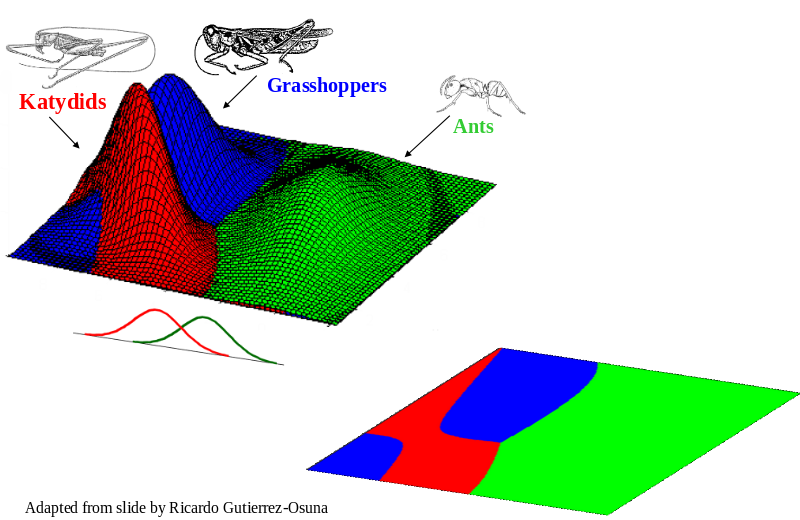

  * From [here](http://www.cs.ucr.edu/~eamonn/CE/Bayesian%20Classification%20withInsect_examples.pdf).

* Evaluation
  * The standard metrics for classification such as accuracy, precision, recall, F1-score etc.

* Nonlinearity
  * Can learn both linear and non-linear boundaries. The non-linear boundaries are however smooth, as naive Bayes is not prone to overfitting.

* n << p
  * Works well in this case.

* Outliers
  * Is not very sensitive to outliers. The probability p(x_outlier | y) will be small.

* Overfitting
  * Naive Bayes is a high bias model, it typically does not overfit.  

* Hyperparameters
  * will depend on the distribution we choose for p(x|y).
     * mean and variance for Gaussian
     * smoothing parameter/alpha, for Multinomial
  * In addition, we can set class prior probabilities if we do not want to use the Maximum Likelihood estimate.

* Online
  * Good at online learning. If using multinomial naive Bayes, stores counts (instead of probabilities), which can be easily updated.

* Unique attributes  
  * Naive Bayes is a generative model -- the only generative model in this list. We predict the joint probability p(y,x) instead of estimating the conditional probability p(y|x). Do not confuse naive bayes for a discriminative model just because the joint probability is THEN USED to calculate the conditional probability.
  * Naive Bayes works well with imbalanced classes.
  * Naive Bayes is insensitive to irrelevant features.  
  * GaussianNB gives a [piecewise quadratic decision boundary](http://www.cs.ucr.edu/~eamonn/CE/Bayesian%20Classification%20withInsect_examples.pdf). These are less complex than say the boundaries learned by knn, svm or neural nets.

* Special use cases
  * Works particularly well in NLP tasks such as document classification or spam filtering. Also works well with imbalanced classes.

## Unsupervised Learning

#### k-means Clustering

* High dimensionality
  * k-means clustering relies on (squared) euclidean distance, and therefore suffers from the curse of dimensionality, as distance becomes less meaningful

* Training speed

* Prediction speed
  * No real "predictions" possible in unsupervised learning
  * To assign the cluster of a new point: very fast, only need to find k distances, much faster than training.

* Interpretability
  * It is not possible to interpret which features are most important, as they all have the same weight when determing distance between clusters. Interpreting the results should instead focus on deriving insight about the kinds of observations one has.
  * Useful as a guide to begin understanding one's data; should not be accepted as hard truth (ISL 401)

* Communication
  * K-means clustering aims to segment the data into some number of groups such that each point is as close to the center of its group as possible. The objective is to find the right number of groups, and the right centers, so that this is achieved.

* Visualization
  * K-means is easily visualized in 2D or 3D space. Somewhat uniquely, you can also easily visualize the algorithm at each step to help explain it.
  * Algorithm at work (click/refresh to play):


  * Visualization of results:


* Evaluation
  * Unsupervised learning is difficult to evaluate. There's no standard accepted way to evaluate clusters, though some techniques are proposed. (ISL 400)

* Nonlinearity
  * The decision boundaries between clusters are depicted by straight lines, producing a Voronoi tesselation (ESL 510). Therefore, K-Means performs poorly on data with clusters that are non-linearly separable:

    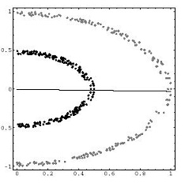

* n << p
  * Results will suffer when there are more predictors than data points. The distance measures become less meaningful if you have sparse, high-dimensional data due to curse of dimensionality

* Outliers
  * The distance used is Euclidean squared, so K-Means isn't robust to outliers. Consider K-Medioids (ESL 515 14.3.10)

* Overfitting
  * Be aware at any point that you may just be "clustering the noise" (ISL 400). If k is too large, your clusters are too small to have interprable meaning.

* Hyperparameters
  * position of starting centroids (often randomized)
  * number of iterations (often until stability is found)
  * number of clusters k
    * This is sometimes defined by your problem statement, or sometimes something that needs to be optimized if clustering is being used as a descriptive tool.
    * To determine K, some possible techniques:
      - elbow method - look at percentage of variance explained at each K, select one such that adding more clusters doesn't much improve the model
      - gap-statistic - see ESL 518
      - Silhouette Coefficient (see DSI clustering slides appendix)

* Online
  * yes, just need to maintain counts for each cluster as well as cluster centers, can easily calculate new centroid with one new point. ([see more](http://ocw.mit.edu/courses/sloan-school-of-management/15-097-prediction-machine-learning-and-statistics-spring-2012/projects/MIT15_097S12_proj1.pdf))

* Unique attributes
  * designed for cases where all variables are quantitative (ESL 509)
  * requires you to pre-specify k
  * Altering the value of K doesn't preserve your present results in a meaningful way, and can change cluster membership in "arbitrary ways" (ESL 514), as opposed to neatly nested clusters as in hierarchical clustering.

* Special use cases
  * won't work well if "true" clusters are different sizes/densities
  * important to normalize data first so that distance metrics aren't dominated by variables with larger units

#### Hierarchical Clustering

* High dimensionality
    * hierarchical clustering depends entirely on distance/similarity measures, and therefore suffers from the curse of dimensionality, as distance becomes less meaningful in higher dimensions.

* Training speed

* Prediction speed
  * No real "predictions" possible in unsupervised learning
  * To assign the cluster of a new point: very fast, only need to find k distances, much faster than training.

* Interpretability
    * It is not possible to interpret which features are most important, as they all have the same weight when determing distance between clusters. Interpreting the results should instead focus on deriving insight about the kinds of data points one has.
    * Useful as a guide to begin understanding one's data; should not be accepted as hard truth (ISL 401)

* Communication
    * Hierarchical clustering arranges items in a hierarchy with a treelike structure based on the distance or similarity between them. Start with n clusters, each with one of your n data points, and one-by-one combine the closest clusters until you end up with one big cluster of all data points.

* Visualization
    * The results of hierarchical clustering are visualized with a binary-tree structure called a dendrogram: (ESL 521)

    

  * The vertical distance between clusters represents the dissimilarity between them, making it highly interpretable.
  * Each "leaf" of the tree is a single observation, and as we move upwards, we can see observations fuse into clusters, which fuse into larger clusters and so on until we end up with one cluster of all observations. (ISL 391)

* Evaluation
    * Unsupervised learning is difficult to evaluate. There's no standard accepted way to evaluate clusters, though some techniques are proposed. (ISL 400)

* Nonlinearity
    * Without any modifications, hierarchical clustering, like k-means, performs poorly on non-linearly separable clusters. [See more here.](http://scikit-learn.org/stable/auto_examples/cluster/plot_ward_structured_vs_unstructured.html)

* n << p
  * Results will suffer when there are more predictors than data points. The distance measures become less meaningful if you have sparse, high-dimensional data due to curse of dimensionality

* Outliers
    * Like k-means, hierarchical clustering necessarily assigns EACH point to a cluster. Outliers will exert undue influence over final clusters. (ISL 400)

* Overfitting
    * Be aware at any point that you may just be "clustering the noise" (ISL 400). If k is too large, your clusters are too small to have interprable meaning.

* Hyperparameters
    * Dissimilarity measure (often Euclidean distance, see ISL 396)
    * Linkage -- which dissimilarity to use between clusters of several observations?
        * Complete -- max pairwise distance
        * Single -- min pairwise distance
        * Average -- mean pairwise distance
        * Centroid -- distance between the two cluster centers
    * Where to cut the dendrogram/how many clusters to choose
        - Can use same methods as k-means
        - Can also look at dendrogram and see if an obvious location exists based on distances between clusters

* Online

* Unique attributes
    * Unlike k-means, increasing the number of clusters in hierarchical clustering doesn't really "change" the clustering results, it just splits an existing cluster into two.
    * No need to pre-specify number of clusters, can be chosen after dendrogram is built.
    * Requires quantitative data

* Special use cases
    * Most common and most studied form is agglomerative clustering, as discussed here. Can also do divisive clustering, where we start with one big cluster and recursively split. This can work better if the goal is relatively few clusters. (ESL 526)

## Other Good Resources

* https://class.coursera.org/ml-005/lecture (Week X)
