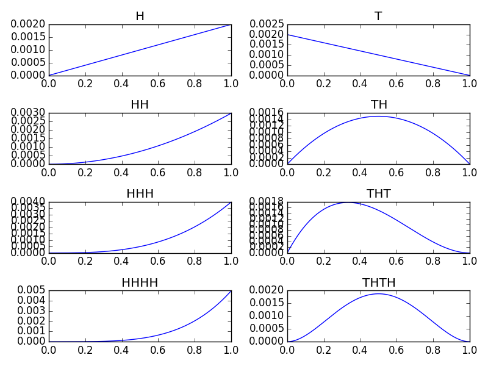

*We assume we've done these import statements:*

```python
import numpy as np
from matplotlib import pyplot as plt
from bayes import Bayes
from coin import Coin
```

1. Create the prior dictionary that has all the keys in `0, 0.01, 0.02, ..., 0.99`. The values should all be the same.

    ```python
    keys = np.linspace(0, 1, 100)
    prior = {key: 0.01 for key in keys}
    ```

2. The likelihood function is a bernoulli. Write the `likelihood` function. It should take the data of either `'H'` or `'T'` and the value for `p` and return a value between 0 and 1.

    ```python
    def likelihood(data, p):
        if data == 'H':
            return p
        else:
            return 1 - p
    ```

3. Make a graph with 8 subplots that has the posterior for each of the following scenarios. Make sure to give each graph a label!

    * You get the data: `H`.

    * You get the data: `T`.
    
    * You get the data: `H, H`.

    * You get the data: `T, H`.
    
    * You get the data: `H, H, H`.

    * You get the data: `T, H, T`.
    
    * You get the data: `H, H, H, H`.

    * You get the data: `T, H, T, H`.
    
    ```python
    all_data = [['H'], ['T'], ['H', 'H'], ['T', 'H'], ['H', 'H', 'H'],
                ['T', 'H', 'T'], ['H', 'H', 'H', 'H'], ['T', 'H', 'T', 'H']]
    for i, data in enumerate(all_data):
        plt.subplot(4, 2, i + 1)
        bayes = Bayes(prior.copy(), likelihood)
        for datapoint in data:
            bayes.update(datapoint)
        bayes.plot(label="".join(data))
    plt.tight_layout()
    plt.show()
    ```

    

    Notice how it gets more certain as the data comes in.

4. There is a biased coin in `coin.pyc`.

    On a single graph, overlay the initial uniform prior with the prior after 1, 2, 10, 50 and 250 flips.

    ```python
    bayes = Bayes(prior.copy(), likelihood)
    coin = Coin()
    bayes.plot(label='prior', color='m')
    colormap = {1: 'b', 2: 'c', 10: 'g', 50: 'y', 250: 'r'}
    for i in range(1, max(colormap) + 1):
        bayes.update(coin.flip())
        if i in colormap:
            bayes.plot(label=str(i), color = colormap[i])
    plt.legend()
    plt.title('Biased Coin')
    plt.show()
    ```

    

    As the data comes in, it gets more certain.
