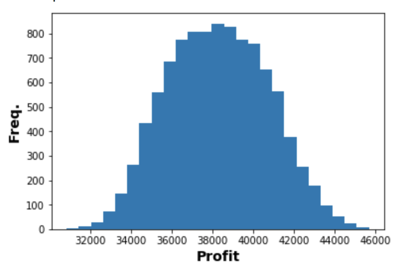
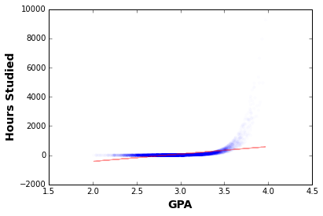

# Solution to Probability Distributions

## Basic

### Part 1: Identifying Distributions

1. A typist makes on average 2 mistakes per page.  What is the probability of a particular page having no errors on it?

   ```
   #X ~ Poisson(2)

   #P(X = 0)
   #= (2 ^ 0 / 0!) * e ^ -2
   #~= 0.135
   
   dist = stats.poisson(mu=2)
   print("P(X = 0) = ", dist.pmf(0))
   ```


2. Components are packed in boxes of 20. The probability of a component being
   defective is 0.1. What is the probability of a box containing exactly 2 defective components?

   ```
   #X ~ Binomial(n=20, p=0.1)

   #P(X = 2)
   # 20 C 2 is 20 choose 2
   #= (20 C 2) * (0.1 ^ 2) * (1 - 0.1) ^ 18
   #= (20! / 2! * 18!) * (0.1 ^ 2) * (1 - 0.1) ^ 18
   #~= 0.285
   
   dist = stats.binom(20, 0.1)
   print ("P(X = 2) = ", dist.pmf(2))
   ```

3. Components are packed in boxes of 20. The probability of any individual component being
   defective is 0.1. What is the probability of a box containing AT MOST 2 defective components? 

   ```
   X ~ Binomial(n=20, p=0.1)

   P(X <= 2)
   = P(X == 0) + P(X == 1) + P(X == 2)
   =   (20 C 0) * (0.1 ^ 0) * (1 - 0.1) ^ 20
     + (20 C 1) * (0.1 ^ 1) * (1 - 0.1) ^ 19
     + (20 C 2) * (0.1 ^ 2) * (1 - 0.1) ^ 18
   ~= 0.677
   ```

4. Patrons arrive at a local bar at a rate of 30 per hour. What is the probability that the bouncer can take a three minute bathroom break without missing the next patron? 

   ```
   X = waiting time
   X ~ Exponential(0.5)  # 30 per hour = 0.5 per minute

   P(X > 3)
   = 1 - P(X <= 3)
   = 1 - (1 - exp(-0.5 * 3))
   ~= 0.2231
   ```

5. You need to find a tall person, at least 6 feet tall, to help you reach a cookie jar. 8% of the population is 6 feet or taller, and people pass by on average twice per minute.  If you wait on the sidewalk, what is the probability that you will have to wait longer than ten minutes to get some cookies?

   ```
   # The waiting time is exponentially distributed.
   # The rate that the event "someone of sufficient height passes by"
   # happens is:
   #  rate = 2 persons / 1 min * 8 tall persons / 100 persons
   #       = 0.16 tall persons / min
   X ~ Exponential(rate = 0.16)

   P(X > 10 min)
   = 1 - P(X <= 10 min)
   = 1 - (1 - exp(- 0.16 * 10))
   = exp(- 0.16 * 10)
   ~= 0.201
   ```

6. A harried passenger will be several minutes late for a scheduled 10 A.M. flight to NYC. Nevertheless, he might still make the flight, since boarding is always allowed until 10:10 A.M., and boarding is sometimes permitted up to 10:30 AM.

Assuming the end time of the boarding interval is **uniformly distributed** over the above limits, find the probability that the passenger will make his flight, assuming he arrives at the boarding gate at 10:25.

   ```
   X ~ Uniform(10, 30) # Really uniform over 10:10 to 10:30

   P(X > 25)
   = (30 - 25) / (30 - 10) = 0.25
   ```

7. Your cat starts to beg for dinner at 3:30 every day, and you suspect that it meows at a fixed rate.  You've observed that about one fifth of the time, your cat will not meow until 3:40, giving you ten unexpected minutes of quiet.  What is the probability your cat leaves you alone until 4:00?

   ```
   # Looks like this one is Poisson distributed, but we are not 
   # directly given the rate, so we'll have to figure it out.
   X = # of meows in a ten mins
   X ~ Poisson(lambda=???)

   # But here's what we do know:
   P(X == 0) = 0.2
   # On the other hand, since X is Poisson distributed:
   P(X == 0) = exp(- lambda)
   # So, solving the resulting equation
   lambda = - log(0.2) = 1.6

   # So the rate our cat is meowing is (approximately) 1.6 meows / 10 min
   # Now we can actually solve the problem.  We want:
   P(Cat does not meow between 3:30 and 4:00)
   # Which is a 30 min interval.  So let's get the rate the cat meows
   # in every 30 mins
   lambda = 1.6 meows / 10 min = 4.8 meows / 30 min
   # Now we can calculate the needed probability
   P(Your cat leaves you alone until 4:00)
   = P(Your cat meows 0 times in 30 mins)
   = exp(- 4.8)
   ~= 0.008
   ```
 
8. Somehow you ended up with two types of forks.  There are the good forks, which are big and fit a healthy bite, but there are also these small, thin ones that you don't really understand what they are for, you should probably just get rid of them.  You need two forks for you and your partner, and grab a fistful of 5.  If there are 14 forks in the drawer, of which half are the good kind, what is the probability you have at least your two required good forks?

   ```
   # The number of good forks in hand is Hypergeometrically distributed.
   X = # of good forks in a hand of 5.
   X ~ Hypergeometric(N=14, k=7, n=5)

   P(X >= 2)
   = 1 - P(X <= 1)
   # I used scipy for this one.
   # 1 -  scipy.stats.hypergeom(14, 7, 5).cdf(1) 
   ~= 0.867
   ```


## Part 2: Basic Concepts

### Set

1. Out of the students in a class, 60% are geniuses, 70% love chocolate,
   and 40% fall into both categories. Determine the probability that a
   randomly selected student is neither a genius nor a chocolate lover.

   ```
   Draw a Venn diagram

    - Probability of both Genius and Chocolate lover is 40%
    - Probability of Genius but not Chocolate lover is 20%
    - Probability of Chocolate lover and not Genius is 30%.

   100% - (40% + 20% + 30%) = 10%
   ```
### Combinatorics

1. A fair 6-sided die is rolled three times, independently. Which is more likely: a
   sum of 11 or a sum of 12?

   ```
   There are 216 possibilities.  We simply enumerate and count.

    * Sum of 11:
      * (1,4,6), (1,5,5) | (2,3,6), (2,4,5) |  (3,3,5), (3,4,4);
      * 6 + 3 + 6 + 6 + 3 + 3 = 27

    * Sum of 12:
      * (1,5,6) | (2,4,6), (2,5,5) | (3,3,6), (3,4,5) | (4,4,4)
      * 6 + 6 + 3 + 3 + 6 + 1 = 25

    ==> So it is more likely to roll an 11.
    ```


2. 90 students are to be split at random into 3 classes of equal size. Joe and Jane are
   two of the students. What is the probability that they end up in the same
   class?

   ```
   There a few approaches, all equal to 0.3258
    * Approach 1:
       (Think given the class of jane, probability joe is in same class) = 29/89

    * Approach 2:
       88_choose_28 / 89_choose_29

    * Approach 3:
       3 x P(both in class i) = 3 * 88_choose_28 / 90_choose_30
   ```

3. A well-shuffled 52-card deck is dealt to 4 players. Find the probability that
   each of the players gets an ace.

   ```
   (Assume ordering, factor by num. permutations)

    4! * (48_choose_12 x 36_choose_12 x 24_choose_12 /
    (52_choose_13  x  39_choose_13 x 26_choose_13)
   ```

### Random Variable


1. A six-sided die is loaded in a way that each even face is twice as likely as
   each odd face. All even faces are equally likely, as are all odd faces.

   Construct a probabilistic model for a single roll of this die and find the
   probability that the outcome is less than 4.

   ```
   # Set up a probability mass function (PMF) and compute probability

   Sample Space = 1, 2, 3, 4, 5, 6

   P(1) = P(3) = P(5) = k
   P(2)= P(4) = P(6) = 2k

   3k + 6k = 1
   k = 1/9

   P(X < 4)
   = P(1) + P(2) + P(3)
   = 1/9 + 2/9 + 1/9
   = 4/9
   ```

2. `X` is a random variable with PMF `p(k) = k^2/a` if `k = -3, -2, -1, 0, 1, 2, 3`
   and `p(k) = 0` otherwise.

  (a) Find `a` and `E[X]`

  (b) Find the expectation value of the random variable `Z = (X - E[X])^2)`

  (c) Using the result from (b), find the variance of `X`

  ```
  (a) Find `a` and `E[X]`
  (b) Find the PMF of the random variable `Z = (X - E[X])^2)`

      First, notice that E(X) = 0 by symmetry

      Let Z = X^2

      P(Z = 1)
      = P(X = -1) + P(X = 1) = 2/a

      P(Z = 4)
      = P(X = -2) + P(X = 2) = 8/a

      P(Z = 9)
      = P(X = -3) + P(X = 3) = 18/a

      28/a = 1
      a = 28

  (c) Find the variance of `X` (use the result from above)

      Var(X)
      = E[X^2] - E(X)^2
      = E(Z)
      = (2/28) * 1 + (8/28) * 4 + (18/28) * 9
      = 7
  ```


3. A soccer team has 2 games scheduled for one weekend. It has a 0.4 probability
   of not losing first game and 0.7 probability of not losing the second
   game, independent of the first. If the team wins a particular game, the
   team is equally likely to win or tie. The team will receive 2 points for a win,
   1 for a tie, and 0 for a loss.
  (a) Find the PMF of the number of points that the team earns over the
   weekend.
  (b) Find the expected value for the number of points earned.
  (c) Find the variance for the number of points earned.

  ```
   * a. Find the PMF of the number of points that the team earns over the weekend.

    P(lose first) = 0.6 --> P(tie first)=P(win first)=0.2
    P(lose second) = 0.3 --> P(tie second)=P(win second)=0.35

    P(X=0) = 0.18
    P(X=1) = 0.27
    P(X=2) = 0.34 = P(LW or TT or WL) = 0.6 x 0.35 + 0.2 x 0.35 + 0.2 x 0.3
    P(X=3) = 0.14
    P(X=4) = 0.07

  * b. Find the expected value for the number of points earned.
    E(X) = 0.18 x 0 + 0.27 x 1 + ... + 0.07 x 4 = 1.65

  * c. Find the variance for the number of points earned.
    E(X^2) = 0.18 x 0 + 0.27 x 1 + ... + 0.07 x 16 = 4.01
    V(X) = E(X^2) - E(X)^2 = 4.01-1.65^2 = 1.2875
  ```


4. You have 5 keys, one of which is the correct one for the house. Find the PMF
   of the number of trials you will need to open the door, assuming that after
   you try a key that doesn't work you set it aside and you otherwise randomly
   select a key to try next.

   ```
   * P(1) = 1/5
   * P(2) = (4/5) * (1/4) = 1/5
   * P(3) = (4/5) * (3/4) * (1/3) = 1/5
   * P(4) = 1/5
   * P(5) = 1/5

   Another approach, logical reasoning:
   Imagine 5 slots [---]  [---]  [---]  [---]  [---]
   Equal chance in any of those slots.  If check one after another,
   chance it will take exactly 1 time, 2 times, 3 times, 4 times, 5 times are 1/5 each.
   ```

5. You toss independently a fair coin and you count the number of tosses until
   the first tail appears. If this number is `n`, you receive `2^n` dollars.
   What is the expected amount you will receive? How much would you be willing
   to play this game?

   ```
   Let X = # tosses until first tail.
   X ~ Geom(0.5), P(X = k) = 1/2^k, for all k = 1, 2, 3, ...
   W = winnings. P(W = 2^n) = 1/2^n for all n = 1, 2, 3, ...
   E(W) = sum [(2^n) P(W = 2^n)] = infinity
   In reality, no one has an infinite amount of money to play the game forever.
   ```


### Joint Distributions


1. A class of `n` students takes a test consisting of `m` questions. Suppose that
   student `i` submitted answers to the first `m_i,` for `m_i <= m` questions.
  - The grader randomly picks one answer, call it `(I, J)` where `I` is the student
    ID number (values `1,...,n`) and `J` is the question number (values `1,...,m`).
    Assume that all answers are equally likely to be picked. Calculate the joint
    and marginal PMFs of `I` and `J`.
  - Assume that an answer to question `j` if submitted by student `i` is correct
    with probability `p_ij`. Each answer gets `a` points if it is correct and `b`
    points otherwise. Find the expected value of the score of student `i`.

  ```
  * The grader randomly picks one answer,
    call it (I, J) where I is the student ID number (values 1,...,n)
    and J is the question number (values 1,...,m).

  Assume that all answers are equally likely to be picked.
  Calculate the joint and marginal PMFs of I and J.

  P(I=i) = m_i/sum(m_j over all j)
  (Simply number of questions answered by student i over total number of questions answered)

  P(J=j) = sum(Indicator(m_i>=j))/sum(m_j over all j)
  (Probability of selecting a particular question is the total number
   of students who answered at least that many questions,
   divided by total number of questions answered.)

  P(I=i, J=j) = 1/sum(m_j over all j)

  * Assume that an answer to question j if submitted by student i is correct
    with probability p.ij. Each answer gets a points if it is correct and b
    points otherwise. Find the expected value of the score of student i.

    E(score for student i) = sum( a x p_ij + b x (1-p_ij) over all j)
  ```


### Independence

1. Alice and Bob want to choose between the opera and the movies by tossing a
   coin. Unfortunately, the only coin they have is biased, though the bias is
   not known exactly. How can they use the biased coin to make a decision so
   that either option (opera or movies) is equally likely to be chosen?

   ```
   (symmetry)

   Flip the coin in pairs.  If HT comes up first, go to opera.
   If TH comes up first, go to movies.

   Experiment might look like HH, TT, HH, HH, HH HH, HT --> opera
   ```

2. A system consists of `n` identical components, each of which is operational
   with probability `p`, independent of other components. The system is
   operational if at least `k` out of the `n` components are operational. What is
   the probability that the system is operational?

   ```
   Let X ~ Binomial(n,p)

   Then simply plug in P(X >= k) = P(k)+P(k+1)+...+P(n)
   ```

### Covariance and Correlation

1. Suppose that *X* and *Y* are random variables with the same variance. Show
   that *X - Y* and *X + Y* are uncorrelated.

   ```
   cov(X-Y,X+Y) = E[ ((X-Y) - E(X-Y)) ((X+Y) - E(X+Y)) ]

   cov(X-Y, X+Y) = 0

   Correlation is just covariance scaled, so X-Y and X+Y are uncorrelated
   ```


## Advanced

### Part 3: Distribution Simulation

1. Given the distributions of each of variables, use `scipy` to write a function that would draw random values from each of the distributions to simulate draws from the distribution of `profit`

   ```python
   def profit_rvs():
       num_views = int(sc.uniform(loc=5000, scale=1000).rvs())
       conversions = sc.binom(p=0.12, n=num_views).rvs()
       wholesales = sc.binom(p=0.2, n=conversions).rvs()
       non_wholesales = conversions - wholesales
       profit = (wholesales * 50 + non_wholesales * 60)
       return profit
   ```

2. Draw 10,000 samples from the distribution of profit, and plot a histogram. Does it look like any of the common distributions is a good fit for `profit`?

   ```python
   samples = [profit_rvs() for _ in range(10000)]
   plt.hist(samples, bins=30)
   plt.xlabel('Profit', fontsize=14, fontweight='bold')
   plt.ylabel('Freq.', fontsize=14, fontweight='bold')
   ```

   

3. Compute the range of values of profit where the middle 95% of the probability mass lies.

  ```python
  print '2.5% percentile', np.percentile(samples, 2.5)
  print '97.5% percentile', np.percentile(samples, 97.5)
  # 2.5% percentile 33730.0
  # 97.5% percentile 42830.0
  ```

## Part 4: Covariance and Joint Distribution

1. Read in data

   ```python
   df = pd.read_csv('data/admissions.csv')
   ```

2. Covariance Function

   ```python
   def covariance(x1, x2):
       return np.sum((x1 - np.mean(x1)) * (x2 - np.mean(x2))) / (len(x1) - 1.)

   print covariance(df.family_income, df.gpa)
   print covariance(df.family_income, df.parent_avg_age)
   print covariance(df.gpa, df.parent_avg_age)

   #Check your results
   df.cov()
   ```

3. Normalizing covariance to compute correlation

   ```python
   def correlation(x1, x2):
       std_prod = np.std(x1) * np.std(x2)
       covar = covariance(x1, x2)
       return covar / std_prod

   print correlation(df.family_income, df.gpa)
   print correlation(df.family_income, df.parent_avg_age)
   print correlation(df.gpa, df.parent_avg_age)

   #Check your results
   df.corr()
   ```

4. Computing the GPA threshold for each income class

   ```python
   # Categorize the family income
   def income_category(income):
       if income <= 26832:
           return 'low'
       elif income <= 37510:
           return 'medium'
       else:
           return 'high'
   # Apply the categorization and define a new column
   df['family_income_cat'] = df.family_income.apply(income_category)

   # Alternatively, we can use pandas' cut function to bin the data
   max_income = df['family_income'].max()
   df['family_income_cat']=pd.cut(np.array(df['family_income']), [0,26382,37510,max_income],
                                         labels=["low","medium","high"])
   ```

   ```python
   # Get the conditional distribution of GPA given an income class
   low_income_gpa = df[df['family_income_cat'] == 'low'].gpa
   medium_income_gpa = df[df['family_income_cat'] == 'medium'].gpa
   high_income_gpa = df[df['family_income_cat'] == 'high'].gpa

   # Plot the distributions
   from scipy.stats.kde import gaussian_kde
   def plot_smooth(gpa_samp, label):
       my_pdf = gaussian_kde(gpa_samp)
       x = np.linspace(min(gpa_samp) , max(gpa_samp))
       plt.plot(x, my_pdf(x), label=label)

   fig = plt.figure(figsize=(12, 5))
   plot_smooth(low_income_gpa, 'low income')
   plot_smooth(medium_income_gpa, 'medium income')
   plot_smooth(high_income_gpa, 'high income')
   plt.xlabel('GPA', fontsize=14, fontweight='bold')
   plt.ylabel('Probability Density', fontsize=14, fontweight='bold')
   plt.legend()
   ```

5. 90th percentile GPA for each income class

   ```python
   # The 90th percentile GPA for each class
   print '90th percentile GPA for low income class', np.percentile(low_income_gpa, 90)
   print '90th percentile GPA for medium income class', np.percentile(medium_income_gpa, 90)
   print '90th percentile GPA for high income class', np.percentile(high_income_gpa, 90)
   ```

## Part 5: Pearson Correlation vs Spearman Correlation

1. Load in the new data

   ```python
   df2 = pd.read_csv('data/admissions_with_study_hrs_and_sports.csv')
   ```

2. Make a scatter plot of GPA against Hours Studied

   ```python
   plt.scatter(df2['gpa'], df2['hrs_studied'], alpha=.01, edgecolor='none')
   slope, intercept, r_value, p_value, std_err = sc.linregress(df2['gpa'], df2['hrs_studied'])
   plt.plot(df2['gpa'], slope * df2['gpa'] + intercept, color='r', alpha=.4)
   plt.xlabel('GPA', fontsize=14, fontweight='bold')
   plt.ylabel('Hours Studied', fontsize=14, fontweight='bold')
   ```

   

3. Correlation between `gpa` and `hrs_studied`

   ```python
   print sc.pearsonr(df2['gpa'], df2['hrs_studied'])
   print sc.spearmanr(df2['gpa'], df2['hrs_studied'])
   # The spearman correlation shows a more positive coefficient since it captures the non-linear relationship
   ```

4. Correlation between `gpa` and `hrs_studied`

   ```python
   print sc.pearsonr(df2['gpa'], df2['sport_performance'])
   print sc.spearmanr(df2['gpa'], df2['sport_performance'])
   # There is s strong relationship between gpa and sports perf. , but the values of the
   # two variables are not monotonically increasing together. Therefore, the coefficients are low
   ```